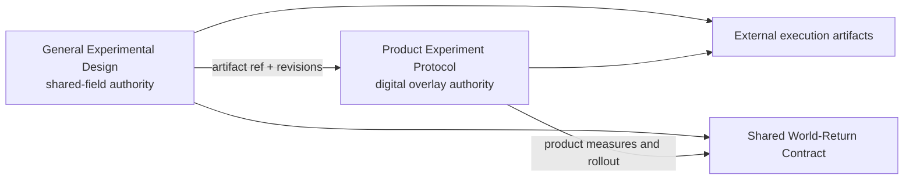

# Experiment composition contract

Use this contract when a general experiment is specialised by `parallax-product-experiment`, or when consuming an artifact produced by either skill.

## Authority model

The general Experimental Design is the base artifact. When a product overlay exists, the base remains authoritative for:

- common envelope identity, inquiry, artifact, and protocol revisions;
- decision, claim, alternatives, estimand, causal identification, and general design family;
- scale regions, Bridge Claims, Crosswalk Claims, cluster contract, precision, and causal analysis;
- general ethics, validity domain, defeaters, and World-Return Contract.

The Product Experiment Protocol overlay is authoritative for:

- digital assignment and exposure implementation;
- variants and feature-flag semantics;
- metric definitions, telemetry, SRM, identity integrity, and concurrent experiments;
- product guardrails, ramp, rollback, product approvals, and operational outcome monitoring.

The overlay must not silently override a base-owned field. Amend the base protocol, increment `protocol_revision`, and retain both revisions when a shared field changes.

## Composition modes

- `standalone-general`: this artifact is a complete general protocol with no product overlay.
- `general-base-for-product`: this artifact is the base for one or more overlays named in `product_overlay_artifact_refs`.
- `standalone-product`: the product protocol owns both shared and product-specific fields because no base artifact is present.
- `product-overlay`: a product artifact references a general base and owns only the product-specific fields listed above.

## Required consistency groups

Before either composed artifact is `ready-to-run`, compare:

1. identity and all three revisions;
2. decision, claim, alternatives, and estimand;
3. scale regions, Bridge Claims, and Crosswalk Claims;
4. World-Return predictions, ownership, thresholds, and reopening conditions.

The product overlay records a base artifact reference, digest, comparison time, checker, and `verified` result for each group. Structural validation checks that this evidence exists; it cannot reproduce a comparison without the base artifact.

## Template and artifact references

`template_ref` identifies the local template used to initialise an artifact. It is not the artifact identity. Composition uses stable `artifact_id` plus `artifact_revision` and `protocol_revision`; never use a filesystem path as provenance.

## Safe degradation

If the product skill or base artifact is unavailable, continue in `standalone-general` mode and record the missing digital specialisation. Do not invent an overlay, mark consistency as verified, or claim product telemetry and rollout readiness.
