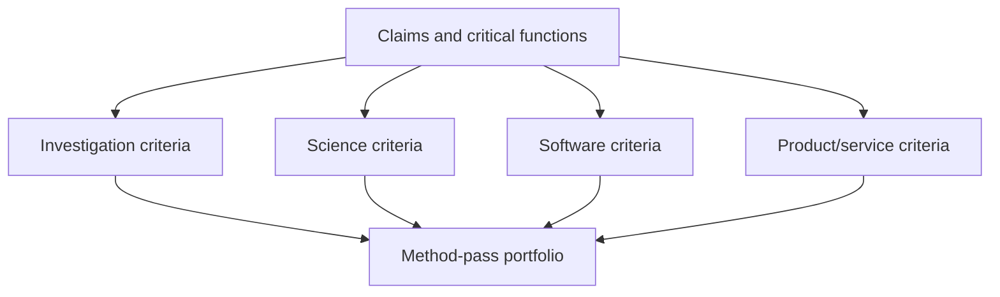

# Stackable domain profiles for inquiry design

Use one or more profiles to add domain-specific warrant criteria, scales, methods, characteristic errors, and execution boundaries. Profiles overlay the same Evidence and Method Plan; they are not mutually exclusive.

## Investigation profile

Use for evidence assembled from documents, testimony, records, repositories, logs, media, datasets, chronology, or open sources.

Plan authenticity, custody, date, proximity, competence, incentives, primary/derivative status, chronology and entity resolution, source dependence, claim traceability, search/selection bias, and negative-evidence handling. External executors search, retrieve, extract, query, inspect, or interview only with appropriate authority.

## Science profile

Use for measurement, empirical regularity, prediction, mechanism, causal effect, experiment, simulation, replication, or statistical inference.

Plan construct validity, calibration, sampling, estimands, dependence, confounding, missingness, identification, precision, severity, robustness, sensitivity, replication, validity domains, ethics, and specialist review. Route controlled intervention design to `parallax-design-experiment`; route digital product/service experiments to `parallax-product-experiment` as well.

## Software-engineering profile

Use for software behaviour, architecture, quality, security, performance, maintainability, delivery, incidents, migrations, or technical strategy.

Plan requirements and invariants, repository/dependency provenance, code and architecture inspection, static/dynamic/formal checks, representative tests and environments, runtime/production evidence, failure and threat models, deployability, observability, rollback, recovery, operational ownership, and technical-to-user bridge claims. Engineering execution requires separate mutation authority.

## Digital-product/service profile

Use for user need, experience, behaviour, adoption, service delivery, product strategy, or intended human/public outcome.

Plan affected and excluded groups, user research, usability and accessibility, instrumentation validity, telemetry and product analytics, qualitative/quantitative triangulation, exposure and interference, prototypes or pilots, guardrails, feasibility, support burden, distribution, ecosystem effects, and long-term user/public outcomes. User exposure, tracking, messaging, and release require separate authority.

## Method-pass requirements

Each method pass records `domain_profiles: []`. For every selected profile include:

- the critical functions and evidence standards it adds;
- relevant scales, bases, stakeholders, and bridge claims;
- characteristic errors and shared dependencies;
- external executor and authority boundary;
- specialist review, harms, stop, and escalation conditions;
- its method-report and synthesis contract.

Do not merge profile-specific criteria into a generic “cross-domain” label. A pass can be shared while its warrants remain distinct.
