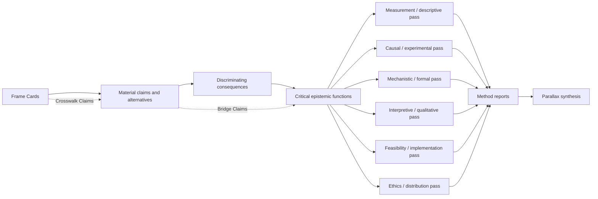

# Inquiry-design reference

Use this reference to map claims to consequences, methods, dependencies, and specialised designs.

## Claim-to-method graph



The nodes are functions, not mandatory method categories. One method may cover several functions; several methods may protect against different failure modes in one function.

## Method-pass contract

For every pass, record:

```yaml
method_pass_id: ""
inquiry_id: ""
inquiry_revision: 1
basis_id: ""
scale_region: {}
domain_profiles: []
claim_ids: []
critical_functions: []
method: ""
warrant_supplied: []
characteristic_errors: []
inputs: []
procedure: []
outputs: []
dependencies: []
constraints: []
success_conditions: []
failure_conditions: []
abort_conditions: []
escalation_conditions: []
```

## Choosing experimental subdesigns

Route to `parallax-design-experiment` when controlled intervention, randomisation, quasi-random assignment, sequential experimentation, factorial allocation, cluster assignment, or formal prospective power or precision analysis is material. Require the specialised design to return more than a sample size: estimand, assignment unit, analysis unit, interference assumptions, effect model, uncertainty inputs, decision rule, multiplicity, attrition, implementation and monitoring.

For online controlled digital-product or service experiments, route to `parallax-product-experiment`, which composes with `parallax-design-experiment`. Additionally require exposure semantics, allocation and identity integrity, telemetry quality, novelty and learning effects, concurrent-change risks, guardrails, accessibility and distributional outcomes, rollout and rollback, and the connection from short-term product metrics to intended human impact.

## Coverage and dependence matrix

Create a matrix of critical functions by method pass. Mark coverage as primary, supporting, absent, or misleading. Then create a method-dependence graph. A larger number of reports is not stronger triangulation when the reports share the same upstream data or assumptions.

## Proportionality test

Compare the expected decision value of information with time, cost, delay, participant burden, privacy exposure, opportunity cost, and risk. Prefer no further inquiry when remaining uncertainty cannot change the action. Prefer a reversible action with monitoring when it resolves uncertainty safely in the world.
