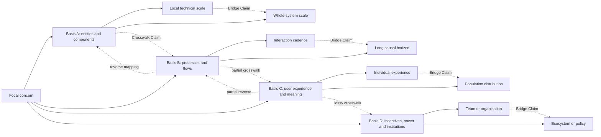

# Framing method reference

Use this reference to construct differentiated frames and explicit scale relationships.

## Frame-generation operations

Generate candidates by changing one or more of:

- construct or operational definition;
- system boundary or excluded environment;
- unit of analysis or aggregation;
- causal direction, mechanism, or counterfactual;
- stakeholder, rights-holder, practitioner, or disciplinary standpoint;
- temporal horizon, cadence, or lag structure;
- spatial, population, organisational, technical, or causal scale;
- decomposition into entities, processes, states, flows, incentives, experiences, or constraints;
- question type: empirical, causal, formal, interpretive, normative, or design.

Protect the candidates from premature convergence, then compare them using their consequences rather than their vocabulary.

## Basis-by-scale map



This diagram is illustrative, not a universal basis. Select task-relevant dimensions and keep the executed set sparse.

## Discrimination test

A candidate earns separate-frame status when at least one of these differs materially:

- what counts as the phenomenon;
- what evidence is relevant;
- what mechanism or interpretation is plausible;
- what intervention follows;
- who benefits, bears risk, or has standing;
- what characteristic error it invites;
- what observation would change its credibility.

If none differ, merge it as a variant rather than inflate the frame count.

## Bridge Claim minimum

```yaml
bridge_id: ""
source_scale: {}
target_scale: {}
direction: ""
relationship: aggregation | mechanism | feedback | extrapolation | translation
assumptions: []
supporting_evidence: []
challenging_evidence: []
uncertainty: ""
information_loss: ""
validity_domain: ""
failure_conditions: []
```

## Crosswalk Claim minimum

```yaml
crosswalk_id: ""
source_basis_id: ""
target_basis_id: ""
direction: one-way | two-way
mapping: []
preserved_meaning: []
lost_or_changed_meaning: []
evidence: []
validity_limits: []
mapping_status: exact | approximate | partial | asymmetric | unavailable
```
