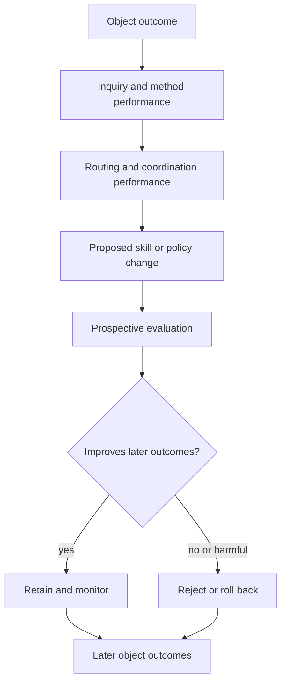

# Learning and improvement protocol

## Learning levels

- **Object learning:** update a claim, model, design, or decision from observed consequences.
- **Inquiry learning:** identify a frame, scale, bridge, measure, method, or synthesis defect.
- **Routing learning:** assess which skills and operating depth were selected, including false
  negatives that an uninvoked skill could not observe itself.
- **Coordination learning:** assess dependencies, duplicated work, anchoring, lost artifacts, and
  invalid claims of independent passes.
- **Learning-policy learning:** test whether changes to capture, attribution, selection, evaluation,
  or graduation improve later object outcomes.

## Structural-change threshold

Propose a durable skill, rule, directive, or policy change only when the candidate is:

1. grounded in real work rather than elegance or speculation;
2. likely to prevent a recurring or consequential failure;
3. stable enough that near-term reversal is not already expected;
4. general rather than patched to one eval prompt;
5. testable against a baseline and regressions;
6. reversible if later outcomes contradict it.

An eligible proposal still requires an identified approval authority and the host's required
reviewers. Evaluation evidence informs that decision; it does not authorise deployment by itself.

One high-severity case may justify a proposal, but not an untested deployment. Several weakly
dependent cases may be less informative than one clean falsifier; record dependence.

## Attribution classes

Do not collapse failure into "the skill failed." Consider:

- the object model was wrong;
- the question or construct was wrong;
- evidence was missing, biased, delayed, or measured at the wrong scale;
- a cross-scale bridge or cross-basis mapping failed;
- the appropriate skill did not trigger;
- the right skill triggered at the wrong depth;
- its instructions were ambiguous or over-constrained;
- an external executor or tool failed;
- parallel passes were correlated;
- the environment changed after the decision;
- the outcome was real but attributed to the wrong intervention;
- the learning policy selected or graduated the wrong lesson.

## Meta-meta-learning test

For every adopted routing or skill-policy change, preserve the prior version and ask prospectively:

- Did invocation precision and recall improve on held-out prompts?
- Did task outcomes improve versus no skill and the prior version?
- Did omissions, unsupported bridges, or calibration errors fall?
- What additional time, tokens, latency, or ceremony did the change impose?
- Did improvement transfer across domains, scales, and phrasings?
- Did any subgroup, stakeholder, or failure class become less visible?
- Would rollback now produce better expected outcomes?
