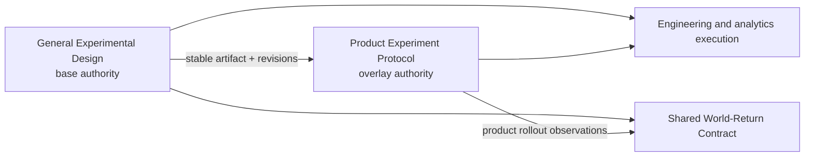

# Product experiment composition contract

Use this contract whenever the Product Experiment Protocol composes with a general Experimental Design or is invoked without that sibling.

## Authority

In `product-overlay` mode, the referenced general Experimental Design is authoritative for:

- common envelope identity and inquiry, artifact, and protocol revisions;
- decision, claim, alternatives, estimand, causal design and identification;
- scale regions, Bridge Claims, Crosswalk Claims, cluster contract, general precision and causal analysis;
- validity, ethics, defeaters and the shared World-Return Contract.

The product overlay is authoritative for:

- digital assignment, exposure, variants and feature-flag semantics;
- metric definitions, telemetry, SRM, identity integrity and concurrent tests;
- product guardrails, approvals, ramp, rollback and product outcome monitoring.

## Modes

- `standalone-product`: no general base is present; this artifact owns shared and product-specific fields and must complete the safe minimum workflow.
- `product-overlay`: `base_experiment_artifact_ref` names the authoritative general artifact; shared-field authority moves to `base-experiment` and product-specific authority remains `this-artifact`.

Do not use a file path as the base identity. Add the base artifact and exact revisions to `inputs`.

## Consistency evidence

Before an overlay can be `ready-to-run`, verify these groups against the base:

1. identity and revisions;
2. decision, claim and estimand;
3. scales, bridges and crosswalks;
4. World-Return predictions, owners, thresholds and reopening conditions.

For each group, record `status: verified`, a base-value digest, comparison timestamp and checker. Structural validation can require this evidence but cannot reproduce the comparison without the base artifact.

If a shared field must change, amend the general protocol, increment `protocol_revision`, preserve the prior revision and then reverify the overlay. Never let the overlay silently override a base-owned value.

## Template references

`template_ref` identifies the local product template. `general_base_contract` is a logical contract identifier, not a dependency path. Both skills remain independently usable.

## Safe degradation

If no general skill or base artifact is available, retain `standalone-product`. Complete the full minimum design, including any cluster contract or quasi-experimental identification contract. Mark work blocked or provisional when specialist depth is unavailable; never claim that the absent sibling reviewed it.
