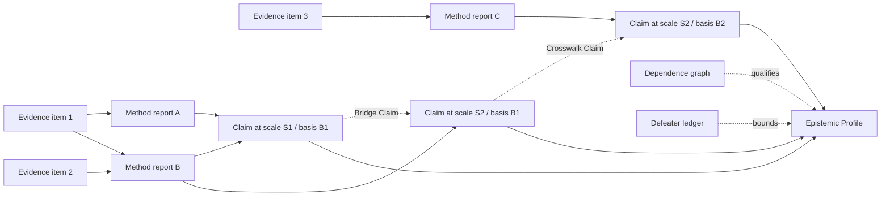

# Synthesis-method reference

Use this reference to create a synthesis that preserves provenance, dependence, scales, and bases.

## Evidence topology



Reports A and B are not independent corroboration for `C1` when both derive from `E1`. Preserve the distinction between evidence, analysis, and claim.

## Per-input identity contract

Do not replace input identity with aggregate coverage. For every input retain:

```yaml
artifact_id: ""
artifact_type: ""
artifact_revision: 1
relationship: "supports | challenges | qualifies | contextualises"
basis_ids: []
scale_regions: []
method_pass_ids: []
domain_profiles: []
assumptions: []
uncertainties: []
provenance:
  sources: []
  transformations: []
```

The synthesis-level identity coverage is derived from these records. It must not become the only surviving representation of their origins.

## Conflict Ledger entry

```yaml
conflict_id: ""
claim_ids: []
conflict_type: contradiction | scope | scale | construct | method | value | implementation | incomparability
compatible_comparison: true
shared_dependencies: []
bridge_claims: []
crosswalk_claims: []
current_resolution: ""
residual_uncertainty: ""
discriminating_evidence: []
reopening_conditions: []
```

## Epistemic Profile

Use a profile rather than one scalar when the dimensions diverge. For each chosen dimension, record:

- assessment and calibrated language;
- direct evidence;
- challenging evidence;
- dependence and assumption sensitivity;
- scope and validity domain;
- defeaters and missing evidence.

An empirically robust short-term association can coexist with weak mechanism, narrow transferability, and high decision relevance. Do not average those into an opaque score.

## Resolution discipline

Resolve only when a documented operation warrants it:

- correct a demonstrable error;
- narrow claims to compatible scopes;
- apply an evidenced scale bridge;
- apply an honest crosswalk;
- condition on context or population;
- distinguish empirical from value disagreement;
- collect discriminating evidence later.

Otherwise preserve the conflict. “Both contribute” is not a resolution unless the combination and its assumptions are specified.
