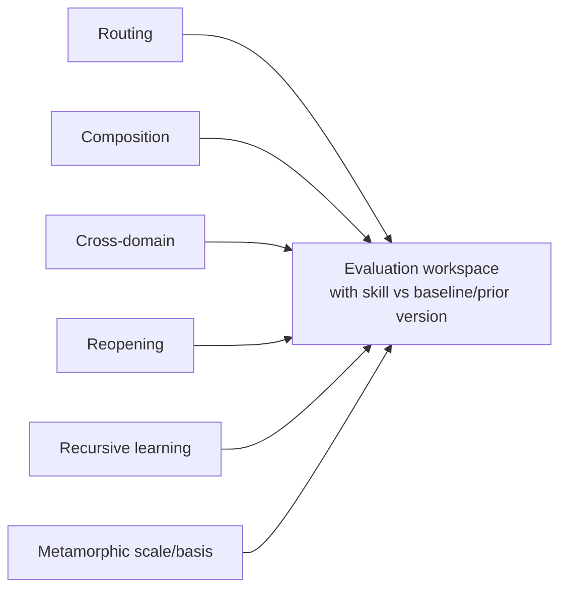

# Parallax collection evaluation suites

These suites test behaviour that no individual skill can establish alone: missed activation, sibling confusion, co-activation, artifact hand-offs, cross-domain overlays, reopening, recursive learning, and metamorphic invariants.

The JSON follows the Agent Skills `evals/evals.json` authoring pattern: `skill_name`, realistic `prompt`, human-readable `expected_output`, optional files, and observable assertions. `skill_name` is `parallax` because it is the collection facade; `metadata.scope` marks these as collection-level cases.

The converging branches show independent suites entering the same comparative evaluation process; they do not imply a sequence among suites.

## Suites

| Directory | Concern |
|---|---|
| `routing/` | Correct skill discovery, decline, direct entry, depth, and co-activation |
| `composition/` | Artifact contracts, protected branches, external capabilities, and hand-offs |
| `cross-domain/` | Stackable investigation, science, software, and product profiles |
| `reopening/` | Defeaters, thresholds, immutable revision, and targeted re-entry |
| `recursive-learning/` | L0/L1/L2 distinction, Practice binding, proposals, and governance |
| `metamorphic-scale/` | Predictable behaviour under scale, basis, provenance, authority, and time transformations |
| `contract-compatibility/` | Common envelopes, producer/consumer semantics, readiness, overlays, and plural profiles |

## Running and grading

1. Start each run in a clean context.
2. Compare the current collection with no skill and, after v0.1.0, the prior released version.
3. Record output artifacts, transcript, timing, tokens, and external/human cost in a workspace outside this bundle.
4. Grade each assertion with concrete cited evidence; use deterministic checks where possible.
5. Review representative outputs blind to configuration.
6. Record unexpected failures before changing skills; preserve held-out cases.
7. Rerun the full regression portfolio after any description, artifact, graph, or procedure change.

These authored cases make v0.1.0 evaluation-ready. They are not evidence that it has passed.
