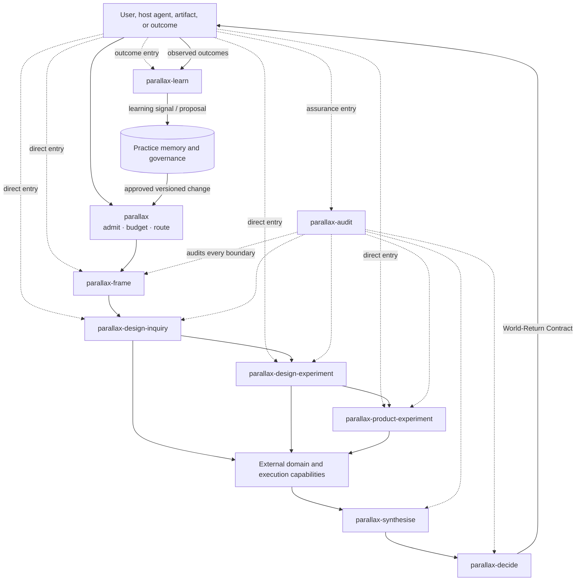

# Parallax collection reference

Parallax is a portable collection of agent skills for disciplined inquiry, experimental design, synthesis, decision-making, assurance, and recursive learning. It supports investigation, science, software engineering, and digital product development without reducing those domains to a single method or standard of warrant.

This directory is the collection-level reference corpus. The independently invocable canonical definitions live in `.agent/skills/*/SKILL-CANONICAL.md`; they are deliberately non-discoverable to vendor scanners. The embedding repository generates discoverable adapters from them. This corpus explains their shared theory, protocol, topology, and governance. It is not itself a skill and is not automatically loaded into an agent's context.

## Collection status

- **Version:** 0.1.0
- **Maturity:** evaluation-ready operational draft; not yet empirically validated
- **Canonical surface:** `.agent` only
- **Vendor adapters:** deliberately excluded; the embedding repository generates them
- **Persistence:** supplied by the embedding Practice, never by private skill state
- **Authority:** normative prose and machine-readable graph manifests together; conflicts must be resolved explicitly, not silently
- **Licensing:** this bundle grants no separate licence; the host repository's licence and notices govern it

## Skill catalogue

| Skill | Primary entry condition | Principal result |
|---|---|---|
| `parallax` | A consequential, uncertain, multiply framed, or cross-scale inquiry needs admission, routing, and orchestration | Inquiry Charter, bounded run plan, and coordinated inquiry |
| `parallax-frame` | Constructs, boundaries, scales, stakeholders, question types, or decompositions may be wrong or incomplete | Frame Set, Scale Map, and alternative decompositions |
| `parallax-design-inquiry` | An empirical, causal, formal, interpretive, normative, design, or mixed question needs an evidence strategy | Inquiry Design and Evidence Plan |
| `parallax-design-experiment` | An intervention can be deliberately varied and its consequences observed | Experimental Design, estimand, power/precision analysis, and analysis plan |
| `parallax-product-experiment` | A digital product or service intervention needs an online, quasi-, staged, or controlled evaluation | Product Experiment Protocol, telemetry contract, guardrails, and decision rule |
| `parallax-synthesise` | Multiple evidence bodies, methods, frames, or scales need reconciliation without forced collapse | Conflict/Dependence/Defeater Ledger and Epistemic Profile |
| `parallax-decide` | Available knowledge must be translated into an action under uncertainty and values | Decision Record, reversibility plan, monitoring, and World-Return Contract |
| `parallax-audit` | Existing inquiry, experiment, synthesis, or decision needs independent adversarial assurance | Audit Report, blocking findings, and reopen/escalate recommendations |
| `parallax-learn` | Outcomes, repeated inquiries, or evaluation evidence are available for method or routing improvement | Learning Signal or governed Improvement Proposal for the Practice |

The catalogue is flat for standards-compliant discovery. Runtime relationships are richer: guarded activation, alternatives, overlays, parallel composition, inhibition, audit, escalation, reopening, and policy updates.

## Reading map

| Need | Read |
|---|---|
| Safely merge and integrate the bundle | [installation.md](installation.md) |
| Release history and validation state | [CHANGELOG.md](CHANGELOG.md) |
| Philosophical and methodological foundation | [framework.md](framework.md) |
| Provenance of inherited and conversation-derived concepts | [concept-provenance.md](concept-provenance.md) |
| Packaging, control planes, and skill topology | [architecture.md](architecture.md) |
| When and how agents enter the collection | [invocation-and-entry-points.md](invocation-and-entry-points.md) |
| Meaning of the different graph projections | [graph-semantics.md](graph-semantics.md) |
| Same-scale, cross-scale, and basis pluralism | [multi-scale-model.md](multi-scale-model.md) |
| Stackable investigation, science, software, and product profiles | [domain-profiles.md](domain-profiles.md) |
| Shared artifacts, states, identity, and provenance | [artifact-protocol.md](artifact-protocol.md) |
| General and product experimental-design boundary | [experimental-design-boundaries.md](experimental-design-boundaries.md) |
| Host memory, critique, learning, and governed change | [practice-memory-and-learning.md](practice-memory-and-learning.md) |
| Evaluation portfolio and release gates | [evaluation-and-governance.md](evaluation-and-governance.md) |
| Lessons about designing agent skills | [skill-design-meta-learning.md](skill-design-meta-learning.md) |
| Theory-to-operation coverage | [traceability-matrix.md](traceability-matrix.md) |
| Terms | [glossary.md](glossary.md) |
| Primary sources | [references.md](references.md) |

Machine-readable graph definitions are in [`graphs/`](graphs/). Collection-level integration evaluations are in `.agent/evaluations/parallax/`; skill-local evaluations remain inside each skill directory. Authored evaluations are executable specifications, not evidence that the collection has passed them.

## Collection at a glance

The arrows above are a readable projection, not a fixed pipeline. Direct entry, parallelism, iteration, reopening, refusal, and reduced-depth operation are all first-class.

## Normative language

`MUST`, `MUST NOT`, `SHOULD`, `SHOULD NOT`, and `MAY` indicate collection requirements, recommendations, discouraged behaviour, and options. Parallax records justified exceptions rather than pretending a universal procedure fits every inquiry.
