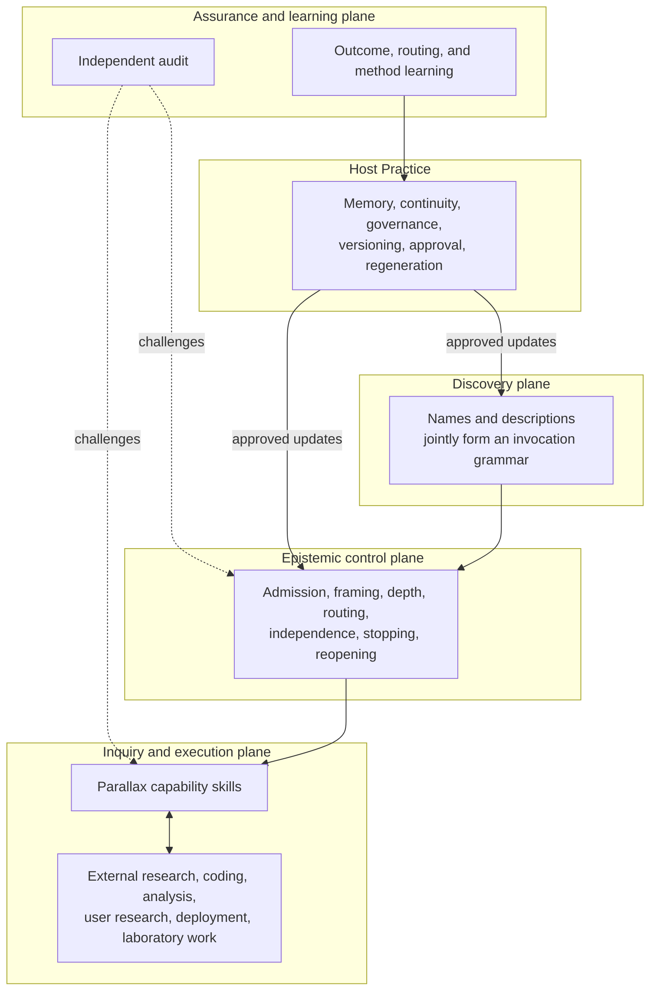
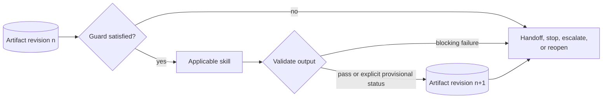
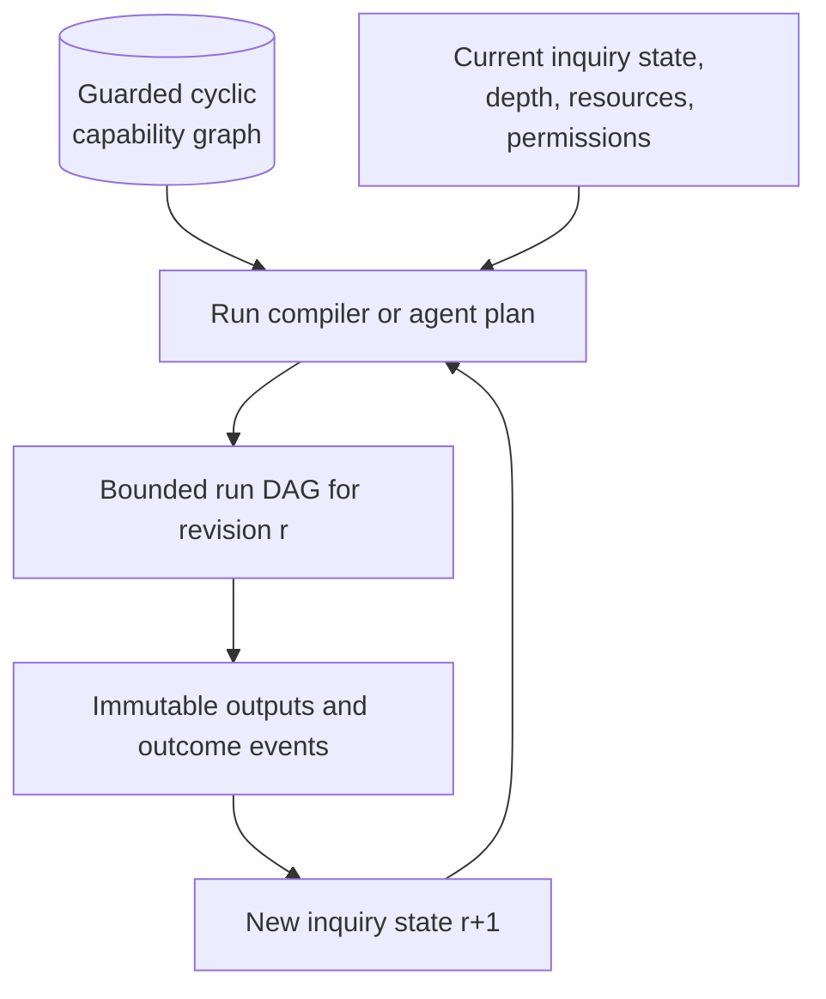

# Collection architecture and topology

## Architectural conclusion

Parallax is best implemented as:

> one recognisable family, multiple independently discoverable entrances, a shared artifact protocol, and a guarded cyclic capability network that materialises bounded run DAGs.

It is not one monolithic skill, a deep skill hierarchy, or a binary separation between “thinking” and “doing.”

## Why this topology

The Agent Skills format supplies flat discovery through each skill's `name` and `description`, then progressive disclosure through `SKILL.md` and referenced resources. It does not standardise dependencies, child skills, automatic chaining, shared state, subagents, or workflow runtimes. The portable Parallax architecture therefore expresses composition through artifacts and guarded hand-offs. Hosts MAY automate those contracts, but minimum correct behaviour remains possible through ordinary agent reads and writes.

The collection distinguishes four concerns:



### Discovery plane

Skill descriptions are the public routing interface. They MUST be designed and evaluated as a set. Overlapping descriptions create activation collisions; gaps create false negatives that no unloaded skill can detect.

### Epistemic control plane

`parallax` supplies admission, depth selection, invocation planning, shared invariants, and closure. Narrower skills can be invoked directly and MUST reconstruct or request their required context rather than assuming the orchestrator ran first.

### Inquiry and execution plane

The collection designs and evaluates inquiry. It composes with external capabilities that search, code, deploy, recruit participants, run laboratory procedures, or operate domain systems. Parallax does not absorb all “doing” skills; it specifies when outputs can count as evidence and how they relate to claims, scales, and decisions.

### Assurance and learning plane

Every skill critiques and validates its own output. `parallax-audit` adds protected challenge. `parallax-learn` turns outcomes and evaluation evidence into learning signals or governed improvement proposals; it does not directly mutate skills.

### Host Practice

Skills are stateless. The Practice supplies durable memory, inquiry continuity, proposal review, canonical updates, and vendor-adapter generation.

## Package boundary

```text
.agent/
├── skills/
│   ├── parallax/
│   ├── parallax-frame/
│   ├── parallax-design-inquiry/
│   ├── parallax-design-experiment/
│   ├── parallax-product-experiment/
│   ├── parallax-synthesise/
│   ├── parallax-decide/
│   ├── parallax-audit/
│   └── parallax-learn/
├── reference/
│   └── parallax/                  # This collection-level corpus and graph manifests
└── evaluations/
    └── parallax/                  # Cross-skill and system-level evals
```

Each skill owns its `SKILL-CANONICAL.md`, focused references/assets/scripts, and local `evals/evals.json`. Collection evaluations cover routing, co-activation, hand-offs, cross-domain composition, reopening, and recursive learning.

## Why nine skills

The seams are based on independently recognisable invocation conditions and artifact contracts, not philosophical categories or arbitrary lifecycle phases.

| Seam | Why independently discoverable |
|---|---|
| Orchestration | A user or agent may ask for end-to-end disciplined inquiry without knowing the needed methods |
| Framing | “We may be solving the wrong problem” is a common direct request with a useful independent output |
| Inquiry design | Evidence planning applies when an experiment is impossible, unethical, unnecessary, or only one component |
| General experimental design | Deliberate intervention, estimands, allocation, power/precision, and analysis have a distinct trigger and specialist procedure |
| Digital product experimentation | Online systems add instrumentation, interference, novelty, guardrails, staged delivery, and organisational decision semantics |
| Synthesis | Existing evidence can need reconciliation without reopening the whole lifecycle |
| Decision | Knowledge-to-action under values, reversibility, and uncertainty is independently useful |
| Audit | Assurance must be invocable independently and protected from the process it examines |
| Learning | Outcome and portfolio entry happen later and often in a different session or context |

## Artifact-mediated composition

Skills SHOULD NOT rely on hard-coded skill-to-skill calls. They consume explicit artifact types, produce new immutable revisions, and expose eligible transitions.



This preserves portability, makes provenance inspectable, and allows a host to implement serial execution, parallel agents, a workflow engine, or human hand-offs without changing the epistemic protocol.

## Cyclic semantics, acyclic execution

The enduring capability network contains cycles: synthesis can reopen framing; audit can reopen design; outcomes can reopen the inquiry; learning can revise future routing. A single inquiry revision, however, SHOULD compile to a bounded run DAG.



An agent can act as the run compiler. Machine-readable manifests make automation possible but do not require it.

## Portable and enhanced execution profiles

| Profile | Required host capability | Behaviour |
|---|---|---|
| Portable serial | Skill discovery plus file access | One agent follows artifact contracts and records dependence explicitly |
| Parallel | Multiple isolated contexts or agents | Protected passes can run concurrently; independence is assessed, not assumed |
| Workflow-assisted | Host can interpret graph manifests | Guards and artifact readiness can materialise a run DAG automatically |
| Practice-integrated | Durable memory and governance | Outcomes, learning signals, proposals, evaluations, and approved revisions persist |

No epistemic claim becomes stronger merely because a more capable execution profile was used.

## Failure-containment principles

- `parallax` MAY decline or delegate routine work instead of adding ceremony.
- A direct-entry skill MUST declare missing inputs and may initialise, reduce scope, request information, hand off, or decline.
- Parallel passes MUST record common dependencies and anchoring.
- Domain profiles MAY modify evidence criteria but MUST NOT weaken collection invariants silently.
- An audit that shares authoring context MUST be labelled self-review, not independent audit.
- Skills MUST NOT write durable memory or rewrite themselves.
- Experimental design MUST NOT imply that randomisation, significance, or power makes an invalid construct or estimand meaningful.
- Product experiments MUST NOT turn user exposure into an ethical or accessibility exemption.
