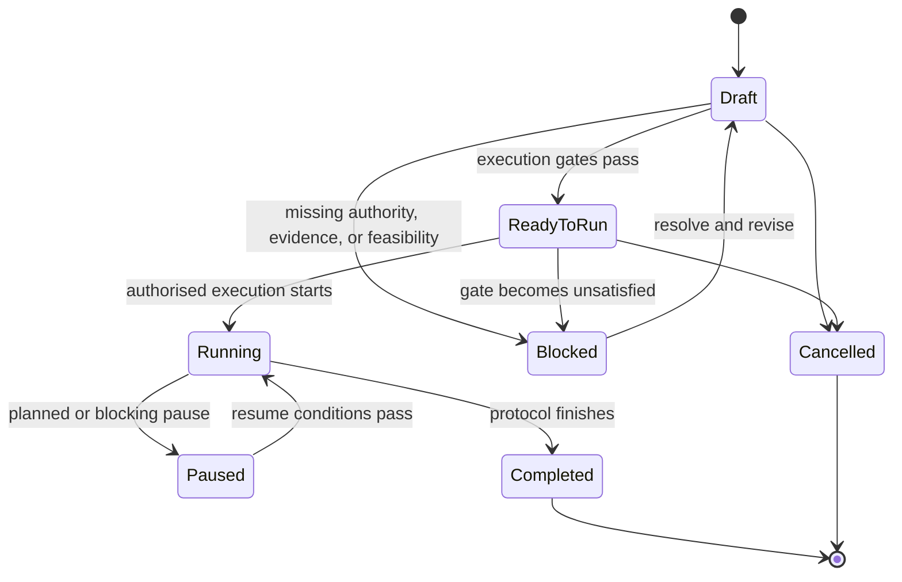
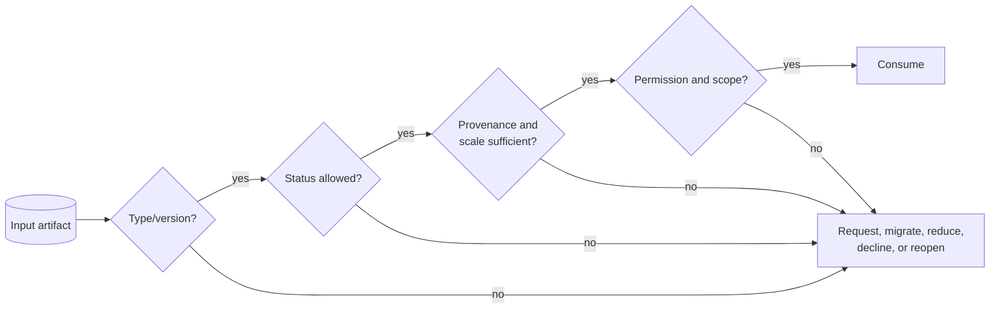

# Shared artifact protocol

## Role

Artifacts are the portable composition and provenance protocol. They allow independent skill invocation, serial or parallel execution, host-managed persistence, human inspection, and future workflow automation without requiring a standard skill-chaining mechanism.

Artifacts are logical types. A host may represent them as Markdown with frontmatter, JSON, database records, issue objects, or another durable form, provided the required semantics remain explicit.

## Common envelope

Every durable Parallax artifact SHOULD contain:

```yaml
schema_version: "parallax/inquiry-charter/0.1"
artifact_id: globally-or-repository-unique-id
artifact_type: inquiry-charter
inquiry_id: stable-id
inquiry_revision: 3
artifact_revision: 1
status: provisional
created_at: 2026-08-02T12:00:00Z
created_by:
  kind: agent-or-human
  identifier: explicit-if-available
producing_skill:
  name: parallax-frame
  version: "0.1.0"
execution_context:
  run_id: run-unique-id
  mode: standard
  independence: shared-context
  host: host-identifier-if-available
inputs:
  - artifact_id: prior-id
    artifact_revision: 2
permissions_and_scope:
  requested_operation: framing-analysis
  task_artifact_writes: true
  practice_memory_writes: false
  decision_authority: false
  external_actions: false
identity:
  basis_ids: []
  scale_regions: []
  method_pass_ids: []
  domain_profiles: [software-engineering, digital-product-service]
provenance:
  sources: []
  transformations: []
assumptions: []
uncertainties: []
validity_domain: null
defeaters: []
reopen_when: []
```

Examples are illustrative; canonical schemas and templates supplied by skills control exact syntax.

In v0.1.0 the common envelope is a semantic contract, not a claim that every nested value has one field-for-field representation. For example, specialised schemas may express `validity_domain` as a scoped statement or a structured mapping, and may encode permissions as allowed/excluded operations or named authority flags. Consumers MUST dispatch on `schema_version`, validate the producer's canonical schema, and perform an explicit, provenance-preserving migration before cross-type automation. Similar labels alone do not establish machine compatibility. Normalising a nested convention is a versioned schema change, not an incidental rewrite.

Artifact types with operational progression MAY add `lifecycle_state`. It is not required in the common envelope and MUST remain semantically separate from `status`.

## Artifact vocabulary

| Artifact | Purpose | Typical producer | Typical consumer |
|---|---|---|---|
| Inquiry Charter | Purpose, impact, claims, stakeholders, constraints, stakes, depth, stop/reopen conditions | `parallax` | All skills |
| Frame Card | One framing's constructs, units, boundaries, standpoint, assumptions, predictions, blind spots | `parallax-frame` | Design, synthesis, audit |
| Frame Set | Alternative and related frames plus coverage/dependence assessment | `parallax-frame` | Design, synthesis |
| Scale Map | Scale dimensions/regions, claim roles, and proposed bridges | `parallax-frame` | All downstream skills |
| Bridge Claim | Evidenced transformation or mechanism between scale regions | Frame/design/synthesis | Audit, synthesis, decide |
| Crosswalk Claim | Partial mapping between conceptual bases | Frame/synthesis | Audit, decide |
| Alternative Register | Explanations, hypotheses, designs, nulls, and retirement conditions | Frame/design | Experiment, synthesis |
| Inquiry Design | Question types, methods, evidence plan, sampling, analysis, ethics, validity and stopping | `parallax-design-inquiry` | External executors, synthesis, audit |
| Experimental Design | Units, estimand, intervention, allocation, controls, power/precision, analysis, stopping, ethics | `parallax-design-experiment` | External executors, product experiment, audit |
| Product Experiment Protocol Overlay | Typed additions to a referenced general design: telemetry, exposure, guardrails, rollout, interference and product decision contract | `parallax-product-experiment` | Engineering/product/analytics executors, audit |
| Evidence Record | Claim-relevant observation with provenance, quality, transformations, dependence, scale and basis | External execution or design skills | Synthesis, audit |
| Method Report | Procedure, outputs, diagnostics, assumptions, limitations, error probes, status | Any executing capability | Synthesis, audit |
| Conflict/Dependence/Defeater Ledger | Disagreements, common dependencies, live threats, resolved and unresolved challenges | `parallax-synthesise` | Decide, audit, learn |
| Epistemic Profile | Multidimensional strength, weakness, applicability, residual uncertainty and decision relevance | `parallax-synthesise` | Decide, audit |
| Decision Record | Options, evidence, values, rights, distributions, risk, reversibility, rationale and authority | `parallax-decide` | Audit, monitoring, learn |
| World-Return Contract | Predicted outcomes, metrics/observations, thresholds, timing, ownership, harms, stop/reopen actions | `parallax-decide` or experiment skills | Monitoring, learn |
| Audit Report | Scope, independence, findings, severity, evidence, blockers and required reopen/escalation | `parallax-audit` | Any owner/governance process |
| Outcome Event | Timestamped observation relative to a World-Return Contract, including side effects and distribution | Host/external system/human | Learn, reopen, synthesis |
| Learning Signal | Bounded observation about object, method, routing, cost, or learning policy | Any skill, consolidated by learn | Practice memory |
| Improvement Proposal | Evidence-backed versioned change, expected benefit, risk, eval and rollback plan | `parallax-learn` | Practice governance |

## Epistemic status and operational lifecycle

`status` and `lifecycle_state` are orthogonal:

- `status` is the common epistemic disposition: `validated`, `provisional`, `inconclusive`, `insufficient-evidence`, `declined`, `reopened`, or `superseded`.
- `lifecycle_state` describes operational progress for artifact types that need it, such as `draft`, `ready-to-run`, `running`, `paused`, `completed`, `blocked`, or `cancelled`.

An Experimental Design can be epistemically `provisional` and operationally `ready-to-run`; a completed run can still produce an `inconclusive` Method Report. Operational completion MUST NOT be presented as epistemic validation.



The diagram projects `lifecycle_state` only. Epistemic `status` changes are versioned artifact events. `validated` means validated against declared criteria, not universally true. `superseded` preserves history. `reopened` creates a new inquiry revision.

## Identity and revision rules

- `inquiry_id` remains stable across reopenings of the same underlying inquiry.
- `inquiry_revision` increments when charter, framing, design, or conclusion is materially reopened.
- `artifact_id` identifies a logical artifact lineage; `artifact_revision` increments for corrections that do not require a new inquiry revision.
- Material reinterpretation SHOULD create a new artifact rather than silently edit the old one.
- Derived artifacts MUST identify exact input revisions.
- Parallel branches MUST use distinct artifact identities even if their prompts or methods are similar.
- A merge or synthesis MUST retain all material parents.
- Retraction, invalidation, and supersession MUST be explicit events.

## Readiness and hand-off

An artifact is ready for a consumer only if:

1. its type and version are supported or deliberately migrated;
2. required fields for the intended depth are present;
3. epistemic status is permitted by the consumer;
4. lifecycle state, where present, is suitable for the operation;
5. provenance resolves sufficiently for the claim being made;
6. scale and basis context is present or explicitly inapplicable;
7. permissions and user scope allow the next action;
8. blocking audit findings are resolved, accepted by authorised decision-makers, or carried forward visibly.

Template placeholders, sentinel values, empty required strings, and unresolved `TODO` fields MUST fail any readiness transition even when the file parses and its structural schema is otherwise valid. Structural validity is not operational readiness, and operational readiness is not epistemic validation.



## Evidence and dependence

Evidence Records SHOULD distinguish:

- source from transformation;
- observation from interpretation;
- primary from secondary evidence;
- direct from proxy measures;
- relevance from quality;
- uncertainty from disagreement;
- missingness from negative evidence;
- repeated evidence from independent evidence.

Dependence attributes may include shared original source, dataset, instrument, analyst, model family, prompt, code path, theoretical assumption, recruitment channel, or operational system. Synthesis uses this graph rather than treating evidence count as weight.

## World-Return Contract

The World-Return Contract closes the recursive loop. It includes:

- action or conclusion being exposed to the world;
- predicted outcomes and plausible adverse outcomes;
- observation and consequence scales;
- measures plus qualitative or participatory observations;
- baseline and comparison where meaningful;
- thresholds for success, concern, stop, rollback, and reopen;
- observation times and expiry;
- distributional and accessibility effects;
- responsible owner or host process;
- response when monitoring is unavailable;
- link back to the decision, experiment, frames, and claim set.

Absence of monitoring data is itself an outcome-state and may invalidate closure.

## Practice boundary

Artifact production is not memory ownership. Skills may read and write task artifacts within authorised scope, but durable placement, retention, consolidation, and graduation are governed by the embedding Practice. A skill MUST NOT create an undisclosed private memory store, append permanent lessons automatically, or edit its own canonical instructions.
