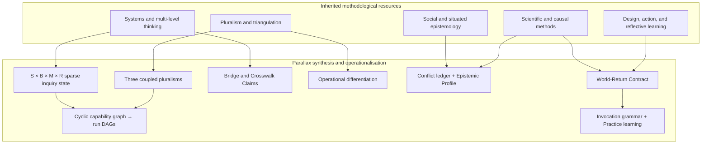

# Concept provenance and original formulation

## Epistemic status

Parallax is a synthesis and operational formulation, not a claim to have invented methodological pluralism, multi-scale analysis, triangulation, experimental design, systems thinking, reflective practice, or meta-learning. Its inherited components have long and diverse intellectual histories.

The contribution developed in the originating conversation is the particular architecture that connects those components into an agent-usable, artifact-mediated, recursively evaluable collection. At v0.1.0 this is a design hypothesis: coherent and evaluation-ready, not empirically validated and not a claim of philosophical priority.

## Inherited foundations

The following are inherited families of ideas, with representative primary sources in [references.md](references.md):

- empirical vulnerability, falsification, severe testing, and error detection;
- Bayesian updating and decision under uncertainty;
- abduction, pragmatism, and learning through consequences;
- paradigms, research programmes, and methodological pluralism;
- causal inference, mechanisms, experimental and quasi-experimental design;
- triangulation and mixed methods;
- systems thinking, feedback, emergence, and multi-level explanation;
- construct validity and measurement theory;
- social epistemology, standpoint, transformative criticism, and situated knowledge;
- design science, action research, and reflective practice;
- single- and double-loop organisational learning;
- open science, preregistration, reproducibility, and transparent revision;
- sequential decision-making, controlled online experiments, and digital product evaluation.

## Conversation-derived synthesis and constructs

### 1. Three explicitly coupled pluralisms

Parallax names and combines:

1. **same-scale methodological pluralism**—composite or protected parallel methods/perspectives at a declared scale and basis;
2. **cross-scale pluralism**—instances of same-scale pluralism at multiple scales connected by explicit bridge claims;
3. **basis/decomposition pluralism**—alternative conceptual coordinate systems that reveal different constructs, boundaries, relationships, and blind spots.

Pluralism itself is inherited; the explicit three-part coupled topology is the Parallax formulation.

### 2. Sparse inquiry state across scale, basis, method, and revision

The conversation first used the intuition of an N-dimensional conceptual space examined through different basis sets. Parallax operationalises inquiry execution as a sparse set across scale, conceptual basis, method/perspective, and immutable revision:

\[
C \subseteq S \times B \times M \times R
\]

Domain profiles may be added as an overlay dimension where useful. This is a modelling device, not a claim that concepts form a literal linear vector space.

### 3. Operational differentiation instead of literal orthogonality

Strict orthogonality rarely has a defensible metric in conceptual spaces. Parallax substitutes operational tests: different primitives, boundaries, causal directions, evidence demands, standpoints, blind spots, or incremental information. Dependence and residual incomparability are recorded rather than denied.

### 4. Bridge Claims and Crosswalk Claims

- A **Bridge Claim** makes movement between scale regions a first-class evidential object.
- A **Crosswalk Claim** makes translation between bases/decompositions a first-class, potentially partial, asymmetric, lossy, or impossible mapping.

The underlying problems of aggregation, transport, construct mapping, and incommensurability are inherited; making these reusable artifact types across every agent skill is a Parallax operationalisation.

### 5. Synthesis through an Epistemic Profile

Parallax rejects both majority voting across method passes and premature scalar confidence. It synthesises through conflict, dependence, and defeater ledgers plus a multidimensional Epistemic Profile. Scalar decision quantities may be derived for a declared rule but cannot erase blocking dimensions.

### 6. World-return closure

Reflective and pragmatic traditions connect ideas to consequences. Parallax makes that connection an explicit **World-Return Contract**: predicted and adverse outcomes, scales, observation windows, thresholds, ownership, rollback, and reopening conditions. This contract closes object, method, and learning-policy loops through later observations.

### 7. Cyclic capability network that generates run DAGs

The reusable collection is a guarded cyclic network because evidence, audit, action, and outcomes can reopen earlier work. One inquiry revision materialises as a bounded DAG, and provenance is append-only. Thus:

> Parallax is not a DAG; it generates DAGs.

This reconciles recursive epistemic semantics with reproducible execution and causal history.

### 8. Invocation grammar as part of epistemology

Agent Skills descriptions jointly determine whether a method enters the agent's context. Parallax therefore treats skill invocation, co-activation, inhibition, depth selection, and missed activation as methodological choices subject to L1/L2 learning—not merely package metadata.

### 9. Artifact-mediated skill federation

The combination of one orchestrating facade, independently discoverable sibling skills, typed artifacts, guarded hand-offs, direct entry, and Practice-owned memory is the proposed portable topology. It separates:

- flat standards-level discovery;
- cyclic capability semantics;
- bounded run DAGs;
- immutable provenance;
- host-governed persistence and improvement.

### 10. Recursive closure of skill improvement

Skill updates alone are not successful meta-learning. Parallax requires later evidence that changes to methods or invocation policy improve subsequent object-level outcomes without disproportionate cost. Changes to the learning/update policy are themselves evaluated in later cycles.

## Construct map

The arrows indicate intellectual and functional contribution, not exclusive derivation or priority.

## Attribution discipline

When publishing or extending Parallax:

- cite representative traditions and primary sources rather than presenting inherited ideas as novel;
- label conversation-derived names and compositions as formulations, hypotheses, or operational constructs;
- avoid claiming mathematical properties for an analogy;
- record where similar formalisms are later found and update this document;
- invite domain and philosophy-of-science review;
- treat evidence of prior art as enrichment and correction, not a threat to the framework.
