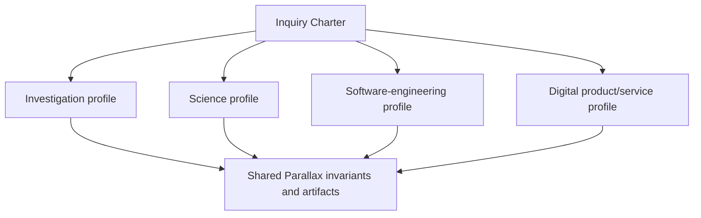
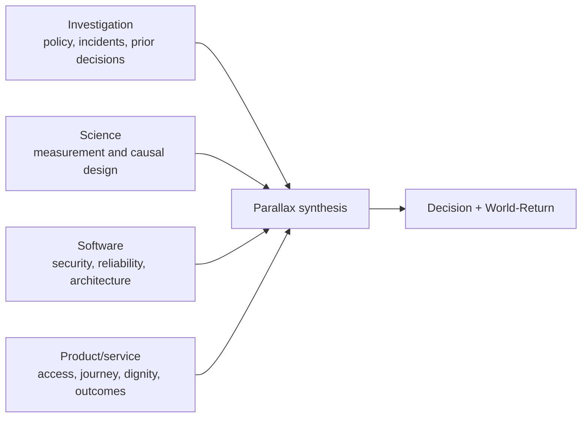

# Stackable domain profiles

## Purpose

Profiles adapt evidence criteria, scale dimensions, likely methods, artifacts, and external hand-offs without forking the Parallax invariants. They are labels and procedures carried by an inquiry, not separate memory stores or mutually exclusive hierarchy branches.

An inquiry may activate any non-empty subset of:

- `investigation`;
- `science`;
- `software-engineering`;
- `digital-product-service`.

The converging arrows mean each selected profile constrains the same inquiry; they do not collapse domain-specific warrant into one generic standard.

## Profile selection

Select a profile when material claims or actions depend on its evidence standards or execution environment. Use more than one when the theory of change crosses domains—for example, a software change evaluated through product experimentation as part of a public-service impact inquiry.

Do not select a profile merely because its vocabulary appears in a prompt. Record why it changes the plan.

## Investigation profile

### Use when

- claims must be established from documents, testimony, public records, repositories, logs, media, datasets, or open sources;
- chronology, identity, provenance, contradiction, or source dependence matters;
- the task is exploratory or explanatory but not yet a formal experiment;
- an evidence dossier or claim graph is needed.

### Characteristic criteria

- source authenticity, custody, proximity, competence, incentives, and date;
- primary versus derivative evidence;
- independent corroboration versus repeated common origin;
- claim-to-source traceability;
- chronology and entity resolution;
- selection, survivorship, publication, availability, and search bias;
- negative evidence versus absence of accessible evidence;
- fair treatment of testimony, context, uncertainty, and contested interpretation;
- legal, ethical, privacy, and safety constraints on acquisition and publication.

### Typical methods and evidence

- structured search and source discovery;
- primary-document review;
- archival and historical method;
- interviews and testimony appraisal;
- claim, entity, chronology, and provenance graphs;
- triangulation across source classes;
- document comparison, code/repository archaeology, and log analysis;
- alternative-explanation and counter-narrative passes;
- evidence tables, contradiction matrices, and gap analysis.

### Common scales

Document or event; person/entity; transaction/session; organisation; institution/ecosystem; immediate chronology; long historical development; local observation versus population claim.

### External doing-skill boundary

Parallax designs claim coverage and warrant. External capabilities browse/search, obtain authorised records, transcribe, extract, query databases, inspect repositories, run forensics, or conduct interviews. Qualified legal, security, safeguarding, journalistic, archival, or domain review is required where relevant. The profile does not authorise access, surveillance, deanonymisation, or publication.

## Science profile

### Use when

- the inquiry concerns empirical regularities, prediction, explanation, mechanisms, measurement, or causal effects;
- theory, observation, experiment, simulation, replication, or statistical inference must be related;
- claims need defined validity domains and uncertainty;
- scientific norms, preregistration, reproducibility, or specialist review matter.

### Characteristic criteria

- construct and operational validity;
- instrument reliability, calibration, detection limits, and uncertainty;
- sampling, randomisation, confounding, selection, missingness, and dependence;
- estimand and model alignment;
- severe or discriminating error probes;
- predictive calibration, robustness, sensitivity, and replication;
- mechanism and causal identification;
- external validity, transportability, and boundary conditions;
- transparent exploratory/confirmatory distinction;
- ethics, consent, welfare, and field-specific governance.

### Typical methods and evidence

- observation and measurement studies;
- prospective experiments and quasi-experiments;
- causal diagrams and identification analysis;
- statistical and Bayesian modelling;
- simulation and computational experiments;
- mechanistic modelling;
- systematic or structured evidence synthesis;
- qualitative and mixed methods;
- preregistration, registered reports, replication, and sensitivity analysis.

### Common scales

Measurement resolution; individual unit; sample; population; site; mechanism; environment; temporal process; laboratory versus field; model versus target system.

### External doing-skill boundary

Parallax specifies the inquiry and experiment contract and interprets method reports. External capabilities operate instruments, laboratories, fieldwork, statistical software, simulation infrastructure, participant recruitment, data stewardship, and specialist analyses. Regulated, clinical, hazardous, animal, or high-consequence research requires qualified institutional and domain review.

## Software-engineering profile

### Use when

- a claim concerns software behaviour, architecture, quality, reliability, security, performance, maintainability, or delivery;
- a change, incident, design, migration, or technical strategy requires multiple forms of evidence;
- local code evidence must connect to system, team, service, user, or organisational consequences;
- verification, observability, rollback, or production learning matters.

### Characteristic criteria

- requirements, invariants, contracts, and threat/failure models;
- repository and dependency provenance;
- static, dynamic, formal, test, runtime, and production evidence;
- representativeness of fixtures, benchmarks, loads, and environments;
- concurrency, partial failure, distributed state, and socio-technical interaction;
- security, privacy, accessibility, safety, and supply-chain constraints;
- deployability, observability, reversibility, recovery, and operational ownership;
- architecture trade-offs and evolutionary cost;
- user and public-value theory of change beyond technical proxy metrics.

### Typical methods and evidence

- code and architecture inspection;
- type checking, linting, static analysis, model checking, or formal proof where proportionate;
- unit, property, integration, contract, end-to-end, accessibility, security, performance, and resilience tests;
- runtime traces, logs, metrics, profiles, and incident evidence;
- dependency and change-impact analysis;
- prototypes, spikes, simulations, canaries, shadow traffic, and staged rollout;
- architecture decision records and comparative design analysis;
- post-incident and longitudinal maintainability evidence.

### Common scales

Expression/function; module/package; process; service; distributed system; platform; repository ecosystem; developer team; operating organisation; user journey; public service; commit/build/request/release/month/year horizons.

### External doing-skill boundary

Parallax frames, designs evidence, synthesises, and connects technical results to decisions. External engineering capabilities inspect and edit code, run builds/tests, provision infrastructure, query observability, perform security analysis, deploy, roll back, and operate incidents. Analysis or design does not grant authority to mutate repositories or production systems.

## Digital product/service profile

### Use when

- a decision concerns user need, experience, behaviour, adoption, retention, service delivery, product strategy, or intended human/public outcome;
- qualitative research, product analytics, experimentation, accessibility, design, engineering, and operational evidence must be connected;
- a theory of change links a feature or service intervention to user value or wider impact;
- distributions, guardrails, unintended effects, and long-term outcomes matter.

### Characteristic criteria

- validity of the user problem and intended outcome;
- representation of affected, excluded, and vulnerable groups;
- qualitative/quantitative triangulation;
- instrumentation and metric construct validity;
- distinction between engagement proxies and user/public value;
- usability, accessibility, dignity, autonomy, calm, trust, and harm;
- causal identification, exposure integrity, interference, novelty, and long-term transport;
- feasibility, viability, operational load, support burden, and sustainability;
- distributional and ecosystem effects;
- explicit product decision and rollback/monitoring contract.

### Typical methods and evidence

- interviews, observation, contextual inquiry, diary and participatory research;
- usability and accessibility evaluation;
- journey/service mapping and theory-of-change modelling;
- telemetry, funnels, cohorts, retention and behavioural analysis;
- online controlled, staged, quasi-, and mixed-method experiments;
- prototypes, pilots, beta programmes, feature flags, canaries, and holdouts;
- support, complaint, safeguarding, operational and qualitative feedback;
- market, policy, organisational, and ecosystem evidence where relevant.

### Common scales

Interaction; session; task; journey; person/household; cohort; product; service; organisation; institution/ecosystem; momentary response; adoption; durable outcome; intergenerational or public-impact horizon.

### External doing-skill boundary

Parallax owns question/decision alignment, evidence design, synthesis, and world-return structure. External product, design, analytics, research, accessibility, engineering, experimentation-platform, legal, safeguarding, and operations skills recruit, instrument, implement, deliver, and monitor. The profile does not authorise user exposure, tracking, messaging, or release.

## Cross-profile composition example

A proposed authentication redesign for a public curriculum service may require:

The four branches carry different criteria and may disagree. Synthesis records dependencies and conflicts instead of averaging them. The decision preserves hard safety/rights constraints and predicts outcomes at technical, journey, organisational, and public-value scales.

## Profile output contract

Each selected profile SHOULD add to the Inquiry Design:

- why the profile applies;
- profile-specific claims and warrant criteria;
- material scales, bases, stakeholders, and bridge claims;
- likely methods and protected alternatives;
- evidence and dependence requirements;
- external capability and authority boundaries;
- specialist-review needs;
- profile-specific harms, guardrails, and stop/reopen conditions;
- how its outputs will enter synthesis and world return.
