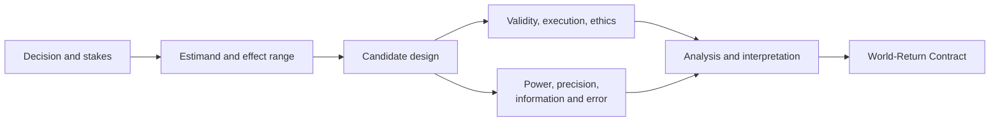
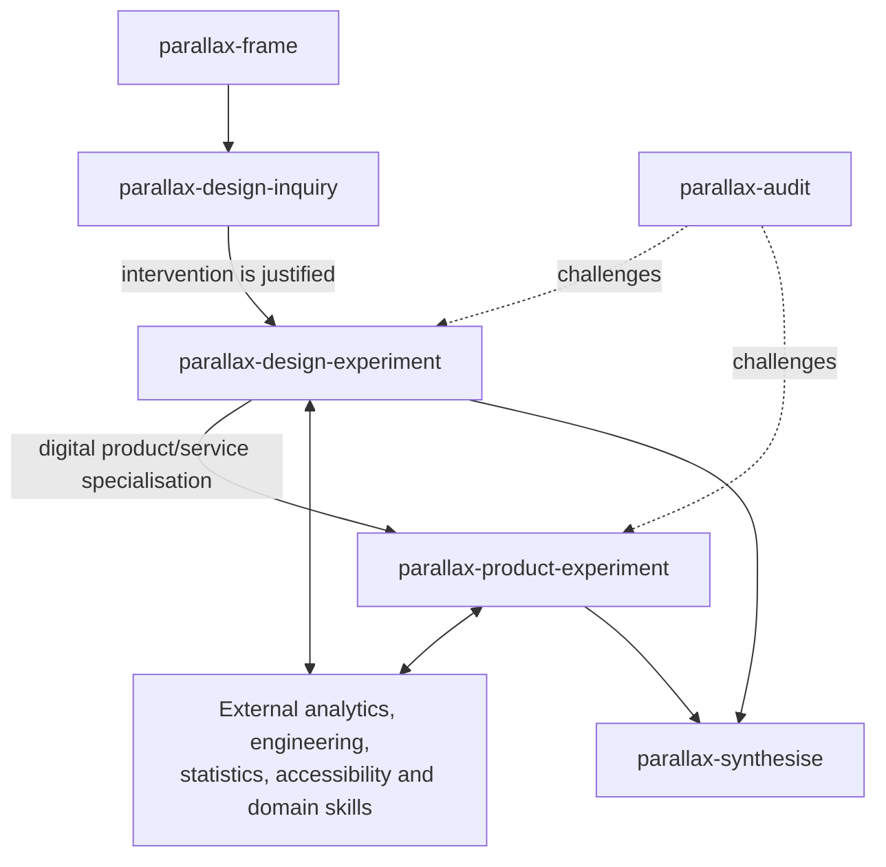

# Experimental-design boundaries

## Decision

Both general experimental design and digital product/service experimentation are first-class skills in the Parallax collection:

- `parallax-design-experiment` is the domain-general experimental-design capability.
- `parallax-product-experiment` specialises and overlays it for digital products and services, including but not limited to A/B testing.

They are also designed to compose with external specialist skills. Membership in the collection does not claim exhaustive expertise.

## Why general experimental design is internal

Experimentation operationalises several central Parallax commitments:

- making claims vulnerable to relevant error;
- distinguishing causal questions from descriptive ones;
- selecting among alternative methods rather than treating one method as universal;
- declaring units, scales, mechanisms, and bridge claims;
- specifying in advance what observations would matter;
- connecting conclusions to decisions and world-return outcomes;
- learning whether method selection worked.

If experimental design were only an external executor, the collection would hand off at precisely the boundary where estimands, validity, ethics, power/precision, analysis, and decision relevance must stay connected.

## General experimental-design scope

`parallax-design-experiment` covers, proportionately:

- decision, question, hypothesis, theory, mechanism, and alternative alignment;
- target population, intervention/condition, outcome, contrast, time horizon, and intercurrent events;
- estimands, estimators, estimates, uncertainty, and action rules as distinct objects;
- randomised, blocked, paired, crossover, factorial, cluster, sequential, adaptive, quasi-experimental, simulation, observational, N-of-1, and mixed-method alternatives;
- assignment, exposure, interference, contamination, compliance, fidelity, and attrition;
- measurement validity, reliability, calibration, reactivity, and missingness;
- confounding, selection, multiplicity, researcher degrees of freedom, and sensitivity;
- sample size, statistical power, precision, expected information, and decision error;
- protocol, preregistration, analysis plan, amendments, transparency, and reproducibility;
- ethics, privacy, accessibility, affected-party welfare, stop rules, and independent review;
- interpretation, external validity, transportability, monitoring, and world return.

### Power is necessary sometimes, sufficient never

Power answers a conditional question: given a design, model, effect, variance or base rate, allocation, error rate, analysis, and other assumptions, how often would the procedure meet its specified criterion? It does not establish that:

- the question is valuable;
- the construct is valid;
- the estimand matches the decision;
- the intervention is delivered as intended;
- the model assumptions hold;
- a chosen effect size is meaningful;
- the result generalises across populations, scales, or time;
- the experiment is ethical;
- a thresholded significance result deserves action.

The skill therefore considers power alongside precision, interval width, smallest effect of substantive interest, expected information, decision loss, feasibility, uncertainty in nuisance parameters, design effects, and simulation. Sensitivity curves are generally more informative than one optimistic sample-size number.

The diagram shows power as one coupled design component, not the centre or terminus of experimental reasoning.

## Why product experimentation is a separate internal skill

Digital product and service experiments have a recognisable direct invocation surface—A/B tests, feature flags, staged rollouts, funnel changes, messaging trials, online controlled experiments—and a recurring cluster of specialist hazards:

- randomisation unit, exposure unit, analysis unit, and account/household/device identity can differ;
- telemetry implementation is part of the measurement instrument;
- sample-ratio mismatch, bot traffic, missing events, identity stitching, and pipeline changes can invalidate inference;
- concurrent releases, caching, learning, novelty, seasonality, network effects, and interference are common;
- rapid repeated testing creates multiplicity, peeking, stopping, and institutional-memory problems;
- local metric movement may not transport to journey, organisational, or public-value scales;
- guardrails, accessibility, dignity, privacy, distributional effects, support burden, and operational reliability are side constraints;
- feature-flag rollout, rollback, experiment exposure, and long-term adoption are coupled engineering concerns;
- experiments serve decisions and theories of change, not merely metric optimisation.

Those concerns justify a separately discoverable skill rather than a long conditional appendix inside general experimental design.

## Relationship between the two skills

`parallax-product-experiment` can be invoked directly for routine digital experimentation. It SHOULD co-activate or hand off to `parallax-design-experiment` when general design depth is material: complex clustering, adaptive or sequential methods, weak identification, power/precision sensitivity, unusual interference, quasi-experimental inference, high stakes, or contested estimands.

Conversely, the general skill SHOULD invoke or hand off to the product skill when a digital service requires exposure logic, product telemetry, guardrails, rollout, or product decision semantics.

### Typed overlay when composed

When both skills are active, the Product Experiment Protocol is a typed overlay on a referenced general Experimental Design. It adds product-specific exposure, telemetry, feature-flag, guardrail, rollout, decision, and long-term monitoring fields; it does not copy or silently replace the base estimand, design assumptions, power/precision work, or analysis plan.

The overlay MUST record:

- the exact base Experimental Design artifact and revision;
- compatible schema/version expectations;
- a field-authority crosswalk distinguishing base-authoritative, overlay-authoritative, specialised, derived, and deliberately overridden fields;
- JSON paths or equivalent identifiers for each crosswalk entry;
- rationale and evidence for any override, with the base value preserved in provenance;
- joint readiness and audit status.

No semantically material field may have two unranked sources of truth. By default, the base design remains authoritative for estimand, design family, assignment, causal assumptions, power/precision, and general analysis; the overlay is authoritative for digital exposure, telemetry, feature flags, product guardrails, rollout/rollback, and product decision integration. A justified protocol may alter that division through an explicit versioned crosswalk.

If the product skill enters directly, it may initialise a minimal embedded general design for a routine case or hand off to `parallax-design-experiment`. Once a separate base design exists, the overlay references it rather than creating competing sources of truth.

## Product experimentation is broader than A/B testing

The skill covers controlled and uncontrolled evidential strategies including:

- A/B/n and factorial experiments;
- switchback, cluster, geographic, and stepped rollout designs;
- staged delivery with safety and operational gates;
- interrupted time series, regression discontinuity, difference-in-differences, matched comparison, and synthetic controls where randomisation is unavailable;
- holdouts and long-term holdbacks;
- sequential monitoring and predeclared stopping;
- bandits when allocation optimisation—not unbiased estimation alone—is the objective;
- qualitative and mixed-method work for mechanism, usability, accessibility, dignity, and unintended effects;
- observational telemetry and natural experiments with explicit identification limits.

It MUST be willing to recommend no experiment when the change is mandatory, obviously harmful, too low-volume for useful inference, unidentifiable, unethical to randomise, or better evaluated through verification, usability work, simulation, staged monitoring, or another design.

Every protocol MUST discriminate its `design_family`, at least among `randomized`, `quasi-experimental`, `observational`, and `staged-delivery/monitoring`. A before/after comparison, interrupted time series, difference-in-differences, regression discontinuity, synthetic control, or natural experiment MUST NOT be labelled or analysed as a randomised A/B test. Quasi-experimental protocols state the identification strategy, comparison construction, assumptions, diagnostics, falsification/placebo tests, sensitivity, and the limits of causal interpretation.

## Internal versus external boundary

The Parallax skills own the **inquiry contract**. External skills may supply deeper technical execution.

| Internal responsibility | Complementary external responsibility |
|---|---|
| Align question, estimand, evidence, scales, decision, and world return | Domain-specific substantive theory and threshold selection |
| Compare design families and expose assumptions | Specialised optimal-design or causal-identification methods |
| Perform or require proportionate power/precision/sensitivity work | Validated software and advanced simulation for complex designs |
| Specify telemetry and experimental validity requirements | Instrument events, flags, identity, pipelines, and dashboards |
| Establish ethics, accessibility, privacy, and stop conditions | Qualified ethics, legal, regulatory, security, or clinical review |
| Produce protocol, analysis and interpretation contracts | Execute laboratory, field, platform, or production procedures |
| Synthesize method reports and preserve limitations | Specialist peer review and domain replication |

Examples that normally require external expertise include clinical-trial regulation, animal research, hazardous laboratory work, advanced survey sampling, safety-critical hardware, privacy-preserving experimentation, complex Bayesian adaptive trials, and high-consequence public policy.

## Entry and authority constraints

Designing or critiquing an experiment does not authorise:

- exposing users or participants;
- deploying a feature;
- changing production allocation;
- collecting new personal data;
- recruiting participants;
- overriding an ethics, legal, accessibility, security, or governance gate.

The skill ends at an honest readiness state unless the user and environment separately authorise execution.

## Evaluation implications

The two skills need both local and collection tests:

- general design should trigger for power, estimands, controls, quasi-experiments, and design critique;
- product design should trigger for A/B, feature-flag, metric, exposure, rollout, and digital-service cases;
- routine A/B prompts should select the product skill without unnecessarily loading the general skill;
- complex product experiments should co-activate both;
- neither should trigger for a simple descriptive dashboard request;
- both should reject “just calculate power” when essential assumptions or a meaningful estimand are absent;
- product results should not silently transport from click/session metrics to durable user or public value;
- neither should treat statistical significance as sufficient for release.
