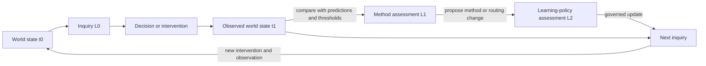
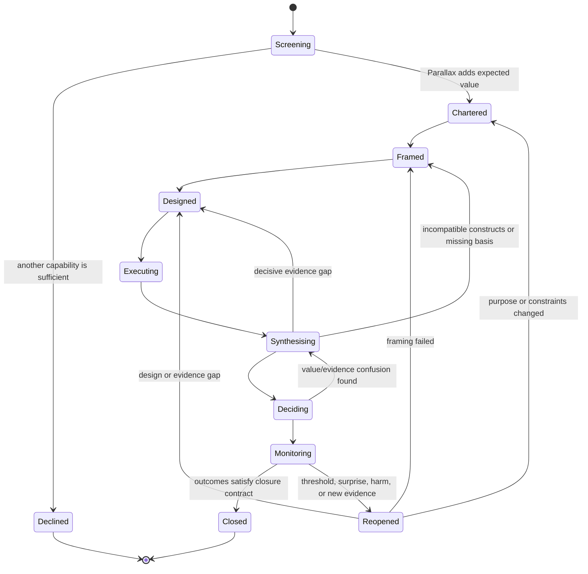

# The Parallax framework

## Purpose

Parallax is a general framework for responsible inquiry and intervention. It treats the familiar scientific-method cycle as one important family of inquiry practices rather than a universal linear algorithm. Its aim is to improve the quality of questions, evidence, synthesis, decisions, and learning when:

- more than one defensible framing exists;
- evidence and consequences span scales;
- different question types require different standards of warrant;
- the cost of error, delay, or over-analysis matters;
- work must return to observable consequences in the world; or
- agents need to improve how they select and apply methods over time.

Parallax is neither methodological relativism nor an instruction to run every method indiscriminately. It is constrained pluralism: methods earn authority through declared applicability, disciplined execution, vulnerability to relevant error, cross-checking, and eventual contact with consequences.

## Starting distinction: framework versus empirical vulnerability

Falsifiability is a property that can apply strongly to some claims and weakly or not at all to others. It is not an admission criterion for the entire inquiry framework.

| Question or claim type | Characteristic warrant |
|---|---|
| Empirical descriptive | Measurement validity, sampling, calibration, reproducibility, robustness |
| Predictive | Out-of-sample performance, calibration, error analysis, boundary conditions |
| Causal | Identifiability, counterfactual contrast, mechanism, design assumptions, sensitivity |
| Formal or mathematical | Valid derivation from declared axioms, definitions, and proof obligations |
| Interpretive or historical | Source provenance, explanatory fit, contextual coherence, triangulation, counter-reading |
| Normative | Explicit values, rights, duties, distributions, affected perspectives, consistency |
| Design or engineering | Fitness for intended use, constraints, failure modes, verification, observed effects |
| Exploratory | Discovery value, novelty, transparent multiplicity, follow-up testability |
| Mixed | A typed combination; no single standard may silently substitute for all components |

A formal theorem is normally proved or disproved relative to axioms; an empirical hypothesis may be exposed to severe tests; an interpretation may be challenged by sources and counter-interpretations; a design is judged partly through operation. Parallax preserves these differences while giving them a common inquiry protocol.

## Philosophical inheritance

Parallax synthesises compatible functions from traditions that are often treated as competitors:

- **Hypothetico-deductive and falsificationist traditions:** derive risky consequences and actively seek error.
- **Bayesian traditions:** update graded belief under stated models and priors; compare predictive adequacy.
- **Severe testing and error statistics:** ask whether a procedure would probably have detected an error if present.
- **Pragmatism and abduction:** generate explanatory possibilities and assess ideas through consequences.
- **Paradigm and research-programme accounts:** recognise that observations are structured by concepts and that theories often evolve as programmes rather than isolated hypotheses.
- **Methodological pluralism:** prevent one method from acquiring authority outside its validity domain.
- **Critical realism and causal-mechanistic inquiry:** distinguish observed regularities, events, structures, and mechanisms.
- **Social, feminist, and standpoint epistemologies:** examine whose questions, categories, evidence, interests, and criticism are represented or excluded.
- **Systems and complexity traditions:** model interaction, feedback, non-linearity, emergence, path dependence, and cross-scale effects.
- **Design science, engineering, and action research:** learn through the creation and situated use of interventions.
- **Open science and reproducibility practices:** make provenance, preregistration where appropriate, materials, uncertainty, and revision inspectable.

The commonality is disciplined correction: each tradition offers a different way to reveal assumptions, constrain claims, expose error, or connect knowledge to consequences. Their differences concern what counts as a legitimate question, evidence, explanation, unit of analysis, and corrective mechanism. Parallax preserves those productive tensions.

## Three pluralisms

### 1. Same-scale methodological pluralism

At a declared scale and under a declared framing, use more than one sufficiently differentiated method or critical perspective when the expected reduction in error justifies the cost.

This has two forms:

- **Composite execution:** methods form one integrated design, such as qualitative discovery informing measurement followed by a controlled experiment.
- **Protected parallel execution:** methods or perspectives work from a common charter while preserving enough separation to reveal framing and reasoning differences before synthesis.

Parallel outputs are not automatically independent evidence. Shared models, prompts, data, sources, assumptions, or anchors create dependence that MUST be recorded.

### 2. Cross-scale pluralism

Run relevant same-scale plural inquiry at more than one scale, then make the bridges explicit. A local effect cannot be assumed to aggregate; an organisational pattern cannot be assumed to describe individuals; a short-term metric cannot silently stand in for durable impact.

Cross-scale claims require mechanisms, aggregation or transformation rules, validity domains, uncertainty, and failure conditions. Feedback may flow upward, downward, laterally, or across time.

### 3. Basis or decomposition pluralism

Any conceptualisation selects dimensions, boundaries, entities, and relationships. Parallax therefore requires serious alternative decompositions when framing uncertainty matters.

The analogy with alternative basis sets is useful but limited:

- a conceptual basis need not be complete;
- dimensions may not be linearly independent;
- mappings may be partial, asymmetric, or lossy;
- two decompositions may reveal different phenomena rather than merely re-express the same coordinates;
- strict orthogonality is rarely demonstrable.

Parallax seeks **operational differentiation** rather than claiming mathematical orthogonality. Alternative frames should vary along explicit dimensions—constructs, units, boundaries, causal direction, stakeholder standpoint, temporal horizon, or mechanism—and their dependence should be assessed.

## Recursive learning closed through the world

Parallax distinguishes three learning levels:

| Level | Learner and object | Core question |
|---|---|---|
| L0: object learning | Current inquiry about the world | What appears to be true, valuable, causal, or effective here? |
| L1: method learning | Inquiry process and routing policy | Which frames, methods, skills, and depths performed well, poorly, or unexpectedly? |
| L2: learning-policy learning | Rules for changing methods and skills | Did our way of learning from prior inquiries improve subsequent object-level outcomes? |

L1 and L2 are not closed by introspection. A proposed methodological improvement gains credibility only when subsequent inquiry quality, calibration, decisions, or outcomes improve without disproportionate cost or harm.

The apparent cycle is represented operationally as new immutable revisions. History stays acyclic even while inquiry is recursively reopened.

## Core invariants

Every applicable Parallax run preserves these invariants, scaled to depth and relevance:

1. **Charter before expansion.** State the purpose, claims, intended impact, constraints, stakeholders, stakes, and stopping conditions.
2. **Typed questions and claims.** Do not apply one warrant standard indiscriminately.
3. **Declared framing.** Make constructs, exclusions, boundaries, decompositions, and standpoint visible.
4. **Relevant alternatives.** Preserve live competing explanations, designs, and counterframes until evidence warrants retirement.
5. **Explicit scale.** Record observation, mechanism, intervention, consequence, and monitoring scales where material.
6. **Bridged inference.** Treat cross-scale and cross-basis movement as claims requiring support.
7. **Evidence provenance and dependence.** Record origin, transformation, relevance, quality, and shared dependencies.
8. **Empirical vulnerability where applicable.** State predictions, tests, defeaters, sensitivity analyses, or other correction mechanisms appropriate to the claim type.
9. **Values are visible.** Separate empirical uncertainty from preferences, duties, rights, risk tolerances, and distributional choices.
10. **Synthesis without false collapse.** Preserve conflict, incomparability, residual uncertainty, and minority findings.
11. **Proportionate depth.** Balance expected value of further inquiry against cost, delay, opportunity, and decision reversibility.
12. **Status honesty.** Use `validated`, `provisional`, `inconclusive`, `insufficient-evidence`, `declined`, `reopened`, or `superseded` deliberately.
13. **World return.** Consequential conclusions produce predictions, monitoring, thresholds, and reopening conditions.
14. **No private memory.** Skills emit artifacts and learning signals; the Practice owns persistence and governed change.
15. **Audit is not self-endorsement.** Local critique is mandatory, but independent assurance requires a protected context or reviewer.

## Epistemic Profile

Parallax avoids compressing a complex inquiry into one confidence number. A conclusion can be strong in one respect and weak in another. The Epistemic Profile SHOULD include at least:

- claim-type appropriateness;
- evidential relevance and quality;
- source and method independence;
- construct and measurement validity;
- causal or inferential identification;
- robustness and sensitivity;
- cross-scale validity;
- cross-basis stability;
- external validity and transportability;
- stakeholder and distributional coverage;
- unresolved conflicts and defeaters;
- decision relevance;
- reversibility and cost of error;
- monitoring and reopenability.

Scalar summaries MAY be supplied for a specific decision rule, but they MUST be traceable to the multidimensional profile and MUST NOT erase blocking weaknesses.

## Operating depths

| Depth | Typical use | Minimum meaningful work |
|---|---|---|
| Screening | Routine or initially ambiguous requests | Classify, identify stakes/uncertainty, invoke a narrower skill or decline |
| Core | Moderate uncertainty or consequence | Charter, one serious counterframe, alternatives, evidence/error probe, synthesis, world return |
| Standard | Material decisions spanning methods or scales | Multiple protected methods or frames, scale bridges, structured synthesis, monitoring |
| Deep | High stakes, irreversibility, conflict, novelty, or systemic consequence | Independent branches/audit, broader stakeholder and basis coverage, stronger preregistration/replication, explicit residual disagreements |

Depth is a budget, not an epistemic rank. More work can add noise, delay, correlated opinion, and ritual. The admission process MAY reduce or terminate depth when marginal inquiry value falls below its cost.

## Full inquiry cycle

The framework is complete only when decisions and interventions return to observable outcomes and those outcomes can alter both object-level conclusions and future method selection.
