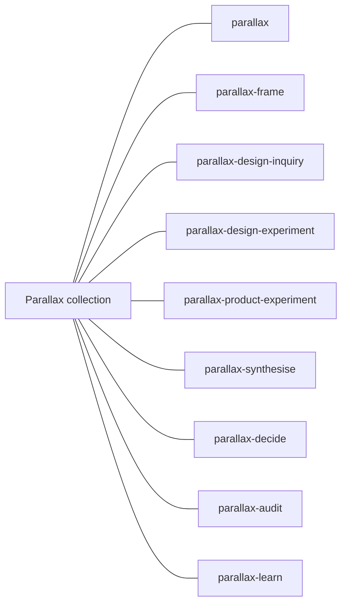
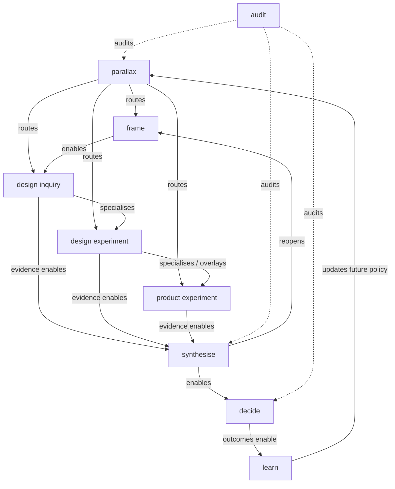
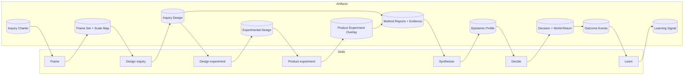
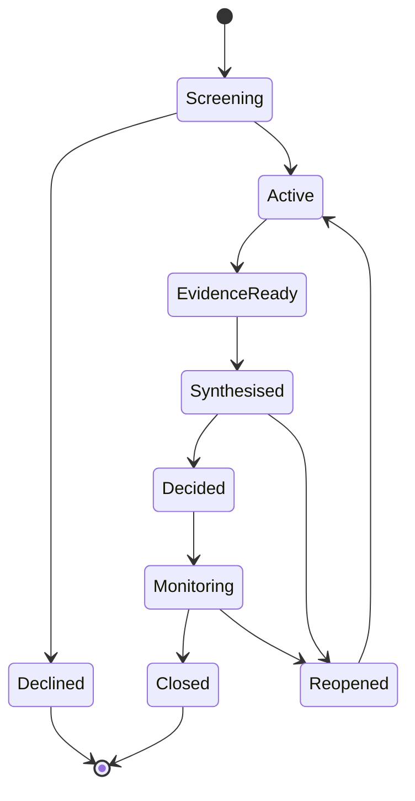
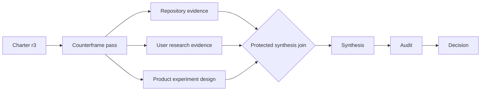
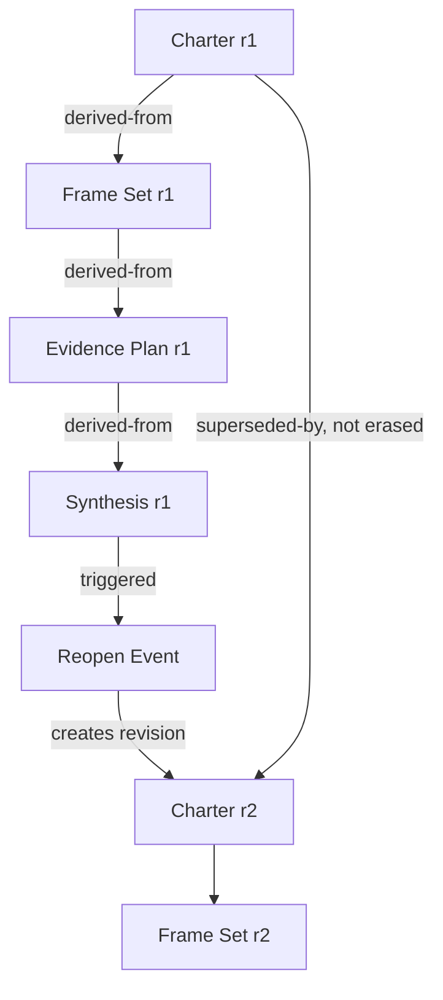
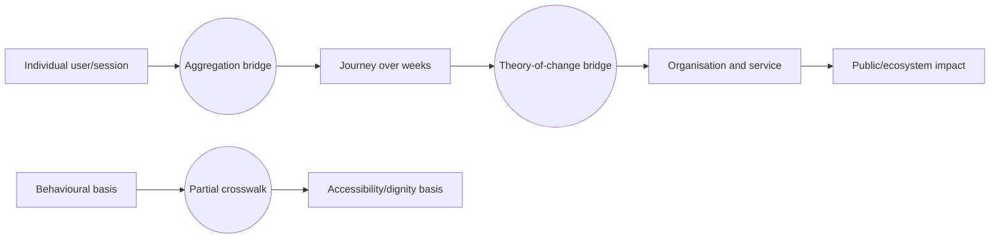
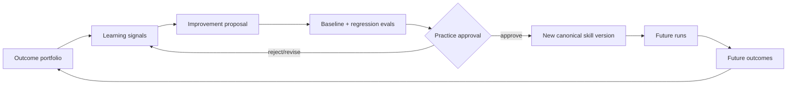

# Graph semantics

Parallax has no single “the graph.” Different projections answer different questions and preserve different invariants. Treating them as one DAG would conflate reusable capabilities, one execution, artifact ancestry, conceptual scale, and long-term learning.

## Graph family

| Graph | Shape | Nodes | Edges | Primary question |
|---|---|---|---|---|
| Catalogue | Flat registry with informative links | Skills and external capability classes | membership, specialisation | What can be discovered? |
| Invocation | Guarded typed multigraph | Skills | enables, complements, inhibits, audits, escalates, reopens | When and how may capabilities relate? |
| Capability–artifact | Directed bipartite graph | Skills and artifact types | consumes, produces, validates | How does work compose portably? |
| Inquiry-state | Guarded cyclic state machine | Inquiry states | transition, stop, reopen | What states and revisitations are legitimate? |
| Run | Bounded DAG | Skill invocations and joins for one revision | precedence and data dependency | What will execute now? |
| Provenance | Append-only DAG | Artifact revisions and events | derived-from, supersedes, responds-to | Why does this result exist? |
| Scale/decomposition | Typed potentially cyclic multigraph | scale regions, bases, constructs, bridge claims | aggregates, decomposes, causes, constrains, maps | Across what scales and conceptual bases do claims travel? |
| Learning | Feedback network realised as revision DAG | outcomes, learning signals, proposals, evaluations, skill versions | observes, proposes, tests, approves, updates | How does later evidence change future inquiry? |

Machine-readable definitions in `graphs/` share the core shape:

```json
{
  "graph_id": "example",
  "title": "Example graph",
  "description": "Purpose and interpretation.",
  "nodes": [
    { "id": "node-a", "label": "Node A", "type": "capability" }
  ],
  "edges": [
    {
      "from": "node-a",
      "to": "node-b",
      "type": "enables",
      "guard": "A relevant output exists"
    }
  ]
}
```

Graphs may add metadata, node attributes, edge attributes, or hyperedges using `sources` and `targets`. Simple edges always retain `from` and `to`.

## Catalogue graph

The catalogue graph is deliberately shallow. Agent Skills discovery sees independently installable skills rather than a hierarchy of runtime dependencies.



This projection communicates membership, not invocation precedence.

## Invocation graph

The invocation graph is enduring and cyclic. Guards are predicates over task signals, inquiry artifacts, permissions, resources, stakes, and current state.



## Capability–artifact graph

This bipartite graph is the portable composition protocol. Capability-to-capability sequencing is derived through artifacts rather than hard-coded calls.



The diagram omits validation and reopening edges for readability; the manifest retains them.

## Inquiry-state graph

The state graph is cyclic in semantics. A reopening creates a new inquiry revision; it does not erase or mutate prior history. Inquiry state and artifact `lifecycle_state` describe operational progression; both remain distinct from common epistemic `status`. A completed execution may yield an inconclusive artifact, and a ready-to-run protocol may remain provisional.



## Materialised run DAG

A run graph is generated for one revision from the enduring capability graph plus current state, depth, resources, profiles, permissions, and budget.



If audit reopens framing, revision r3 completes with a reopen event and a new r4 run DAG is materialised. A cycle never appears inside the immutable r3 provenance.

## Provenance DAG



`supersedes` is not deletion. Consumers must be able to distinguish latest-effective, historical, retracted, and contested artifacts.

## Scale and decomposition graph

Nodes may denote scale regions, frames, constructs, or claims. Bridge and crosswalk claims are first-class nodes when their own evidence and uncertainty matter.



Unsupported arrows are not innocuous visual shortcuts; they are ungrounded inferences.

## Learning graph

The learning graph contains conceptual feedback but is operationalised with immutable versions:



No node autonomously rewrites a skill. Governance is part of the graph, not an administrative afterthought.

## Graph validity invariants

- Node identifiers MUST be unique within a graph.
- Every simple edge endpoint MUST resolve to a node.
- Every hyperedge source and target MUST resolve to a node.
- Edge types MUST have declared semantics in this document or graph metadata.
- Guarded edges MUST use observable or explicitly assessable conditions.
- A run graph MUST be acyclic and bounded.
- Provenance edges MUST not create cycles.
- Reopening MUST create a new revision identity.
- A diagram MUST NOT imply a cross-scale or cross-basis bridge absent from the artifact set.
- Generated Mermaid views SHOULD be checked against manifests when tooling is available.
