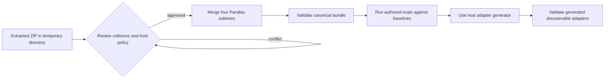

# Install and integrate the Parallax canonical bundle

## Package contract

The ZIP contains only a canonical `.agent` package:

- `.agent/skills/parallax*` — canonical, independently invocable but deliberately non-discoverable `SKILL-CANONICAL.md` definitions, references, assets, scripts, and authored local evals;
- `.agent/reference/parallax` — collection theory, architecture, protocols, manifests, diagrams, and sources;
- `.agent/evaluations/parallax` — authored cross-skill integration suites;
- `.agent/tools/parallax` — bundle validation and graph-to-Mermaid tools.

It contains no vendor-specific adapters, no generated evaluation results, and no Practice memory writes.

## Safe merge

Do **not** replace the host repository's `.agent` root wholesale. It may contain the Practice, memory, directives, other skills, and governance that Parallax is designed to use.

1. Extract the ZIP into a temporary directory.
2. Review collisions before copying.
3. Merge only these subtrees into their corresponding host locations:

   ```text
   .agent/skills/parallax*
   .agent/reference/parallax
   .agent/evaluations/parallax
   .agent/tools/parallax
   ```

4. Preserve host files outside those targets.
5. If the host already contains a Parallax version, compare manifests and changelogs/Practice decisions; do not overwrite local changes blindly.
6. Apply the host repository's normal review, ownership, and decision-record process.



The loop at collision review means resolve or intentionally reconcile the conflict before merge; it does not authorise repeated overwrites.

## Validate the canonical package

From the host repository root, run:

```bash
python3 .agent/tools/parallax/validate_bundle.py
```

The validator checks the expected nine canonical skills, names/descriptions, canonical non-discoverability, per-skill authored evals, trigger train/validation shape, common artifact envelopes, collection-evaluation shapes, manifest completeness, JSON parsing, graph endpoints, local links, Mermaid fence closure, and exclusion of generated Python cache files. It is a structural validator: it does not certify epistemic truth, statistical correctness, experiment readiness, execution authority, or browser rendering.

Render a graph projection for inspection with:

```bash
python3 .agent/tools/parallax/render_graph.py \
  .agent/reference/parallax/graphs/invocation.json
```

The renderer writes Mermaid source to standard output. Rendering does not prove the graph's epistemic adequacy.

## Run evaluations

The bundled `evals.json` and trigger sets are authored but not executed evidence. Use clean contexts and the host's evaluation harness to compare:

- current skills versus no-skill baselines;
- current skills versus the prior version after the first release;
- different consuming agents/clients where relevant;
- representative core, standard, and deep costs;
- real or simulated world-return/reopening events.

Store generated outputs, timing, grading, benchmarks, and reviewer feedback in a separate workspace, not in the installable skills or collection-evaluation directories.

## Generate vendor adapters

After canonical validation and review, use the host repository's documented adapter generator. The generator should project each `.agent/skills/<name>/SKILL-CANONICAL.md` and its supporting directories into the host's discoverable vendor surfaces, preserve ownership metadata, and validate drift according to the Practice.

Do not hand-author vendor adapters inside this bundle and do not rename canonical files to `SKILL.md` under `.agent/skills`; canonical non-discoverability is intentional.

Where the host exposes the standards reference validator, validate each generated standards-compliant adapter as well. Adapter success does not replace behavioural invocation and output evaluation.

## Practice memory binding

Installation MUST NOT create or update `.agent/memory`. During use, skills emit Learning Signals or memory intents; the host Practice decides whether and where to capture, distil, graduate, or enforce them. Review [practice-memory-and-learning.md](practice-memory-and-learning.md) before integrating automated improvement workflows.

## Installation completion criteria

- the four subtrees are merged without unrelated `.agent` replacement;
- canonical validation passes;
- local modifications and host-specific decisions are reviewed;
- authored evals have a recorded execution plan and are not described as passed until actually run;
- the host adapter generator produces discoverable adapters without drift;
- generated adapters pass format validation;
- no memory, external action, user exposure, or deployment occurred merely because the bundle was installed.
