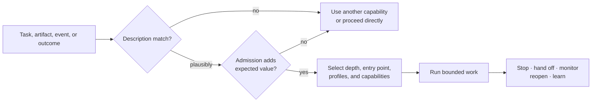
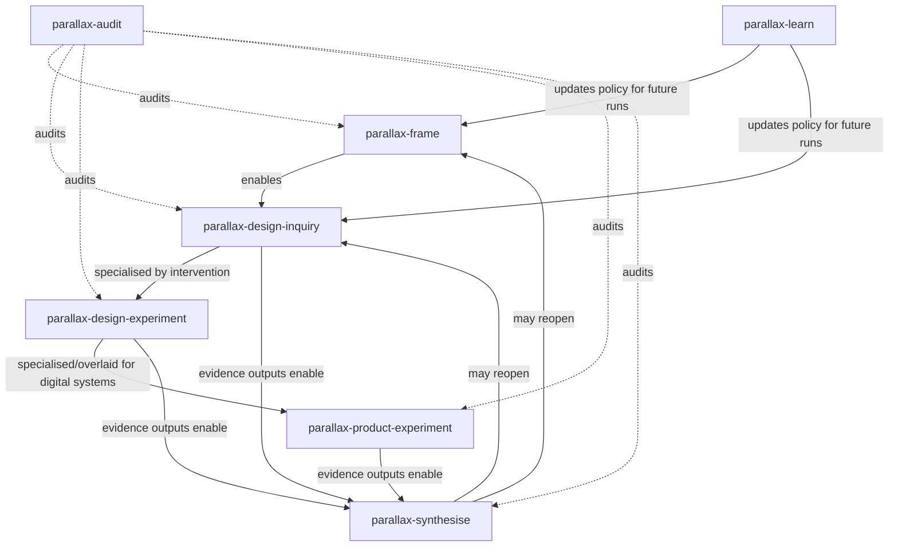

# Invocation grammar and entry points

## Invocation is part of the method

A skill that cannot be selected reliably cannot improve work. Under progressive disclosure, consuming agents initially see only skill names and descriptions. Those descriptions therefore form a distributed routing interface: a collection-level invocation grammar.

Invocation has four stages:

1. **Discover:** determine whether any Parallax skill plausibly applies.
2. **Admit:** inspect stakes, uncertainty, novelty, reversibility, disagreement, scale span, and inquiry value.
3. **Compose:** select direct, sequential, parallel, overlay, assurance, or external capabilities.
4. **Return:** emit explicit hand-off, stop, monitor, reopen, or learning conditions.



False-positive discovery should be cheap: a loaded skill may inspect and decline. False negatives are more dangerous because an unloaded skill cannot report that it was missed; collection routing evaluations must detect them.

## Shared invocation contract

Every skill MUST expose, in natural language and where available machine-readable metadata:

```yaml
use_when:
  - observable task conditions
do_not_use_when:
  - boundary conditions or a better capability
consumes:
  - required artifact types or information
produces:
  - output artifact types
compose_with:
  - compatible skills, profiles, or external capabilities
handoff_when:
  - another capability becomes appropriate
stop_when:
  - sufficient, declined, blocked, or disproportional conditions
reinvoke_when:
  - outcomes, new evidence, conflicts, thresholds, or monitoring events
```

The high-signal `use_when` and the most important exclusions belong in the frontmatter description. The full contract belongs near the beginning of `SKILL-CANONICAL.md`. Portable behaviour MUST NOT depend on custom metadata support.

## Skill routing matrix

| Observable condition | Prefer | Common co-activation | Prefer not to invoke when |
|---|---|---|---|
| End-to-end consequential inquiry; route is unclear | `parallax` | Any collection skill selected after admission | Task is a simple lookup, mechanical transformation, or settled implementation |
| Wrong problem, ambiguous construct, hidden boundary, missing stakeholder, alternative decomposition | `parallax-frame` | `parallax-audit`, domain capabilities | Only wording or presentation needs editing |
| Need evidence for a typed question but intervention is not yet justified or possible | `parallax-design-inquiry` | `parallax-frame`, external research/analysis | A complete valid inquiry design already exists and only execution is requested |
| Deliberate intervention; estimand, allocation, controls, precision/power, or analysis design needed | `parallax-design-experiment` | `parallax-frame`, domain/statistical capabilities, `parallax-audit` | No meaningful intervention or comparison exists; manipulation is unethical or infeasible |
| Digital product/service exposure, A/B test, feature flag, staged rollout, online quasi-experiment | `parallax-product-experiment` | General experiment design, analytics, accessibility, engineering | Request is merely implementation of an already approved protocol |
| Existing heterogeneous results need reconciliation | `parallax-synthesise` | `parallax-audit`, domain experts | Evidence collection or analysis is still the only requested task |
| Evidence must become a choice, commitment, or reversible action | `parallax-decide` | `parallax-synthesise`, ethics/safety/domain skills | User asks only for analysis and has not authorised action |
| Existing work needs adversarial, assurance, preregistration, or go/no-go review | `parallax-audit` | Any collection skill in protected context | “Audit” merely means proofreading or deterministic validation |
| Outcomes or repeated run evidence are available; method/routing may change | `parallax-learn` | Practice memory and governance | No outcome or performance evidence exists beyond a single intuition |

## Entry points

### Orchestration entry

Invoke `parallax` when the route itself is uncertain or a full inquiry lifecycle is requested. It screens, charters, chooses depth, materialises a run plan, and coordinates hand-offs.

### Direct capability entry

Invoke any narrower skill when its output is independently useful. Direct entry MUST NOT assume earlier skills ran. The skill must:

1. discover existing artifacts;
2. check minimum inputs and scale/basis context;
3. initialise safe missing state, request it, reduce scope, or decline;
4. identify provenance and limitations of reconstructed context.

### Artifact entry

An existing artifact can be the entry condition:

| Artifact present | Plausible next entries |
|---|---|
| Inquiry Charter | Frame, design inquiry, or audit |
| Frame Set / Scale Map | Design inquiry, design experiment, or audit |
| Inquiry Design | Execute externally, specialise as experiment, or audit |
| Experimental Design | Product specialisation, external execution, or audit |
| Method Reports / Evidence Records | Synthesis or audit |
| Epistemic Profile | Decision or audit |
| Decision Record / World-Return Contract | Monitoring, outcome entry, audit |
| Outcome Event | Learn, reopen, synthesise, or decide |
| Learning Signal portfolio | Learn at L1/L2 or governance review |

### Domain/profile entry

Investigation, science, software engineering, and digital product/service contexts act as stackable profiles. A task can carry several profiles simultaneously. Profiles refine methods, evidence standards, artifacts, and external capability selection; they are not mutually exclusive branches.

### Assurance entry

Invoke `parallax-audit` against an existing artifact set or live run. Declare whether the audit context is independent, protected-but-shared, or ordinary self-review.

### Outcome entry

When observed consequences arrive, locate the World-Return Contract and enter `parallax-learn`. Compare outcome, prediction, threshold, timescale, distribution, and side effects. An outcome may also trigger reopening before portfolio learning.

### Reopening entry

Reopen on a declared defeater, monitoring threshold, surprise, material harm, invalidated bridge, changed environment, new stakeholder evidence, or unsupported assumption. Create a new inquiry revision and preserve the prior run.

### Portfolio entry

Invoke `parallax-learn` over multiple completed inquiries to assess method selection, routing precision, depth proportionality, domain performance, and learning-policy effectiveness. A portfolio conclusion requires diversity and dependence analysis; a count of similar runs is not automatically strong evidence.

## Guarded composition relationships

Edges are typed rather than reduced to “calls”:

- `requires`: an artifact or precondition is mandatory;
- `enables`: work makes another capability applicable but not obligatory;
- `alternative-to`: competing procedure or decomposition;
- `complements`: protected parallel or composite work;
- `specialises`: applies a general design to a domain;
- `overlays`: modifies criteria without establishing sequence;
- `audits`: challenges inputs, method, or output;
- `inhibits`: a finding makes another capability inappropriate;
- `escalates-to`: stakes or unresolved risk justify more expensive work;
- `reopens`: creates a new revision from an earlier stage;
- `updates-policy-for`: learning proposes future routing or method change.



## Invocation priority and conflict resolution

When several descriptions match:

1. Honour an explicit user request unless unsafe or impossible.
2. Prefer the narrowest skill that completely covers the requested result.
3. Use `parallax` when routing or lifecycle coordination is itself part of the problem.
4. Co-activate skills only where their contracts add distinct value.
5. Preserve user scope: analysis does not authorise implementation; experiment design does not authorise participant exposure.
6. If two skills prescribe incompatible actions, record the conflict, follow the stricter safety/permission constraint, and seek resolution.
7. Do not load the complete collection defensively; progressive disclosure is part of correctness.

## Invocation evaluation

Routing must be evaluated against:

- true-positive and false-positive activation;
- false negatives;
- sibling confusion;
- appropriate co-activation;
- correct direct versus orchestration entry;
- correct decline/delegation;
- correct depth;
- action-scope preservation;
- cost and latency relative to outcome gain;
- cross-agent and cross-client robustness.

Descriptions are trained on one query set and validated on held-out, naturally phrased cases. Near-boundary cases are more informative than obvious keyword matches.
