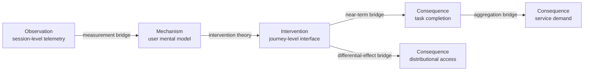
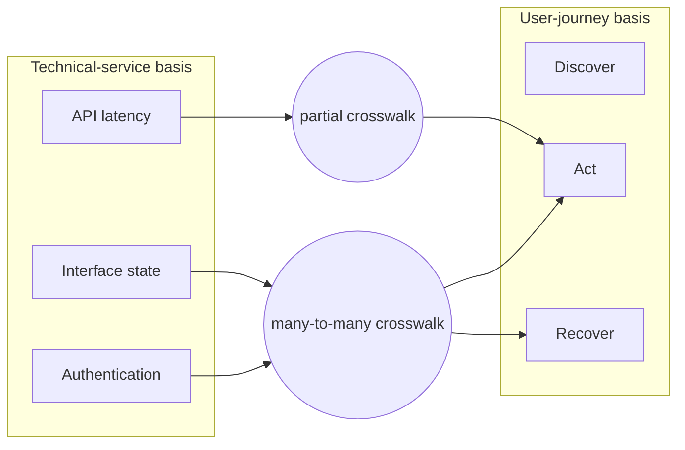
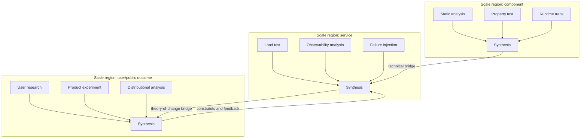

# Multi-scale, multi-method, and multi-basis model

## Purpose

Multi-scale inquiry is not a domain profile or optional late-stage check. It is a cross-cutting semantic coordinate carried through framing, design, evidence, synthesis, decision, monitoring, and learning.

For an inquiry revision, Parallax models executed inquiry cells as a sparse subset:

\[
C_r \subseteq S \times B \times M \times D
\]

where:

- \(S\) is the task-specific multidimensional scale space;
- \(B\) is the set of bases, frames, or decompositions;
- \(M\) is the set of methods, traditions, or protected perspectives;
- \(D\) is the set of applicable domain profiles;
- \(r\) identifies an immutable inquiry revision.

The revision dimension is kept outside the product because a new revision changes the state against which cells are interpreted. Across history, executions are identified by \((r,s,b,m,d)\).

The product is sparse: practical inquiry does not execute every conceivable cell. Coverage is justified against declared candidate sets, risk, information value, cost, and stopping rules.

## Scale is a vector, not a ladder

`micro`, `meso`, and `macro` are sometimes useful labels, but they are not sufficient. A scale region MAY contain:

```yaml
scale_region:
  temporal_extent: "twelve months"
  temporal_resolution: "daily"
  spatial_or_system_extent: "public digital service"
  population_unit: "eligible user"
  aggregation_unit: "account-week"
  technical_abstraction: "cross-service journey"
  organisational_scope: "product and operations teams"
  causal_horizon: "eight weeks"
  intervention_scope: "progressive rollout cohort"
  consequence_horizon: "one year"
  monitoring_horizon: "six months after rollout"
```

Fields are task-specific and may use qualitative regions. False precision is worse than a declared coarse range.

## Claim roles can occupy different scales

One claim may have distinct coordinates for:

- **phenomenon scale:** what is being described;
- **observation scale:** where evidence was measured;
- **mechanism scale:** where the proposed causal process operates;
- **intervention scale:** where action is applied;
- **consequence scale:** where effects and side effects occur;
- **monitoring scale:** where and when outcomes will be checked.



Each labelled arrow is a claim, not a drawing convenience.

## Bridge Claims

A material movement between scale regions MUST be represented by a Bridge Claim containing:

- source and target scale-region identifiers;
- direction and relationship type;
- aggregation, disaggregation, transformation, transport, or mechanism rule;
- assumptions and boundary conditions;
- supporting and challenging evidence;
- dependence on models, proxies, and intermediate claims;
- uncertainty and information loss;
- validity domain;
- known ecological, atomistic, temporal, survivorship, or selection risks;
- defeaters and reopening conditions.

Common bridge types include:

| Type | Example | Characteristic hazard |
|---|---|---|
| Aggregation | user outcomes to population effect | ecological fallacy, heterogeneity, weighting |
| Disaggregation | system metric to individual experience | atomistic assumptions, hidden mixture |
| Temporal transport | short test to durable impact | novelty, learning, decay, seasonality |
| Organisational | team practice to service reliability | coordination and incentive mediation |
| Technical | component property to system behaviour | interaction, load, emergent failure |
| Causal | observed association to intervention consequence | confounding, non-compliance, interference |
| Theory of change | product behaviour to human/public value | proxy substitution, missing intermediate mechanism |

## Basis or decomposition pluralism

A basis specifies what the inquiry treats as salient dimensions and entities. Candidate bases might decompose a product problem by:

- user jobs and journeys;
- technical components and dependencies;
- causal mechanisms;
- organisational responsibilities;
- rights, harms, and distributions;
- information flows;
- temporal phases;
- incentives and institutions.

### Operational differentiation

Parallax does not assert literal vector-space orthogonality. It assesses basis differentiation using:

- distinct constructs or primitives;
- distinct boundaries or units;
- distinct causal directions;
- distinct stakeholder standpoints;
- distinct blind spots and predicted failure modes;
- non-identical evidence demands;
- incremental explanatory or decision value after conditioning on other bases.

High dependence does not automatically invalidate a basis. It changes the incremental information attributed to it.

### Crosswalk Claims

A mapping between bases MUST state:

- source and target basis;
- mapped constructs and unmatched residuals;
- mapping cardinality (one-to-one, one-to-many, many-to-one, partial);
- directionality and reversibility;
- semantic, causal, or measurement assumptions;
- information loss and contested correspondences;
- evidence and defeaters.



Some residuals should remain unmapped. Forced common denominators can destroy the very perspective difference that basis pluralism is meant to preserve.

## Same-scale pluralism

At one declared scale and basis, methods can be:

- **composite:** outputs or procedures are intentionally integrated;
- **protected parallel:** passes remain separated until a planned synthesis point;
- **competitive:** alternatives make divergent predictions or recommendations;
- **triangulating:** different error structures bear on a common claim;
- **nested:** one method samples, validates, or explains another.

Method independence is multidimensional. Record common data, source lineage, model family, prompt, analyst, prior framing, and execution environment. Two agents using the same model and source set are two passes, not necessarily two independent witnesses.

## Cross-scale application of same-scale pluralism

The same-scale pattern can be instantiated at several scales, then connected by Bridge Claims:



The diagram's feedback is conceptual. Each operational feedback transition creates a new revision.

## Coverage and stopping

“Exhaustive” MUST always name its universe. Examples:

- all frames in the predeclared Frame Set;
- all material stakeholder standpoints identified by the Charter;
- all scale regions containing a plausible high-severity consequence;
- all method families meeting the relevance threshold;
- all alternatives above a predeclared plausibility floor.

Coverage is not achieved by counting cells. It is evaluated through:

- relevance to material claims and consequences;
- differentiation from already covered cells;
- severity of plausible missed error;
- residual stakeholder and distributional gaps;
- quality of scale bridges;
- marginal information value versus cost and delay.

## Metamorphic invariants

Collection evaluations SHOULD transform a case while preserving or varying one coordinate:

- change the scale label without changing evidence: conclusions should not silently transport;
- aggregate heterogeneous groups: the system should demand a bridge and distributional analysis;
- replace a basis with a near-synonym: routing should remain stable;
- supply a genuinely different basis: additional residuals should appear;
- duplicate a method under shared provenance: independence should not double;
- lengthen the consequence horizon: short-term results should become insufficient for durable claims;
- reverse a crosswalk: asymmetric mappings should not be treated as invertible;
- reopen from an outcome event: a new revision should be created rather than history mutated.

These tests protect the original multi-scale insight more effectively than checking whether a document contains the word “scale.”
