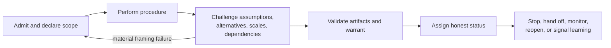
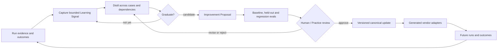

# Practice memory, critique, and learning

## Separation of responsibilities

Parallax is reflexive but stateless:

> Skills encode how to observe, challenge, validate, and emit learning signals. The collection supplies cross-skill assurance and improvement procedures. The embedding Practice owns memory, continuity, consolidation, governance, and durable change.

This separation prevents session residue and one-off anecdotes from becoming hidden doctrine.

| Layer | Responsibility | Must not do |
|---|---|---|
| Every skill | Local critique, validation, status, defeaters, reopen/hand-off, learning signal | Claim independent assurance; retain private memory; rewrite itself |
| `parallax-audit` | Protected adversarial review and blocking findings | Pretend shared-context review is independent |
| `parallax-learn` | Compare expected/observed, aggregate cases, analyse routing/method performance, propose evaluated changes | Treat one surprising run as a general rule; directly approve changes |
| Collection evals | Detect false negatives, sibling confusion, interaction effects, regressions, cost | Prove real-world impact from synthetic prompts alone |
| Embedding Practice | Durable memory, continuity, distillation, review, versioning, rollback, adapter generation | Silently import provisional findings into permanent policy |

## Reflexive envelope in every skill

Each skill follows a proportionate envelope:

The feedback arrow represents a new or amended artifact revision, not erased history.

Every skill ends with one declared status: `validated`, `provisional`, `inconclusive`, `insufficient-evidence`, `declined`, `reopened`, or `superseded`. It explains what the status permits and forbids.

## Local critique versus independent assurance

Local critique is always required because it catches missing assumptions before hand-off. It is structurally limited by anchoring, shared context, incentives, and model/source dependence. Independence is therefore recorded as:

- `self-review`: same pass or authoring context;
- `protected-shared`: separate pass but material shared sources/models/anchors;
- `independent`: sufficiently separated reviewer, context, sources, authority, or method for the asserted assurance;
- `unknown`: dependence has not been established.

These labels qualify the audit contribution; they are not prestige ranks.

## Practice binding

When the Oak Practice memory surfaces exist, learning substances route as follows. The host's current documentation remains authoritative if paths evolve.

| Substance | Practice destination or process |
|---|---|
| Fresh surprise, error, or correction | `.agent/memory/active/napkin.md` |
| Refined cross-session lesson | `.agent/memory/active/distilled.md` |
| Grounded recurring instance | `.agent/memory/active/patterns/` |
| Live inquiry, monitoring, owner, or next-safe-step state | `.agent/memory/operational/` |
| Stable host contract or routing knowledge | `.agent/memory/executive/` |
| Settled engineering decision | ADR or permanent project documentation |
| Portable Practice governance | PDR through the host consolidation process |
| Stable behavioural improvement | Canonical skill, rule, or directive after evaluation and review |

If a surface does not exist, a skill emits a portable memory-intent or Learning Signal. It MUST NOT invent an authoritative host path.

## Learning pipeline

The collection instantiates the Practice pattern `capture → distil → graduate → enforce`:

The collection contains no vendor adapters; the diagram shows their place in the embedding repository's wider lifecycle.

## Three learning levels

### L0: object learning

Compare claims and predicted consequences with observed outcomes. Update the current inquiry, decision, or theory of change.

### L1: method and routing learning

Assess:

- whether the right skills triggered;
- whether depth was proportionate;
- whether protected passes added differentiated information;
- whether method assumptions held;
- whether scale bridges transported;
- whether synthesis preserved decisive conflict;
- whether decisions were calibrated and reversible;
- whether inquiry cost bought enough quality.

### L2: learning-policy learning

Assess whether changes to capture, distillation, evaluation, approval, or skill-update policy improve subsequent L0/L1 performance. L2 claims require later runs; the attractiveness of a meta-process is not evidence that it works.

## Learning Signal contract

A Learning Signal SHOULD include:

- inquiry, revision, skill, and policy versions;
- scale, basis, method pass, and domain context;
- expected versus observed behaviour or outcome;
- surprise, correction, failure, or reusable success;
- evidence and dependence;
- candidate explanation plus alternatives;
- severity, recurrence hypothesis, and confidence;
- immediate operational consequence;
- proposed Practice destination or portable intent;
- next observation or evaluation needed;
- expiry or conditions under which the signal should be discarded.

Signals are observations, not policy.

## Improvement Proposal contract

A proposal SHOULD contain:

- affected skill, description, reference, artifact, graph edge, evaluation, or Practice rule;
- problem supported by multiple cases or a justified high-severity exception;
- causal hypothesis for why the change will help;
- proposed minimal change;
- intended generalisation and explicit non-goals;
- risks, interactions, context/token cost, and portability effects;
- training and held-out invocation cases where relevant;
- output-quality, composition, regression, and metamorphic evaluations;
- baseline or prior-version comparator;
- expected world-return improvement;
- review authority, rollout, monitoring, rollback, and expiry.

## Reopening versus skill improvement

Do not confuse:

- **inquiry failure:** reopen the current inquiry;
- **execution failure:** rerun or fix an external capability;
- **artifact failure:** correct the artifact or schema use;
- **invocation failure:** propose description/routing change;
- **method failure:** propose procedural or reference change;
- **collection failure:** alter composition or graph policy;
- **Practice failure:** alter capture, evaluation, approval, or memory policy.

One event can implicate several levels, but attribution uncertainty must remain explicit.

## Privacy, retention, and safety

Learning must not become uncontrolled data retention. Practice governance determines what may persist, for how long, and at what level of abstraction. Learning Signals SHOULD minimise personal, confidential, or sensitive material; link to governed evidence rather than duplicate it. Deletion and legal obligations override epistemic convenience.
