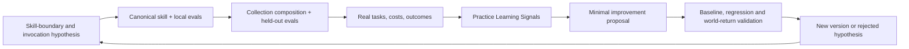

# Meta-learning about agent skill design

This document captures transferable lessons produced while translating the Parallax theory into a working Agent Skills collection. These are design hypotheses at v0.1.0; they require evaluation like the skills themselves.

## 1. Invocation is an interface, not decoration

Because consuming agents initially see names and descriptions, frontmatter descriptions jointly implement a routing surface. Skill quality includes whether it is invoked, rejected, combined, or deferred correctly—not merely what happens after loading.

**Design consequence:** author descriptions as a collection; evaluate false negatives, sibling collisions, and co-activation on held-out prompts.

## 2. One doorway and many entrances can coexist

A family benefits from one memorable orchestrating name, but requiring every task to enter through it adds ceremony and hides independently useful capabilities.

**Design consequence:** provide a broad facade plus direct-entry siblings. Every sibling reconstructs, requests, reduces, or declines missing state.

## 3. Standards-level packaging and runtime topology are different

Agent Skills discovery is flat. A runtime may be cyclic, guarded, parallel, and recursive. Encoding a deep hierarchy into portable skill assumptions would make the collection client-dependent.

**Design consequence:** package a flat federation; express composition through artifacts and guarded semantics; let capable hosts compile run DAGs.

## 4. A capability network generates DAGs; it is not a DAG

Reusable inquiry legitimately cycles through reframing, redesign, audit, outcomes, and learning. One revision still needs bounded, auditable execution.

**Design consequence:** maintain a cyclic capability/state model, materialise an acyclic run per revision, and preserve append-only provenance.

## 5. Divide by invocation and artifact contracts, not “thinking” and “doing”

Doing contains epistemic judgement; thinking disconnected from intervention breaks world return. A cognitive-layer split creates generic ritual skills and leaky execution skills.

**Design consequence:** a viable skill has a recognisable trigger, coherent transformation, typed output, validation loop, and useful independent result.

## 6. Shared artifacts are a portable composition protocol

Hard-coded skill calls assume orchestration features the standard does not define. Hidden prompt state undermines resumption and audit.

**Design consequence:** skills consume and produce versioned artifacts with provenance, scale, basis, dependence, status, and hand-off contracts.

## 7. Progressive disclosure is epistemic control

Context is not free. Loading every tradition, domain, edge case, and procedure can reduce judgement and increase ritual compliance.

**Design consequence:** keep each canonical skill operational and concise; load focused references when an observable condition applies. Move reusable deterministic work into scripts and templates.

## 8. Collection seams should be provisional and evidence-driven

One mega-skill triggers too broadly and overloads context; excessive micro-skills create activation storms and conflicting instructions. Abstract elegance cannot determine the optimum boundary.

**Design consequence:** begin with coherent hypothesised seams, then split or merge based on trigger confusion, repeated independent use, context cost, and output-quality evaluation.

## 9. Local critique and independent audit are distinct products

Self-critique is cheap and mandatory but shares blind spots with the work. Naming it “independent” creates false assurance.

**Design consequence:** every skill contains a reflexive envelope; assurance is a separately invocable capability with explicit dependence labels.

## 10. Parallel agents do not imply independent evidence

Multiple outputs may share model family, prompt, sources, tools, framing, and anchors. Counting them as votes launders dependence.

**Design consequence:** record method-pass provenance and dependency; use protected passes where useful; synthesise based on evidence and error structure, not majority.

## 11. Multi-scale meaning must live in the data contract

Putting “consider multiple scales” in a theoretical document is too weak. It is easy for downstream skills to erase.

**Design consequence:** carry scale-region identifiers through artifacts; require Bridge Claims for material transport; add metamorphic scale tests.

## 12. Domain capabilities are often overlays, not children

A digital product experiment may also be a scientific, software, organisational, and public-service inquiry. A tree forces false exclusivity.

**Design consequence:** use stackable profiles and specialisation edges. The product experiment skill can co-activate with general experimental design and external domain skills.

## 13. A collection should own central methodological seams, not all expertise

Experiment design is central to Parallax's world-return contract and has a stable trigger. Advanced statistics, regulated protocols, platform instrumentation, and domain theory remain deeper specialties.

**Design consequence:** internal skills own alignment and inquiry contracts; explicitly hand off execution and specialist review without losing provenance.

## 14. Memory is an embedding-environment concern

Skills that retain private lessons become non-portable, unauditable, and prone to turning anecdotes into doctrine. Yet skills still need to improve.

**Design consequence:** skills emit bounded Learning Signals; the Practice captures, distils, evaluates, approves, versions, and regenerates.

## 15. Self-improvement must include the update policy

Changing a skill after a failure is L1 learning. Testing whether that change process improves later object-level outcomes is L2 learning.

**Design consequence:** version improvement proposals, compare baselines, preserve regressions, and observe later world-return performance. Do not close the loop at “skill updated.”

## 16. Evals belong at both skill and collection scales

A skill-local eval cannot detect that it failed to activate. It also cannot fully test sibling disambiguation or multi-skill composition.

**Design consequence:** store local authored evals inside each skill; store routing, composition, cross-domain, reopening, and recursive-learning suites at collection level; store generated results outside the installable package.

## 17. Diagrams should project authoritative semantics

Hand-authored diagrams drift and may imply unsupported edges. Yet different graph projections are genuinely useful.

**Design consequence:** keep machine-readable manifests as authoritative wiring where practical; document projection semantics; generate or validate Mermaid from manifests when host tooling permits.

## 18. Admission and graceful decline are core behaviours

A broadly useful reasoning skill can trigger on almost everything and make routine work expensive. False-positive loading need not become full execution.

**Design consequence:** separate discovery from admission; let a loaded skill select screening, a narrower sibling, another capability, or decline.

## 19. Depth is a metareasoning budget

Deeper inquiry can improve error detection but also adds cost, delay, correlated output, and opportunities for process theatre.

**Design consequence:** choose depth from stakes, uncertainty, irreversibility, novelty, disagreement, scale span, and expected value of information. Evaluate quality/cost curves rather than maximising procedure count.

## 20. Correct refusal and incompleteness are first-class outputs

Agents are often rewarded for producing an answer, experiment, or decision even when evidence, authority, or identifiability is absent.

**Design consequence:** explicitly support `declined`, `inconclusive`, and `insufficient-evidence`; include them in evals; state what would make progress possible.

## 21. Conceptually correct prose can still produce a non-working skill

Clean-context integration testing exposed cases where instructions said the right thing but templates, validators, or hand-offs encoded different semantics.

**Design consequence:** validate the whole contract chain—prose → artifact/template → validator → consumer/handoff → outcome. Do not validate files independently and infer system coherence.

## 22. Epistemic status and operational lifecycle must be separate

`validated` and `inconclusive` describe warrant; `draft`, `ready-to-run`, and `completed` describe progress. Combining them creates nonsense such as treating a completed experiment as a validated claim.

**Design consequence:** use a common epistemic `status` plus an orthogonal optional `lifecycle_state`; test their combinations and consumer behaviour.

## 23. Parseable placeholders must never count as ready

A well-shaped template full of empty strings or `TODO` sentinels may pass superficial schema checks while containing no executable contract.

**Design consequence:** readiness validators reject unresolved placeholders and semantically empty required fields. Report structural validity, lifecycle readiness, and epistemic status separately.

## 24. Specialised overlays require field authority

General and product experiment skills can otherwise duplicate estimands, design families, power assumptions, and analysis rules with no way to know which controls.

**Design consequence:** a typed overlay references a precise base revision and supplies a field-authority crosswalk for base-authoritative, overlay-authoritative, derived, and overridden fields. Overrides retain provenance and rationale.

## 25. Collection contract evals catch defects local evals miss

Local skill cases can pass while producers and consumers disagree, two siblings duplicate authority, or plural domain/profile fields collapse at a hand-off.

**Design consequence:** maintain collection-level contract-compatibility cases alongside routing and composition suites. Exercise real assets and validators in clean contexts before claiming integration works.

## 26. A shared semantic envelope is not automatically a shared wire schema

Artifacts can carry the same required concepts while nested representations differ by type. Treating matching top-level names as field-for-field interchange hides migration work and can silently broaden permissions or validity.

**Design consequence:** distinguish semantic compatibility, structural compatibility, and machine interchange. Dispatch by `schema_version`; test exact producer-consumer mappings; make transformations explicit and provenance-preserving; standardise nested conventions only through a versioned, evaluated change.

## Meta-learning loop for skill design

The final arrow means the next design hypothesis is informed by evidence. Operationally, each step creates versioned artifacts; the history remains auditable.

## Questions deliberately left empirical

- Should `parallax-design-inquiry` and general experiment design remain separate after real use?
- Does routine product experimentation benefit from loading the general design sibling, and at what complexity threshold?
- Which description wording generalises across agent families without excessive activation?
- Which artifact fields are essential at core depth and which create ceremony?
- How much protected parallelism produces genuinely differentiated information?
- Which scale dimensions recur enough to standardise and which must remain task-specific?
- When does independent audit improve decisions enough to justify its cost?
- Do L1/L2 improvements survive changes of model, host, domain, and team?

These are not missing theory. They are explicit targets for the collection's own world-return process.
