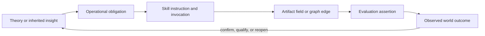

# Parallax traceability matrix

This matrix connects theoretical commitments to operational obligations, owning skills, artifacts, and evaluation evidence. It prevents the theory from becoming detached documentation and prevents procedures from losing their rationale.

| ID | Theoretical or architectural commitment | Operational obligation | Primary skills | Material artifact/evidence | Evaluation locus |
|---|---|---|---|---|---|
| T01 | Question types require different warrant | Type claims; state applicable correction and evidence standards | `parallax`, frame, design inquiry, synthesise | Charter, Frame Cards, Inquiry Design, Epistemic Profile | Local output; cross-domain |
| T02 | Falsifiability is applicable selectively, not a universal gate | Use empirical vulnerability where meaningful; use proof, interpretation, normative argument, or design evidence appropriately elsewhere | Design inquiry, experiment, synthesise, audit | Claim types, method rationale, error probes | Cross-domain; audit |
| T03 | Same-scale methodological pluralism | Compare or combine differentiated methods when expected value justifies cost | Orchestrator, design inquiry, experiment | Method passes, Evidence Plan, dependence graph | Composition |
| T04 | Protected parallelism preserves useful difference | Delay cross-anchoring where appropriate; document shared dependencies | Orchestrator, audit, synthesise | Method Reports, dependence ledger | Composition; metamorphic provenance |
| T05 | Cross-scale pluralism | Declare scale roles and require support for material transport | All | Scale Map, Bridge Claims | Cross-domain; metamorphic scale |
| T06 | Basis/decomposition pluralism | Create serious alternative frames and preserve residual incompatibility | Frame, synthesise, audit | Frame Set, Crosswalk Claims | Framing local; metamorphic basis |
| T07 | Orthogonality is an analogy, not an assumed metric property | Assess operational differentiation and dependence | Frame, synthesise | Frame comparison and dependence analysis | Framing; composition |
| T08 | Inquiry is sparse over scale × basis × method × revision | Declare coverage universe and selected cells; justify omissions | Orchestrator, frame, design inquiry | Run Plan, coverage ledger | Composition; scale metamorphics |
| T09 | Cross-scale movement is itself a claim | Record source/target, mechanism/transformation, evidence, uncertainty, validity and defeaters | Frame, design, synthesise, audit | Bridge Claim | Deterministic structure plus expert grading |
| T10 | Cross-basis movement may be partial/asymmetric/lossy | Record mapped and unmatched constructs; do not silently invert | Frame, synthesise, audit | Crosswalk Claim | Metamorphic basis reversal |
| T11 | Evidence count is not independence | Preserve common sources/models/prompts/data and assess incremental support | All evidence-producing skills, synthesise, audit | Evidence Records, dependence ledger | Metamorphic duplicate provenance |
| T12 | Synthesis must not force consensus | Preserve conflict, minority findings, incomparability, defeaters, and blocking dimensions | Synthesise, audit | Conflict/Dependence/Defeater Ledger, Epistemic Profile | Synthesis local; composition |
| T13 | Values and evidence differ but interact | Separate empirical support, preferences, rights, duties, risk, and distribution | Decide, audit | Decision Record | Decision local; safety review |
| T14 | Depth is a metareasoning budget | Select screening/core/standard/deep based on expected inquiry value and cost | Orchestrator | Charter and Run Plan | Routing; cost benchmark |
| T15 | Action authority is not implied by analysis | Preserve investigate/decide/act permissions and stop before unauthorised mutation | Orchestrator, experiment, product experiment, decide | Charter authority, readiness state | Routing/scope; action-log assertions |
| T16 | Experiment power is one conditional design property | Define estimand, validity, effect relevance, assumptions and sensitivity before interpreting power | Design experiment, audit | Experimental Design, power/precision analysis | Experiment local; boundary routing |
| T17 | Product experiments require digital-system semantics | Address exposure, telemetry, interference, novelty, guardrails, rollout and durable outcomes | Product experiment | Product Experiment Protocol | Product local; composition |
| T18 | World-return closes inquiry through consequences | Specify predictions, adverse outcomes, observations, timing, thresholds, owner, rollback/reopen | Decide, experiment skills, learn | World-Return Contract, Outcome Events | Reopening; real outcome evaluation |
| T19 | Reflexivity is inherent in every skill | Challenge, validate, assign status, state limitations and learning signal | All | Status, self-critique, hand-off | Every local eval |
| T20 | Self-review is not independent assurance | Label dependence and invoke protected audit when material | Audit, orchestrator | Audit Report | Audit local; composition |
| T21 | Skills are stateless; Practice owns memory | Emit learning signal or intent; do not write hidden memory or self-update | All, especially learn | Learning Signal, Improvement Proposal | Recursive learning; filesystem/action review |
| T22 | L0 object learning | Compare prediction/action with observed outcome | Learn, decide | Outcome Events, updated Epistemic Profile | Reopening; world-return |
| T23 | L1 method/routing learning | Analyse method selection, skill activation, depth, cost and performance | Learn | Learning Review, Improvement Proposal | Recursive learning |
| T24 | L2 learning-policy learning | Test whether changes to improvement policy improve later L0/L1 outcomes | Learn plus Practice governance | Portfolio comparison, policy-version evidence | Recursive learning longitudinally |
| T25 | Reopening is correction, not mutation | Increment inquiry revision and preserve prior provenance | All | Reopen Event, new revision artifacts | Reopening; provenance validation |
| T26 | Skill descriptions are a collection invocation grammar | Jointly test positive, negative, sibling and co-activation cases | All metadata; collection governance | Trigger train/validation and routing evals | Routing |
| T27 | Flat discovery and richer runtime must coexist | Avoid required skill hierarchy; compose through artifacts and guards | Architecture and all skills | Graph manifests, hand-off contracts | Structural; composition |
| T28 | Cyclic capability model generates bounded run DAGs | Compile one acyclic run per revision; represent feedback as new revision | Orchestrator | Run DAG, provenance DAG | Graph validation; reopening |
| T29 | Domain profiles are stackable overlays | Apply investigation/science/software/product criteria together where relevant | Orchestrator and design skills | Charter profiles, profile-specific plan sections | Cross-domain |
| T30 | Improvement is governed and empirically vulnerable | Propose minimal versioned changes; compare baselines; test regressions; monitor later outcomes | Learn plus Practice | Improvement Proposal, eval workspaces, release decision | All evaluation layers |
| T31 | Epistemic status differs from operational lifecycle | Record common warrant status separately from draft/ready/running/completed state | All, especially experiment skills | Common artifact envelope | Structural and composition evals |
| T32 | Product experimental semantics are an overlay when composed | Reference a general Experimental Design and add/override typed product fields with rationale | General and product experiment skills | Experimental Design plus Product Experiment Protocol overlay | Product local and composition evals |
| T33 | Quasi-experiment is not randomised A/B | Declare design family and identification strategy; preserve design-specific diagnostics and limits | Product experiment, general experiment, audit | Product/Experimental Design | Routing, experiment local, cross-domain |
| T34 | Instructions, artifacts, validators and hand-offs are one semantic contract | Test meaning across the full producer/consumer chain, not files separately | All | Templates, validators, hand-offs | Contract compatibility |
| T35 | Placeholder-filled artifacts are not ready | Reject sentinels, empty required values and unresolved TODOs at readiness gates | Design and experiment skills | Templates plus validator reports | Contract compatibility |
| T36 | Stackable profiles must remain plural through hand-off | Preserve domain profile arrays and profile-specific criteria across producers and consumers | All | Common identity envelope and Inquiry Design | Contract compatibility; cross-domain |

## Coverage flow

The return arrow does not imply that one outcome settles a philosophical commitment. It means operational claims and implementations remain corrigible through later evidence.

## Change rule

A material change to theory, skill procedures, artifact vocabulary, graph semantics, or evaluation expectations MUST update the corresponding traceability rows. If a commitment has no operational or evaluation expression, label it explanatory rather than normative. If a procedure has no rationale, either document the rationale or remove the procedure.
