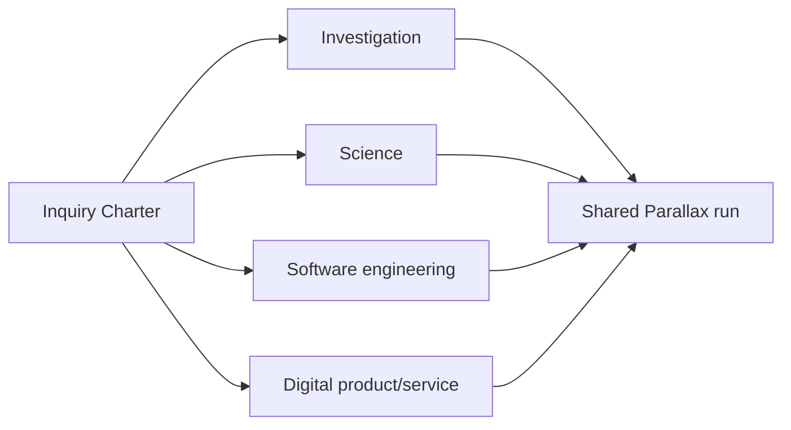

# Stackable domain profiles

Use profiles as simultaneous overlays on one inquiry, not exclusive hierarchy branches. Select a profile only when its evidence criteria, scale dimensions, characteristic errors, or execution boundaries materially change the run.

## Investigation

Select when claims depend on documents, testimony, public records, repositories, logs, datasets, chronology, identity, provenance, contradiction, or source independence.

Add source authenticity and proximity, primary versus derivative evidence, custody, incentives, chronology, entity resolution, selection/search bias, negative-evidence discipline, and claim-to-source traceability. External capabilities may search, retrieve, extract, inspect repositories, query authorised records, or conduct interviews; the profile grants no access or publication authority.

## Science

Select when empirical regularity, prediction, explanation, mechanism, measurement, causal effect, experiment, simulation, replication, or statistical inference is material.

Add construct and operational validity, calibration, sampling, estimands, dependence, causal identification, uncertainty, severity, robustness, sensitivity, replication, validity domain, exploratory/confirmatory separation, ethics, and specialist review. Route prospective experimental design to the appropriate experimental skill. The profile does not authorise participant exposure, hazardous work, or regulated research.

## Software engineering

Select when claims concern software behaviour, architecture, reliability, security, performance, maintainability, delivery, incidents, migrations, or technical strategy.

Add requirements and invariants, repository/dependency provenance, static and runtime evidence, representative tests and environments, failure and threat models, observability, deployability, reversibility, recovery, operational ownership, and the bridge from technical evidence to service or user outcome. External engineering capabilities inspect or modify code and infrastructure only within separately authorised scope.

## Digital product/service

Select when user need, experience, behaviour, adoption, service delivery, product strategy, or intended human/public outcome is material.

Add representation of affected and excluded groups, qualitative/quantitative triangulation, instrumentation and metric validity, accessibility, dignity, autonomy, trust, harms, causal exposure, feasibility, operational burden, distribution, ecosystem effects, and a theory of change from intervention to value. Route online controlled experiments to the product-experiment skill. The profile grants no authority to track, message, expose, or release to users.

## Composition contract

For every selected profile record:

- why it changes the inquiry;
- profile-specific claims, warrant criteria, scales, bases, and stakeholders;
- characteristic errors and dependence risks;
- protected methods or alternatives;
- external capability and authority boundaries;
- specialist-review, harm, stop, and reopen conditions;
- how its outputs enter synthesis and world return.

One method pass may carry several `domain_profiles`. Preserve their distinct criteria even when one artifact reports the combined work.
