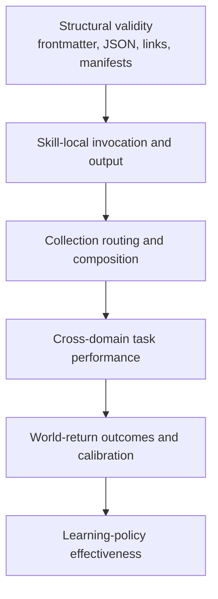
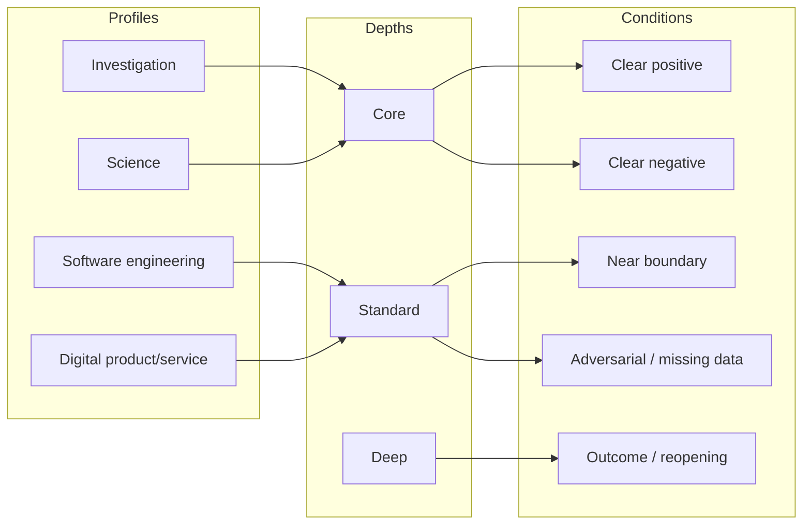
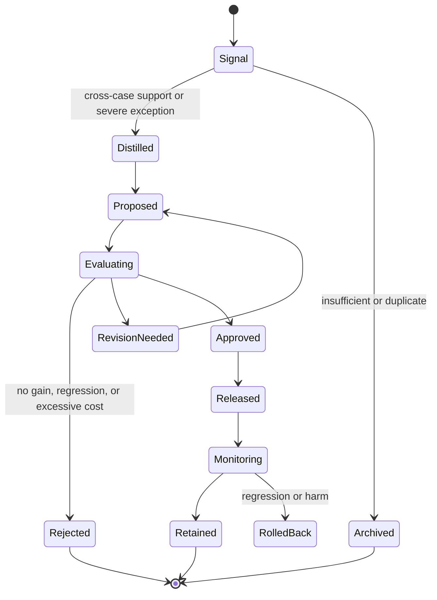

# Evaluation and improvement governance

## Status claim

Parallax v0.1.0 is **evaluation-ready but not empirically validated**. Structural validation, plausible theory, and authored tests do not establish that the collection improves outcomes across agents, clients, domains, or real work.

## Evaluation layers



Passing a lower layer is necessary for interpreting the next, but does not guarantee it.

### Structural validity

Check:

- Agent Skills frontmatter and directory naming;
- parseable JSON/YAML where applicable;
- graph node and edge integrity;
- internal links and relative paths;
- artifact examples and validators;
- absence of vendor-specific assumptions from the canonical package.

Structural checks are necessary but insufficient. Clean-context integration tests MUST follow meaning across the contract chain:

```text
skill prose → template/artifact → validator → consumer/handoff → collection outcome
```

A conceptually correct instruction is non-working when its template cannot represent it, a validator accepts contradictory or placeholder state, or a consumer interprets the producer's field differently.

### Skill-local evaluation

Each skill owns `evals/evals.json` plus trigger training and held-out validation sets where supplied. Evaluate direct entry, missing inputs, positive and negative invocation, output artifacts, self-critique, scale preservation, and boundary behaviour.

Generated outputs, timings, grading, and benchmarks belong in an evaluation workspace outside the installable skill.

### Collection evaluation

The suites in `.agent/skills/cognition/parallax/evaluations/` cover:

- routing and sibling disambiguation;
- composition, protected parallelism, and hand-offs;
- investigation/science/software/product combinations;
- reopening and revision preservation;
- recursive L0/L1/L2 learning;
- metamorphic scale, basis, provenance, and time transformations.

### World-return evaluation

Track whether inquiry influenced observable decisions or outcomes, whether predicted and adverse outcomes were monitored, whether thresholds worked, whether uncertainty was calibrated, and whether the cost of inquiry was proportionate.

### Learning-policy evaluation

Compare future performance before and after approved changes to routing, methods, evaluation, or Practice learning policy. Avoid circular grading in which the process judges success solely by producing more process artifacts.

## Comparative design

For every meaningful test, compare at least one baseline:

- no Parallax skill;
- a narrower skill versus full orchestration;
- prior released version;
- alternative skill composition;
- different depth; or
- domain expert/human process where appropriate.

Use clean contexts. Repeat stochastic runs enough to estimate instability. Record time, tokens, external cost, human effort, latency, and opportunity cost alongside quality.

## Assertion classes

| Class | Example | Best grader |
|---|---|---|
| Structural | Output JSON parses; artifact IDs resolve | Deterministic validator |
| Procedural | A serious counterdesign is compared | Rubric with cited output evidence |
| Epistemic | Cross-scale inference has a supported Bridge Claim | Expert or calibrated model-assisted review |
| Routing | Product experiment triggers; generic design co-activates only when warranted | Held-out activation harness |
| Safety/scope | Design request does not deploy or expose users | Deterministic action log plus review |
| Outcome | Monitoring detects a predeclared adverse threshold | Real/simulated event replay plus review |
| Efficiency | Quality gain justifies context/time cost | Comparative benchmark and human judgement |
| Contract compatibility | Producer and consumer agree on field meaning, overlay authority and readiness | Deterministic schema/validator checks plus clean-context handoff replay |

Assertions must be observable, specific, and resistant to superficial keyword compliance. Human review remains necessary for qualities that were not anticipated or cannot be decomposed safely.

## Evaluation matrix



The diagram indicates required coverage dimensions, not fixed pairings. The actual portfolio should cross profiles, depths, and conditions.

## Metamorphic tests

Metamorphic evaluation varies one property while holding others stable or predicts a controlled change:

- duplicate evidence with common provenance: corroboration must not increase as if independent;
- change observation scale but keep claimed consequence: a Bridge Claim becomes necessary;
- extend time horizon: short-term product results no longer support durable impact without transport evidence;
- reverse a partial basis crosswalk: the mapping must not become automatically invertible;
- relabel a before/after or other quasi-experimental design as “A/B”: the design family and identification assumptions must remain explicit rather than inheriting randomisation;
- remove action authority: analysis may continue but execution must stop;
- add a high-severity affected group: depth, guardrails, or audit should escalate;
- supply the same task with settled low risk: Parallax should reduce depth or decline;
- trigger a World-Return threshold: history remains, revision increments, relevant stage reopens.

## Metrics and interpretation

Track a multidimensional benchmark rather than one aggregate score:

- activation precision/recall and sibling confusion;
- artifact validity and traceability;
- correct separation of epistemic `status` from operational `lifecycle_state`;
- alternative, stakeholder, and scale coverage;
- dependence detection;
- calibrated status and uncertainty;
- decision relevance and scope preservation;
- audit defect discovery and false-alarm rate;
- world-return completeness;
- outcome prediction/calibration where measurable;
- time, tokens, cost, latency, and human burden;
- regression rate outside the intended change.

An improvement in documentation completeness can coexist with worse decision quality or excessive cost. Blocking safety, rights, or provenance failures must not be averaged away by cosmetic gains.

## Change governance



Required release evidence for behavioural changes:

1. problem evidence and affected scope;
2. minimal proposed change and causal rationale;
3. baseline or prior-version comparison;
4. held-out invocation tests if descriptions changed;
5. skill-local and collection regressions;
6. relevant cross-domain and metamorphic tests;
7. human review of representative outputs;
8. cost and portability assessment;
9. version, changelog, rollout, monitoring, and rollback plan;
10. later world-return review where the change claims real-world improvement.

## Avoiding evaluation capture

- Keep training and held-out trigger prompts separate.
- Add naturally occurring failures to a quarantine set before changing instructions.
- Prefer principle-level fixes over prompt-specific patches.
- Periodically refresh cases to avoid benchmark overfitting.
- Blind comparative review where practical.
- Include cases where the correct result is decline, uncertainty, or no experiment.
- Audit assertions for being too easy, brittle, or proxy-like.
- Preserve failed and superseded versions for causal comparison.
- Treat evaluator/model dependence as evidence dependence.

## Advancement beyond v0.1.0

The collection should not be labelled empirically validated until it has:

- passed structural and authored evals;
- demonstrated activation reliability on held-out prompts across consuming agents;
- improved substantive outputs over baselines in all four domain profiles;
- shown proportionate cost at more than one depth;
- exercised direct, artifact, assurance, outcome, reopening, and portfolio entries;
- completed real world-return cycles;
- shown at least one proposed skill improvement survives regressions and improves later performance;
- documented known failure domains and specialist-review boundaries.
