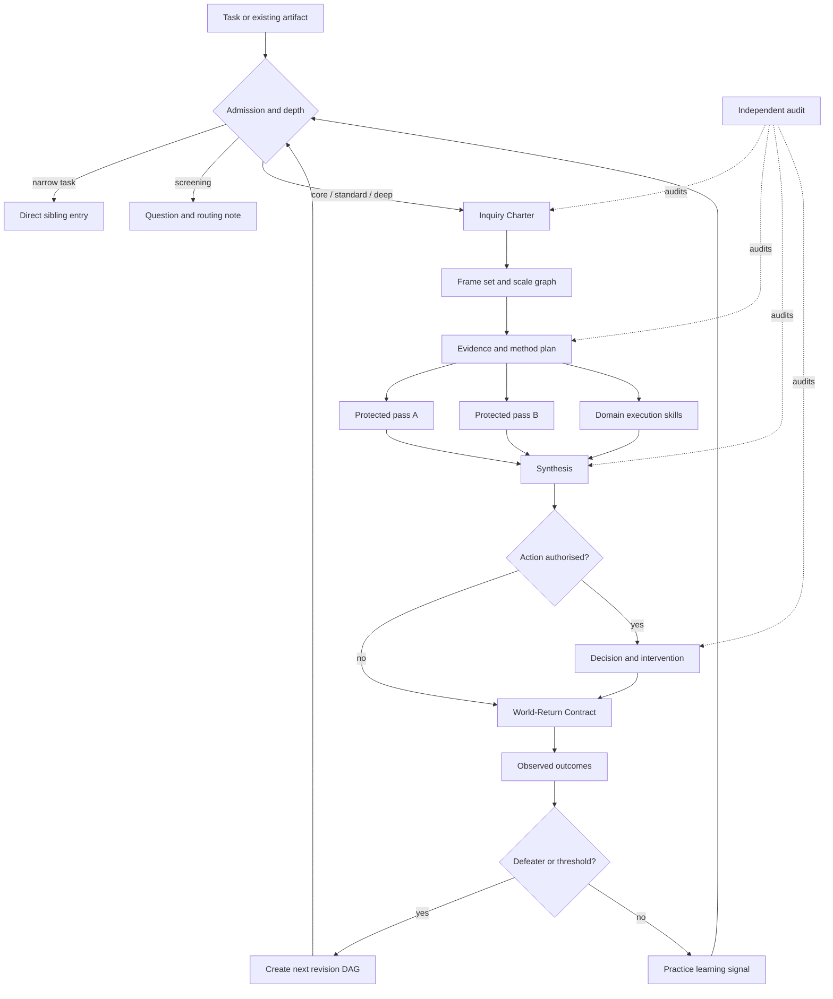

# Orchestration and entry-point reference

Use this reference when selecting a starting point, compiling a run, or reopening an inquiry.

## Entry points

| Available state | Enter through | Minimum safe behaviour |
|---|---|---|
| Only a consequential or ambiguous request | `parallax` | Admit, select depth, create a provisional Charter |
| Contested question or suspected wrong frame | `parallax-frame` | Produce alternative Frame Cards and scale map |
| A stable question needing an investigation plan | `parallax-design-inquiry` | Produce an Evidence and Method Plan |
| Several existing evidence or method reports | `parallax-synthesise` | Produce conflicts, dependencies, defeaters, and an Epistemic Profile |
| A decision is required from existing evidence | `parallax-decide` | Separate evidence from values; produce decision and world-return artifacts |
| A completed or proposed inquiry needs challenge | `parallax-audit` | Audit independently and identify reopening conditions |
| Outcomes or repeated cases are available | `parallax-learn` | Analyse performance and propose governed improvements |

No entry point may pretend its upstream artifacts exist. Initialise missing context, operate in a labelled reduced mode, or decline.

## Reusable capability graph and materialised run

A single inquiry revision should normally be a DAG. Reopening creates a new revision; the reusable capability graph and long-term learning network are intentionally cyclic.

## Guarded edge types

- `requires`: target cannot operate honestly without the artifact.
- `enables`: source makes target eligible but not mandatory.
- `complements`: protected or concurrent passes add distinct warrant.
- `alternative-to`: choose one or compare explicitly.
- `specialises`: domain capability adapts a general procedure.
- `audits`: separate context challenges another capability or artifact.
- `inhibits`: a finding makes an action or method inappropriate.
- `escalates-to`: stakes or defects justify deeper work.
- `reopens`: an outcome invalidates closure and creates a new revision.
- `updates-policy-for`: cross-case learning proposes a routing or method change.

## Depth compilation rules

Compile only the nodes needed to cover the declared critical functions. A function may be covered by one method or several complementary methods. Record deliberate omissions and their risk. Prefer a reversible probe over expensive analysis when it can resolve the material uncertainty safely.

## Emulation fallback

Native sibling invocation is preferred. If the host cannot invoke a sibling, mark the capability and its artifacts `emulated-reduced`, load the sibling instructions or contract when accessible, and validate required invariants, inputs, outputs, status, permissions, and handoff conditions. If that cannot be done, report non-conformance rather than presenting the emulation as the sibling's completed work.

Emulation shares the orchestrator's context, anchors, sources, and competence limits. An emulated audit is therefore `same-context-self-review`; it never fulfils an independent-audit requirement.
