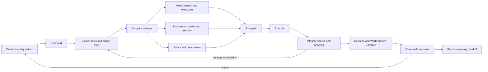

# Design an experiment

Design an inquiry that can change a justified belief or decision. Treat statistical power as one component of a larger contract spanning the question, estimand, validity, execution, interpretation, and return to the world.

Read the [composition contract](references/composition-contract.md) whenever a product overlay exists or shared experiment fields cross skill boundaries.

## Preserve these invariants

- Separate the decision, scientific question, estimand, estimator, estimate, and action rule.
- Express uncertainty and practical importance; never reduce evidence to a thresholded p-value.
- Make assignment, intervention, measurement, analysis, inference, implementation, and outcome-monitoring scales explicit.
- Represent every material cross-scale inference as a bridge claim. Represent translations between incompatible constructs or decompositions as crosswalk claims.
- Protect participant and affected-party welfare, privacy, accessibility, and rights as side constraints, not metrics to trade away.
- Preserve preregistered confirmatory analyses and label deviations, post-hoc analyses, and exploration honestly.
- Treat local self-critique as necessary but not independent assurance.
- Return outcomes and method-performance signals to the embedding Practice; do not retain private memory or rewrite this skill from one run.

## Operating graph



## Start or resume safely

1. Inspect any existing Inquiry Charter, experiment plan, protocol, data dictionary, analysis plan, decision record, and World-Return Contract.
2. If entering directly, initialise the minimum experiment plan from the [experiment-plan template](assets/experiment-plan.template.json).
3. Record distinct `inquiry_revision`, `artifact_revision`, and `protocol_revision` values plus provenance. Never silently overwrite a preregistered plan; create an amendment with rationale and timestamp.
4. Classify the request:
   - **design**: no defensible protocol exists;
   - **critique**: inspect a proposed design without authorising execution;
   - **analysis**: data exist and the estimand and protocol must be reconstructed or checked;
   - **world-return**: outcomes are available after the intervention;
   - **decline/escalate**: required expertise, authority, ethics review, data, or feasibility is absent.
5. Use screening, core, standard, or deep depth proportionate to stakes, irreversibility, novelty, disagreement, and design complexity.

## Build the experiment contract

### 1. Anchor the decision and question

State:

- the decision the evidence is meant to inform;
- the claim and question type;
- the theory or mechanism linking intervention to outcome;
- credible alternatives, counterframes, null effects, and adverse effects;
- what result would change the decision, what would not, and why an experiment is worth its costs.

Decline false experimentalism. If an experiment cannot identify the relevant effect, choose a different evidential method or state the limitation.

### 2. Define the estimand before the estimator

Specify the target population, conditions or interventions, outcome and time horizon, contrast or summary measure, and treatment of intercurrent events such as non-adherence, switching, attrition, competing events, or partial exposure. Distinguish the assignment effect from effects among exposed or compliant units.

Read [design selection](references/design-selection.md) when choosing an experimental family or causal alternative.

### 3. Map dimensions, scales, and bridges

Create a task-specific scale map. At minimum compare:

- unit and mechanism of assignment;
- unit receiving or experiencing the intervention;
- spatial, temporal, population, organisational, and technical extent;
- measurement unit and cadence;
- analysis unit and dependence structure;
- target population and validity domain;
- implementation and world-return horizon.

For every mismatch, record a bridge claim with transformation or mechanism, assumptions, information loss, supporting and challenging evidence, uncertainty, validity domain, and reopening condition. Do not use `micro/meso/macro` as a substitute for explicit coordinates.

### 4. Compare designs, not just variants of one design

Generate at least one serious counterdesign. Consider, as relevant:

- individually randomised parallel, paired, crossover, blocked, or stratified designs;
- factorial, fractional-factorial, response-surface, or screening designs;
- cluster, split-plot, stepped-wedge, or multi-site designs;
- group-sequential, adaptive, enrichment, or multi-arm designs;
- regression discontinuity, interrupted time series, difference-in-differences, instrumental-variable, matched comparison, or synthetic-control designs;
- observational, natural, simulation, computational, N-of-1, qualitative, or mixed-method complements.

Select against the estimand, interference, feasibility, ethics, validity threats, expected information, operational fragility, and cost—not prestige or familiarity.

### 5. Design measurement and execution

Define construct validity, operationalisation, reliability, calibration, timing, blinding where feasible, fidelity, manipulation checks, missingness, contamination, measurement reactivity, and data-quality checks. Preserve raw observations and transformations with provenance.

Specify allocation generation, concealment where relevant, stable identifiers, controls, protocol deviations, and the dependency structure. Avoid conditioning on post-treatment variables unless the estimand and causal assumptions justify it.

Read [validity and analysis](references/validity-analysis.md) for validity, missing-data, analysis, and interpretation checks.

### 6. Design for information, not a ritual sample size

Choose a smallest effect of substantive interest or decision-relevant effect range. Evaluate estimation precision, interval width, expected information, decision error, or posterior decision probability as appropriate. If using frequentist power, state alpha, target power, sidedness, effect, variance/base rate, allocation, design effect, attrition, non-compliance, multiplicity, interim looks, and analysis method.

Use sensitivity curves or scenarios rather than one optimistic point estimate. Account for clustering, repeated measures, unequal allocation, finite populations, measurement error, covariate adjustment, heterogeneous effects, and recruitment constraints. Simulate complex sequential, adaptive, nonlinear, or dependency-rich designs.

Read [power, precision, and information](references/power-precision.md) whenever sizing, power, precision, sequential monitoring, or adaptation matters.

### 7. Establish ethics and governance before execution

Identify participants and indirectly affected parties, burdens, foreseeable harms, exclusion, accessibility, privacy, consent, equipoise, compensation, conflicts, stop rules, and applicable institutional, legal, professional, or regulatory review. In regulated or high-stakes domains, require qualified domain and statistical review.

Preregister the protocol and analysis plan when feasible. Freeze primary and key secondary outcomes, estimands, exclusions, transformations, multiplicity strategy, interim rules, missing-data assumptions, sensitivity analyses, and decision thresholds. Distinguish protocol registration from public disclosure when confidentiality or safety constrains publication.

Read [ethics, governance, and open science](references/ethics-open-science.md) for governance and reporting sources.

### 8. Pre-mortem and run gate

Before declaring the design ready:

- try to explain a positive result through bias, leakage, measurement change, attrition, interference, multiplicity, or implementation failure;
- try to explain a null result through imprecision, weak intervention, non-compliance, insensitive measurement, dilution, or timing;
- test the randomisation and analysis code with synthetic data when code exists;
- check whether the planned analysis recovers known effects under realistic simulations;
- seek independent audit for consequential, novel, adaptive, regulated, or difficult-to-reverse experiments.

Keep epistemic `status` separate from `lifecycle_state`. Mark lifecycle `ready-to-run` only when status is `validated`, or `provisional` with explicit non-blocking gaps and rationale, and required approvals, instruments, data contracts, analysis code, stopping rules, and operational ownership exist. Readiness never validates the substantive claim. Otherwise retain lifecycle `draft` or `blocked` and use the honest epistemic status.

## Analyse and interpret

1. Verify provenance, eligibility, allocation, exposure, fidelity, attrition, missingness, and protocol deviations before effects.
2. Execute the preregistered primary analysis first. Preserve its result before exploratory work.
3. Align estimator and population with the estimand; report assumption-dependent sensitivity analyses.
4. Apply the prespecified multiplicity and sequential policy. Do not repair an invalid design with post-hoc modelling.
5. Report effect estimates, uncertainty, practical meaning, adverse outcomes, missingness, exclusions, and the scope of generalisation.
6. Label subgroup and heterogeneous-effect analyses as confirmatory only when adequately justified and planned.
7. Distinguish absence of evidence, evidence of negligible effect, and evidence of harm.
8. Record anomalies and serious alternative explanations in a conflict/defeater ledger.

## Return to the world

Create or update a World-Return Contract containing predicted consequences, observation windows, owners, measures at relevant scales, thresholds, adverse indicators, reopening criteria, and the next decision. Monitor implementation effects beyond the experimental endpoint where the decision changes a real system.

At closure, report one of: `validated`, `provisional`, `inconclusive`, `insufficient-evidence`, `declined`, `reopened`, or `superseded`.

Emit a Practice learning handoff when there is a durable surprise, correction, repeated failure mode, method-performance result, or invocation lesson. Include evidence, scope, confidence, possible destination, and whether immediate operational continuity is required. Do not edit Practice memory unless the host authorises it. See the [Practice handoff contract](references/practice-handoff.md).

## Validate artifacts

Run:

```bash
python3 scripts/validate_experiment_plan.py path/to/experiment-plan.json
```

Treat structural validation as necessary but not epistemic certification.

The validator always reports `scope: structural-only` and `execution_authorised: false`. If Python 3.10+ is unavailable, manually verify against the local template and composition contract that: the common envelope and three revisions are explicit; status and lifecycle are distinct and compatible; no `TODO:` remains in a materially required ready-to-run field; every scale region, basis, method pass, bridge, and crosswalk retains identity; a cluster family has the complete numeric cluster contract; composition authority and consistency evidence are coherent; approvals, owners, stops, and World-Return conditions are resolved. Record that deterministic validation was unavailable. Manual review never authorises execution.

## Output

Produce the smallest set appropriate to the entry point:

- experiment plan and scale/bridge map;
- protocol and analysis plan or critique;
- sizing/precision assumptions and sensitivity scenarios;
- ethics, governance, execution, and stop conditions;
- results with an Epistemic Profile;
- decision implications separated from values and preferences;
- World-Return Contract;
- proposed Practice learning handoff.

Keep uncertainties, unresolved conflicts, and non-identifiable claims visible.
