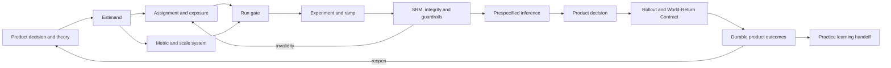

# Design a product experiment

Design a controlled product intervention that answers a consequential product decision without sacrificing trustworthy assignment, user welfare, or long-term outcomes. Treat A/B testing as a specialised experimental system, not a dashboard ritual.

Read the [composition contract](references/composition-contract.md) whenever this protocol overlays a general Experimental Design or must operate safely without that sibling.

## Preserve these invariants

- Separate product intent, theory of change, estimand, metric, estimator, result, and rollout decision.
- Establish assignment and exposure integrity before interpreting effects. A low p-value cannot rescue an invalid experiment.
- Report effect magnitude, uncertainty, practical significance, guardrails, harms, and distribution—not only statistical significance.
- Make user, session, account, classroom/organisation, service, ecosystem, and temporal scales explicit where relevant.
- Encode material translations from telemetry to construct, construct to user value, and experimental effect to durable product outcome as bridge or crosswalk claims.
- Keep confirmatory, exploratory, and operational monitoring analyses distinguishable.
- Use local self-critique, and seek independent assurance for consequential or novel tests.
- Return experiment and rollout outcomes to the embedding Practice; do not retain private memory or modify the skill from one result.

## Operating graph



## Start or compose

1. Inspect an existing Inquiry Charter, product theory of change, experiment plan, metric definitions, assignment/exposure design, analysis plan, feature-flag plan, decision record, and World-Return Contract.
2. If entering directly, initialise the [product-experiment-plan template](assets/product-experiment-plan.template.json) and reconstruct missing context explicitly.
3. If `parallax-design-experiment` is available, compose with it for cluster, factorial, sequential/adaptive, quasi-experimental, interference-heavy, high-stakes, regulated, or methodologically novel work. Follow the composition contract: reference the base artifact and exact inquiry, artifact, and protocol revisions; never duplicate shared fields without verified consistency evidence.
4. If it is unavailable, execute this complete minimum workflow; never fail solely because a sibling skill cannot be called.
5. Classify the entry:
   - **design** before traffic is exposed;
   - **integrity audit** during or after collection;
   - **analysis/decision** after a planned stopping condition;
   - **rollout/world-return** after the experimental decision;
   - **decline/escalate** when authority, telemetry, ethics, specialist review, or identification is inadequate.

## Establish the product contract

### 1. Anchor the product decision

State the user or public value intended, affected parties, current experience, proposed intervention, theory of change, credible alternatives and adverse mechanisms, decision options, practical success threshold, costs, and reversibility.

Do not experiment merely because infrastructure exists. If qualitative discovery, accessibility research, telemetry repair, or a reversible prototype addresses the uncertainty better, say so.

### 2. Define population, assignment, exposure, and estimand

Specify:

- eligible population and exclusions;
- randomisation unit and stable bucketing identity;
- intervention variants and allocation;
- exposure event and when outcomes begin accruing;
- analysis population and assignment-versus-exposure effect;
- outcome, time horizon, contrast, and handling of switching, partial exposure, attrition, repeated visits, identity loss, bots, or cross-device use.

Prefer analysis from assignment when that answers the rollout decision. Triggered/exposed analyses may improve precision but can introduce post-assignment selection; justify them causally.

Read [assignment, exposure, and integrity](references/assignment-integrity.md) for bucketing, exposure, SRM, interference, concurrent experiments, and A/A tests.

### 3. Map product scales and bridges

Compare at least:

- assignment and exposure units;
- event, session, user/account, group/organisation, service, and ecosystem extents;
- metric aggregation and analysis unit;
- novelty, learning, retention, and long-term outcome horizons;
- experiment traffic, rollout population, and excluded or low-connectivity populations;
- technical reliability, user behaviour, user value, organisational outcome, and social impact.

For each mismatch, write a bridge claim with mechanism, assumptions, evidence, uncertainty, information loss, validity domain, and reopening condition. A click is not automatically engagement; engagement is not automatically learning, wellbeing, trust, or mission impact.

### 4. Build a metric system

Define:

- one decision-relevant primary metric or an explicit multiple-primary policy;
- guardrails for reliability, performance, safety, privacy, accessibility, burden, quality, and downstream harms;
- diagnostic metrics that distinguish the theory of change from alternatives;
- data-quality metrics including assignment counts, exposure, missingness, latency, and event-schema versions;
- long-term measures that may require holdouts or post-rollout observation.

State metric numerator, denominator, unit, aggregation, window, direction, practical threshold, owner, source, version, and validity evidence. Predefine transformations, outlier handling, variance reduction, and missingness.

Read [metrics, sizing, and inference](references/metrics-inference.md) for sizing, inference, practical significance, multiplicity, and heterogeneous effects.

### 5. Select the design

Compare a standard user-level A/B/n test with at least one credible alternative where relevant:

- cluster or organisation assignment;
- switchback or time-blocked randomisation;
- geo experiment;
- factorial test;
- long-term holdout;
- staged encouragement or invitation design;
- regression discontinuity, interrupted time series, difference-in-differences, synthetic control, or matched comparison when randomisation is unavailable;
- qualitative or usability evidence as a protected complement rather than a pseudo-randomised substitute.

Choose based on the mechanism, interference, operational constraints, validity, ethics, information, and decision—not convenience alone.

### 6. Size for a useful decision

Set the smallest practically consequential effect or equivalence/non-inferiority region. State baseline rate or variance, target interval width or power, alpha/error policy where used, allocation, eligibility and exposure rate, attrition, repeated measures, clustering, covariance reduction, multiplicity, interim looks, and duration.

Show sensitivity across plausible baselines, variance, traffic, effect, exposure, and seasonality. Ensure the duration covers complete business/service cycles and plausible novelty or learning dynamics. More traffic over an unrepresentative period is not necessarily more information.

Use fixed-horizon inference only if no decisions depend on repeated inspection. If teams will peek, ramp, stop, or extend based on results, adopt and document a coherent sequential or Bayesian policy prospectively. Do not repeatedly apply fixed-horizon tests.

### 7. Protect users and service integrity

Assess privacy, consent or lawful basis, safeguarding, manipulation, dark patterns, accessibility, exclusion, vulnerable groups, material disadvantage, unequal error, and indirect harms. Guardrails are constraints: an average gain does not cancel a severe accessibility or safeguarding regression.

Design ramp stages, capacity checks, kill switch, stop conditions, incident ownership, rollback, and recovery. Assign before exposure where feasible; preserve stable assignment through ramps. Define whether emergency stops invalidate confirmatory inference and how the event will be reported.

Read [ramping, affected parties, and durable outcomes](references/rollout-outcomes.md) for ethics, accessibility, ramping, decisions, and long-term return.

## Run gate and monitoring

Before exposure:

- freeze the protocol, metric definitions, variants, analysis, duration/information threshold, sequential policy, and decision rules;
- validate randomisation, bucketing, mutual exclusion, exposure logging, outcome joins, bot/internal filtering, event schemas, and rollback;
- run synthetic or replay tests; use an A/A test when its cost is justified and platform integrity is uncertain;
- define SRM and data-quality alerts independently of effect monitoring;
- record concurrent experiments and expected interactions;
- obtain required product, engineering, data, accessibility, privacy, safeguarding, ethics, and domain approvals.

During collection, investigate SRM, unexpected exposure, guardrail breaches, telemetry changes, interference, incidents, and protocol deviations before interpreting treatment effects. Do not "correct" unexplained SRM and continue as though validity were restored.

Keep epistemic `status` separate from `lifecycle_state`. Mark lifecycle `ready-to-run` only when status is `validated`, or `provisional` with explicit non-blocking gaps and rationale, and the evidence pipeline, operational controls, ownership, approvals, frozen protocol, and analysis contract are resolved. Readiness never validates the substantive claim.

## Analyse and decide

1. Freeze the analysis dataset and provenance at the planned decision point.
2. Check allocation counts and SRM, exposure, eligibility, joins, missingness, telemetry versions, sample composition, repeated units, and concurrent tests.
3. Execute the prespecified primary analysis before exploration.
4. Report absolute and relative effects where useful, intervals, practical thresholds, guardrails, harms, and sensitivity analyses.
5. Apply the prespecified sequential and multiplicity policy.
6. Examine novelty, seasonality, interference, carryover, and implementation fidelity.
7. Treat heterogeneous effects cautiously: predefine consequential segments, model uncertainty, and avoid declaring subgroup wins from noisy slices.
8. Separate the causal result from the rollout choice. Include strategic value, opportunity cost, reversibility, operational risk, rights, and affected-party distribution.
9. Choose among ship, do not ship, extend under the existing valid policy, redesign, partial/reversible rollout, further investigation, or inconclusive. Never extend only because a fixed-horizon result narrowly missed significance.

## Return beyond the test

The experiment endpoint is not the end of the inquiry. Create a World-Return Contract for ramp and full rollout with owners, predicted product and user outcomes, immediate and delayed windows, guardrails, distributional checks, practical thresholds, rollback/reopening rules, and long-term holdout or observational plans where proportionate.

Close as `validated`, `provisional`, `inconclusive`, `insufficient-evidence`, `declined`, `reopened`, or `superseded`.

Emit a Practice learning handoff for platform defects, SRM causes, metric-validity failures, unexpected user effects, outcome reversals, method performance, or skill-routing lessons. Propose rather than silently write memory unless the host authorises it. See the [Practice handoff contract](references/practice-handoff.md).

## Validate artifacts

Run:

```bash
python3 scripts/validate_product_experiment_plan.py path/to/product-experiment-plan.json
```

Structural validity is not causal, statistical, ethical, product, or accessibility approval.

The validator always reports `scope: structural-only` and `execution_authorised: false`. If Python 3.10+ is unavailable, manually verify against the local template and composition contract that: the common envelope and three revisions are explicit; status and lifecycle are compatible; no `TODO:` remains in a materially required ready-to-run field; identity and scale references resolve; randomised families have numeric allocations and enabled SRM; quasi-experimental families have comparison and identification contracts plus an explicit SRM-not-applicable rationale; cluster families have the complete numeric cluster contract; overlay authority, base reference and consistency evidence agree; and approvals, protocol freeze, owners, stop rules, rollback and World-Return conditions are resolved. Record that deterministic validation was unavailable. Manual review never authorises user exposure or production execution.

## Output

Produce the smallest appropriate bundle:

- decision, theory of change, estimand, alternatives, and practical thresholds;
- assignment/exposure design and scale/bridge map;
- versioned metric dictionary, sizing scenarios, and analysis plan;
- integrity, SRM, ramp, stop, and rollback plan;
- ethics, accessibility, privacy, safeguarding, and distribution assessment;
- result and Epistemic Profile;
- rollout decision record and World-Return Contract;
- proposed Practice learning handoff.
