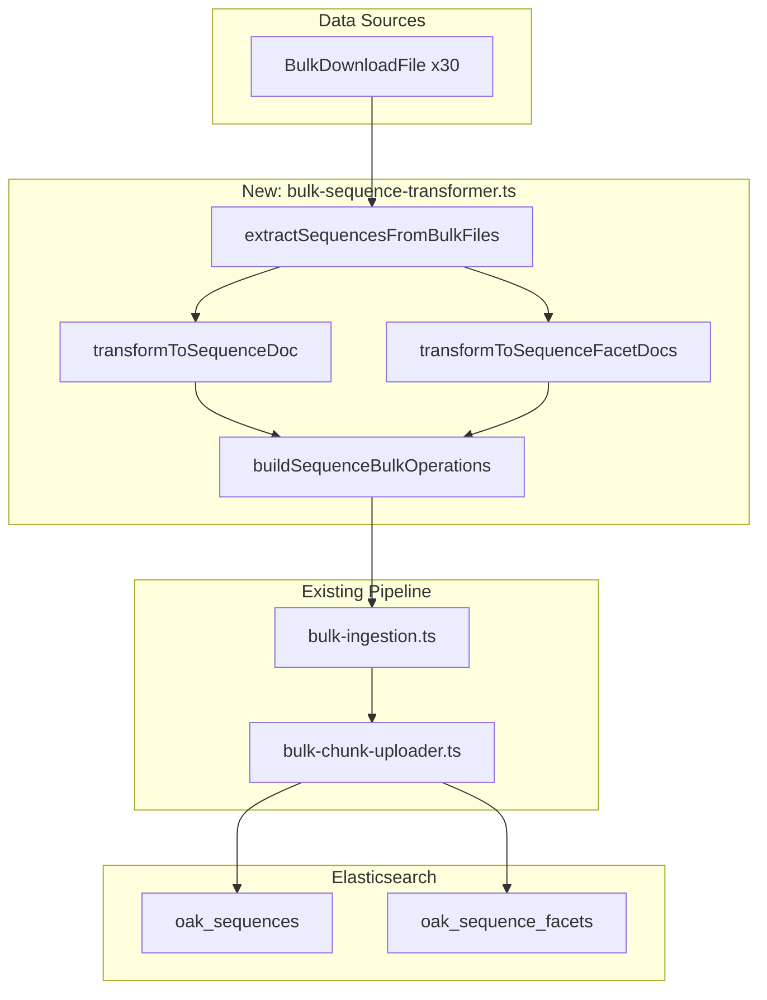

# Bulk Sequence Indexing

## Problem Statement

The bulk download files contain all sequence data needed for indexing, but the bulk-first ingestion pipeline currently skips sequences:

- `oak_sequences`: 0 documents (should have ~30 sequences)
- `oak_sequence_facets`: 0 documents (should have ~60+ facet documents)

The existing builders in `sequence-bulk-helpers.ts` were designed for API input shapes. Following the established pattern (per [ADR-093](docs/architecture/architectural-decisions/093-bulk-first-ingestion-strategy.md)), we need a bulk-specific transformer.

## Architectural Approach




## Key Files

| File | Action ||------|--------|| [`src/adapters/bulk-sequence-transformer.ts`](apps/oak-open-curriculum-semantic-search/src/adapters/bulk-sequence-transformer.ts) | **CREATE** - New transformer || [`src/adapters/bulk-sequence-transformer.unit.test.ts`](apps/oak-open-curriculum-semantic-search/src/adapters/bulk-sequence-transformer.unit.test.ts) | **CREATE** - TDD tests || [`src/lib/indexing/bulk-ingestion.ts`](apps/oak-open-curriculum-semantic-search/src/lib/indexing/bulk-ingestion.ts) | **MODIFY** - Wire sequence operations || [`src/adapters/README.md`](apps/oak-open-curriculum-semantic-search/src/adapters/README.md) | **UPDATE** - Document new transformer |

## Implementation Details

### Phase 1: TDD - Write Tests First (RED)

Create `bulk-sequence-transformer.unit.test.ts` with tests for:

1. **`extractSequencesFromBulkFiles()`** - Extracts one sequence per bulk file

- Derives `subjectSlug` from sequenceSlug (e.g., `"maths-primary"` → `"maths"`)
- Derives `phaseSlug` from sequenceSlug (e.g., `"maths-primary"` → `"primary"`)
- Collects unique `keyStages` from units
- Collects unique `years` from units
- Collects `unitSlugs` and `unitTitles`
- Computes `lessonCount` per key stage

2. **`transformToSequenceDoc()`** - Produces `SearchSequenceIndexDoc`

- All required fields populated
- `sequence_url` constructed correctly
- `title_suggest` with contexts

3. **`transformToSequenceFacetDocs()`** - Produces one `SearchSequenceFacetsIndexDoc` per (sequence, keyStage)

- Groups units by keyStage
- Computes `unit_count` and `lesson_count` per keyStage
- Gets `keyStageTitle` from lessons

4. **`buildSequenceBulkOperations()`** - Produces bulk ops array

- Correct index names
- Correct document IDs

### Phase 2: Implement Transformer (GREEN)

Create `bulk-sequence-transformer.ts` following the `bulk-thread-transformer.ts` pattern:

```typescript
// Key functions (pseudocode)
export function extractSequencesFromBulkFiles(
  bulkFiles: readonly BulkDownloadFile[]
): readonly BulkExtractedSequence[]

export function transformToSequenceDoc(
  sequence: BulkExtractedSequence
): SearchSequenceIndexDoc

export function transformToSequenceFacetDocs(
  sequence: BulkExtractedSequence
): readonly SearchSequenceFacetsIndexDoc[]

export function buildSequenceBulkOperations(
  bulkFiles: readonly BulkDownloadFile[],
  sequencesIndex: string,
  facetsIndex: string
): BulkOperationEntry[]
```


### Phase 3: Wire into Pipeline

Modify [`bulk-ingestion.ts`](apps/oak-open-curriculum-semantic-search/src/lib/indexing/bulk-ingestion.ts):

1. Add index name constants:
   ```typescript
            const SEQUENCES_INDEX = 'oak_sequences';
            const SEQUENCE_FACETS_INDEX = 'oak_sequence_facets';
   ```


2. Add to `prepareBulkIngestion()`:
   ```typescript
            const sequenceResult = extractAndBuildSequenceOperations(bulkDownloadFiles);
            const allOperations = [
              ...processingResult.operations,
              ...threadResult.operations,
              ...sequenceResult.operations  // NEW
            ];
   ```


3. Update `BulkIngestionStats` to include `sequencesIndexed` and `sequenceFacetsIndexed`.

### Phase 4: Documentation

1. **TSDoc** - Comprehensive documentation on all functions with examples
2. **Update [`src/adapters/README.md`](apps/oak-open-curriculum-semantic-search/src/adapters/README.md)** - Add sequence transformer to architecture diagram and file list
3. **Update [`src/lib/indexing/README.md`](apps/oak-open-curriculum-semantic-search/src/lib/indexing/README.md)** - Document sequence ingestion in pipeline overview

### Phase 5: Quality Gates

Run from repo root, one at a time:

```bash
pnpm type-gen
pnpm build
pnpm type-check
pnpm lint:fix
pnpm format:root
pnpm markdownlint:root
pnpm test
pnpm test:e2e
pnpm test:e2e:built
pnpm test:ui
pnpm smoke:dev:stub
```


### Phase 6: Verification

```bash
cd apps/oak-open-curriculum-semantic-search
pnpm es:setup --reset
pnpm es:ingest-live --bulk --bulk-dir ./bulk-downloads --force --verbose
pnpm es:status
# Verify oak_sequences and oak_sequence_facets have document counts
```


## Data Derivation Strategy

| Field | Derivation ||-------|------------|| `subjectSlug` | Parse from sequenceSlug: `"maths-primary".split('-').slice(0,-1).join('-')` → `"maths"` || `phaseSlug` | Parse from sequenceSlug: `"maths-primary".split('-').pop()` → `"primary"` || `phaseTitle` | Capitalise phaseSlug: `"Primary"` || `keyStages` | Unique `unit.keyStageSlug` values from `sequence[]` || `keyStageTitle` | Lookup from `lessons[]` by matching `keyStageSlug` || `years` | Unique `unit.year` values (as strings) from `sequence[]` || `unitSlugs` | Collect `unit.unitSlug` from `sequence[]` || `unitTitles` | Collect `unit.unitTitle` from `sequence[]` || `lessonCount` | Sum of `unit.unitLessons.length` || `has_ks4_options` | `Boolean(ks4Options?.length)` || `canonicalUrl` | `https://www.thenational.academy/teachers/programmes/${sequenceSlug}/units` |

## Acceptance Criteria

- [ ] `oak_sequences` populated from bulk data (~30 documents)
- [ ] `oak_sequence_facets` populated from bulk data (~60+ documents)
- [ ] No duplication of ingestion pipeline logic (single pipeline)
- [ ] No API calls required for sequence indexing
- [ ] TDD: all tests written before implementation
- [ ] Comprehensive TSDoc on all public functions
- [ ] README documentation updated
- [ ] All quality gates pass

## Foundation Documents (Re-read Before Each Phase)