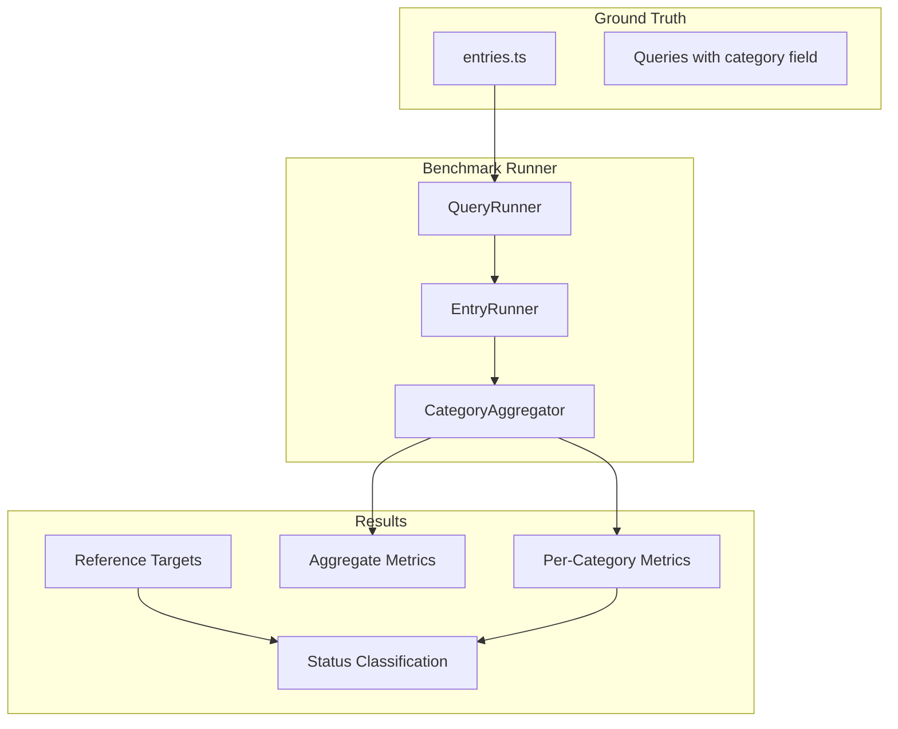

# Consistent Categories + Full Benchmark Output

## Problem Statement

1. **Inconsistent category coverage**: Only `maths/secondary` has `pedagogical-intent` queries (5). The other 29 entries have 0.
2. **Benchmark output lacks granularity**: Currently shows only aggregate metrics per subject/phase. Need per-category breakdown showing measured vs target with status indicators.

---

## Part 1: Add Pedagogical-Intent Queries to All Entries

### What is a pedagogical-intent query?

| Aspect | Description |

|--------|-------------|

| User scenario | Teacher describes teaching **goal/purpose**, not curriculum topic |

| Examples | "extension work for able students", "visual introduction for beginners", "revision activity before exam" |

| Behavior tested | System understands pedagogical intent without explicit topic keywords |

| MRR expectation | Lower (exploratory) - this is the hardest category |

### Files to modify (29 entries)

Each subject/phase directory needs 1+ pedagogical-intent query added:

```
src/lib/search-quality/ground-truth/{subject}/{phase}/
```

All subjects except maths/secondary: art, citizenship, computing, cooking-nutrition, design-technology, english, french, geography, german, history, music, physical-education, religious-education, science, spanish (primary and secondary where applicable).

### Query template pattern

```typescript
{
  query: '[teaching goal] [optional context]',
  expectedRelevance: {
    'highly-relevant-lesson-slug': 3,
    'relevant-lesson-slug': 2,
  },
  category: 'pedagogical-intent',
  description: 'Tests [specific behavior being validated]',
  priority: 'exploratory',
}
```

### Realistic examples by subject area

| Subject | Example Query | Intent Being Tested |

|---------|---------------|---------------------|

| science | "hands-on activity for reluctant learners" | Engagement-based selection |

| english | "creative writing warm-up activity" | Lesson type intent |

| history | "starter activity to hook year 8" | Year-group context |

| geography | "consolidation activity after fieldwork" | Sequence position |

| PE | "indoor lesson rainy day alternative" | Context-based selection |

| MFL | "confidence building speaking activity" | Skill-focus intent |

### Validation requirements

Each query must pass all 16 validation checks in [`validate-ground-truth.ts`](apps/oak-open-curriculum-semantic-search/evaluation/validation/validate-ground-truth.ts):

- 3-10 words
- At least 2 slugs with varied scores
- At least one score=3
- Valid slugs that exist in bulk data
- Correct phase/subject match

### Decision: Make pedagogical-intent required?

Current: Optional (0-1 minimum)

**Recommendation**: Update [`validate-ground-truth.ts`](apps/oak-open-curriculum-semantic-search/evaluation/validation/validate-ground-truth.ts) to make `pedagogical-intent` a required category with minimum 1 query per entry, ensuring consistent coverage going forward.

```typescript
// In validate-ground-truth.ts
const REQUIRED_CATEGORIES = [
  'precise-topic',
  'natural-expression',
  'imprecise-input',
  'cross-topic',
  'pedagogical-intent',  // ADD
] as const;

const CATEGORY_MINIMUMS: Readonly<Record<string, number>> = {
  'precise-topic': 4,
  'natural-expression': 2,
  'imprecise-input': 1,
  'cross-topic': 1,
  'pedagogical-intent': 1,  // ADD
};
```

---

## Part 2: Update Benchmark to Output Per-Category Metrics

### Current output structure

```
Subject    | Phase    | #Q  | MRR  | NDCG | P@10 | R@10 | Zero% | p95ms
art        | primary  | 9   | 0.889| 0.809| 0.167| 0.833| 0.0%  | 2344
```

### Target output structure

```
Subject    | Phase    | Category           | #Q | MRR   |vs Tgt|Diff  |Status
art        | primary  | precise-topic      | 5  | 0.920 | 0.70 |+31%  | GOOD
art        | primary  | natural-expression | 2  | 0.750 | 0.70 |+7%   | GOOD
art        | primary  | imprecise-input    | 1  | 1.000 | 0.70 |+43%  | GOOD
art        | primary  | cross-topic        | 1  | 0.500 | 0.70 |-29%  | ACCEPTABLE
art        | primary  | AGGREGATE          | 9  | 0.889 | 0.70 |+27%  | GOOD
-----------+----------+--------------------+----+-------+------+------+-------
[repeat for all 6 metrics]
```

### Status categorization

Based on [`baselines.json`](apps/oak-open-curriculum-semantic-search/evaluation/baselines/baselines.json) reference values:

| Status | MRR | NDCG@10 | P@10 | R@10 | Zero% | p95ms |

|--------|-----|---------|------|------|-------|-------|

| GOOD | >=0.70 | >=0.75 | >=0.50 | >=0.60 | <=0.10 | <=300 |

| ACCEPTABLE | >=0.50 | >=0.60 | >=0.30 | >=0.40 | <=0.20 | <=500 |

| BAD | >=0.25 | >=0.30 | >=0.15 | >=0.20 | <=0.40 | <=1000 |

| CRITICAL | <0.25 | <0.30 | <0.15 | <0.20 | >0.40 | >1000 |

### Files to modify

1. **[`benchmark-query-runner.ts`](apps/oak-open-curriculum-semantic-search/evaluation/analysis/benchmark-query-runner.ts)** - Add category to QueryResult
2. **[`benchmark-entry-runner.ts`](apps/oak-open-curriculum-semantic-search/evaluation/analysis/benchmark-entry-runner.ts)** - Track and return per-category results
3. **[`benchmark-main.ts`](apps/oak-open-curriculum-semantic-search/evaluation/analysis/benchmark-main.ts)** - New printDetailedResults() function
4. **[`benchmark-stats.ts`](apps/oak-open-curriculum-semantic-search/evaluation/analysis/benchmark-stats.ts)** - Add status classification functions

### Data flow



### New types needed

```typescript
interface CategoryResult {
  category: QueryCategory;
  queryCount: number;
  mrr: number;
  ndcg10: number;
  precision10: number;
  recall10: number;
  zeroHitRate: number;
  p95LatencyMs: number;
}

interface MetricStatus {
  measured: number;
  target: number;
  diff: number;       // (measured - target) / target
  status: 'GOOD' | 'ACCEPTABLE' | 'BAD' | 'CRITICAL';
}
```

---

## Implementation Order

1. Update validation to require pedagogical-intent (1 file)
2. Add pedagogical-intent queries to 29 entries (29 files)
3. Run `pnpm ground-truth:validate` to confirm all pass
4. Update benchmark types and runner (3 files)
5. Update benchmark output formatting (1 file)
6. Run `pnpm benchmark --all` to verify new output
7. Update EXPERIMENT-LOG.md with per-category grid

---

## Success Criteria

- [ ] All 30 entries have 1+ pedagogical-intent queries
- [ ] `pnpm ground-truth:validate` passes with 0 errors
- [ ] `pnpm benchmark --all` outputs per-category metrics for every entry
- [ ] Each metric row shows: measured, target, diff%, status
- [ ] Quality gates pass (`pnpm type-check`, `pnpm lint:fix`, `pnpm test`)
