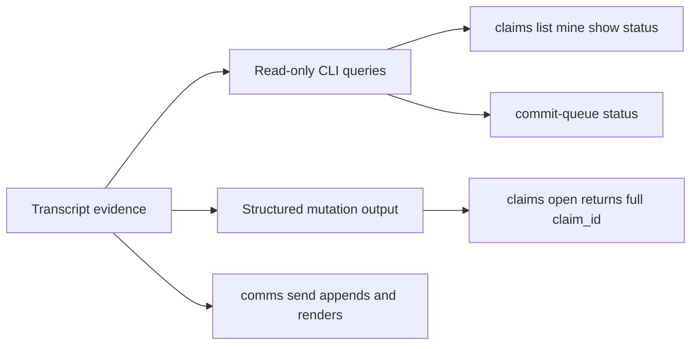

# Collaboration CLI Ergonomics Plan

## Scope

Add the smallest CLI surface that replaces the Python workarounds observed in recent Claude transcripts:

- `claims open` prints the generated full `claim_id` in a machine-readable way.
- `claims list`, `claims mine`, `claims show`, and `claims status` provide read-only inspection of active claims and freshness.
- `commit-queue status` exposes queue entries without manually parsing `active-claims.json`.
- `help` becomes discoverable at top-level and per topic/action.
- Argument validation reports unknown flags before missing required flags when possible.
- `comms send` provides a low-boilerplate append-and-render path using defaults for event ID, timestamps, repo paths, and identity.

## Key Files

- [agent-tools/src/collaboration-state/cli.ts](agent-tools/src/collaboration-state/cli.ts) routes collaboration-state topics/actions.
- [agent-tools/src/collaboration-state/cli-options.ts](agent-tools/src/collaboration-state/cli-options.ts) owns current permissive flag parsing and help friction.
- [agent-tools/src/collaboration-state/cli-claim-commands.ts](agent-tools/src/collaboration-state/cli-claim-commands.ts) opens, closes, heartbeats, and archives claims.
- [agent-tools/src/collaboration-state/state-parsers.ts](agent-tools/src/collaboration-state/state-parsers.ts) parses claim and queue records.
- [agent-tools/src/commit-queue/cli.ts](agent-tools/src/commit-queue/cli.ts) owns queue mutation and verification commands.
- [agent-tools/tests/collaboration-state/collaboration-state.unit.test.ts](agent-tools/tests/collaboration-state/collaboration-state.unit.test.ts) and [agent-tools/tests/commit-queue.unit.test.ts](agent-tools/tests/commit-queue.unit.test.ts) receive behaviour-first coverage.
- [agent-tools/README.md](agent-tools/README.md) documents the new operator commands.

## Behaviour Design

Use JSON as the default structured output for new query/mutation-result commands, with compact human output only where an existing command already prints a single token. Keep existing flags working.

For claims freshness, calculate from `heartbeat_at ?? claimed_at` plus `freshness_seconds ?? 14400`; do not introduce `expires_at` or `status` fields into the claim schema just to match the Python workaround.

For `comms send`, keep it as sugar over existing immutable event creation plus render. It should not create a new communication state model.

## Validation

Add focused unit tests for:

- `claims open` returning the full generated or supplied claim ID.
- `claims list/mine/show/status` formatting freshness and area data from a fixture registry.
- help commands returning action lists without exit-2 failures.
- unknown flags producing direct errors.
- `comms send` writing an event and rendering the shared log through existing primitives.
- `commit-queue status` rendering queued, active, expired, and abandoned entries.

Run `pnpm agent-tools:test`, `pnpm agent-tools:lint`, and `pnpm agent-tools:build`. If docs change trigger markdown formatting, run the targeted markdown/format gate for touched files.

## Review

After implementation, dispatch `code-reviewer` for the CLI changes and `test-reviewer` for the new tests. Use `docs-adr-reviewer` if README or plan-facing documentation grows beyond command reference updates.