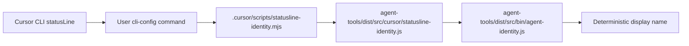

# Cursor Status Line Plan

## Shape

Cursor’s `statusLine` command is user-level, so the repo cannot make Cursor automatically load it from checkout alone. The repo can own the implementation and the documented activation command. The flow will mirror the established Claude shape:



## Implementation

- Add a repo shim at `[.cursor/scripts/statusline-identity.mjs](.cursor/scripts/statusline-identity.mjs)` modelled on `[.claude/scripts/statusline-identity.mjs](.claude/scripts/statusline-identity.mjs)`. It will resolve the repo root, check for the built adapter, delegate via `node`, and fail soft with no stdout.
- Add Cursor-specific adapter code under `[agent-tools/src/cursor/](agent-tools/src/cursor/)`, using the Cursor status-line stdin field `session_id` as the seed. This should parallel `[agent-tools/src/claude/statusline-identity.ts](agent-tools/src/claude/statusline-identity.ts)` while keeping platform naming explicit.
- Add unit tests under `[agent-tools/tests/cursor/](agent-tools/tests/cursor/)` for valid `session_id`, invalid JSON, missing/non-string/blank `session_id`, and whitespace trimming. These tests should match the behaviour already proved by `[agent-tools/tests/claude/statusline-identity-input.unit.test.ts](agent-tools/tests/claude/statusline-identity-input.unit.test.ts)`.
- Update `[agent-tools/package.json](agent-tools/package.json)` build chmod so the built Cursor status-line adapter is executable alongside the Claude one.
- Update `[agent-tools/docs/agent-identity.md](agent-tools/docs/agent-identity.md)` to mark Cursor as `Wired (sessionStart + statusline implementation; user CLI config required)` and document the exact user-level activation snippet for `~/.cursor/cli-config.json`.

## Activation Doc

Document this one-time user config, without committing machine-local config:

```json
{
  "statusLine": {
    "type": "command",
    "command": "node /path/to/repo/.cursor/scripts/statusline-identity.mjs",
    "padding": 2
  }
}
```

If we want portability across checkouts later, we can add a separate user-level wrapper, but this first pass keeps the repo change minimal and faithful to the Claude implementation.

## Validation

- Run `pnpm --filter @oaknational/agent-tools test -- cursor` or the closest targeted Vitest command available for the Cursor tests.
- Run `pnpm --filter @oaknational/agent-tools build` to verify the new adapter is emitted and chmod succeeds.
- Smoke-test the repo shim with a mock Cursor payload: `echo '{"session_id":"example"}' | node .cursor/scripts/statusline-identity.mjs` after build.
- Run lints for changed files and address any diagnostics.

todos:
- Add Cursor status-line shim
- Add adapter and parser tests
- Update build chmod and docs
- Run targeted validation