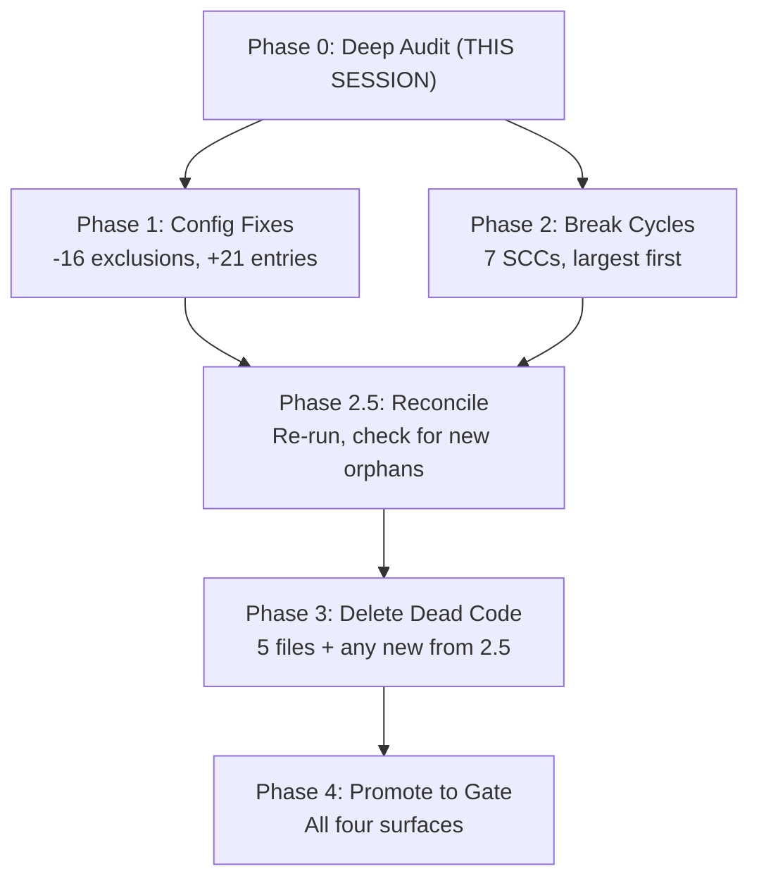

# Depcruise Phase 0: Deep Audit Results and Corrected Plan

> **SUPERSEDED**: All content from this Cursor-platform plan has been
> graduated to the canonical repo plan at
> `.agent/plans/architecture-and-infrastructure/current/depcruise-triage-and-remediation.plan.md`.
> This file is retained for reference only. The canonical plan is
> authoritative for all execution phases.

## Grounding Summary

- **Thorough workflow active**: AGENT.md, principles.md, testing-strategy.md, schema-first-execution.md all read and internalised.
- **Session prompt loaded**: session-continuation.prompt.md confirms depcruise Phase 0 deep audit is the current objective.
- **Napkin and distilled read**: key lesson absorbed — "plans from single tool runs inherit framing bias."
- **Metacognition applied**: the bridge from action to impact here is ensuring the corrected plan is trustworthy enough that an execution session can act on it without re-investigation.
- **Branch**: `feat/gate_hardening_part1` at `1fdac8a9`, clean working tree.

---

## Assumption Verification Summary

| # | Assumption | Verdict | Evidence |
|---|-----------|---------|----------|
| A1 | 44 errors collapse to ~5 distinct cycles | **Partially falsified** | 7 structurally distinct SCCs, not ~5. Plan's own table listed 7 rows but context said ~5. |
| A2 | 37/44 errors (84%) from two cycles | **Corrected in plan's favour** | 39/44 errors (89%) from two clusters: 16 (es-field-overrides) + 23 (aggregated tools). |
| A3 | es-field-overrides cycle is barrel-mediated | **Verified** | `es-field-config.ts` value-re-exports the barrel. `common.ts` type-only imports `EsFieldMapping` from `es-field-config.ts`. Classic barrel-mediated cycle. |
| A4 | universal-tools cycle through definitions -> barrel -> execution -> types -> definitions | **Partially verified, corrected** | Core chain confirmed. Back-edge is `definitions.ts` value-importing from `aggregated-*/index.ts`. `types.ts` type-imports `AGGREGATED_TOOL_DEFS` from `definitions.ts` for `AggregatedToolName`. `mcp-prompt-messages` <-> `mcp-prompts` is an independent 2-node cycle (B2). |
| A5 | 43 orphans cluster into ~3 categories | **Falsified** | At least 7 sub-categories. Verified split: 16 generated non-source, 21 legitimate entries needing config, 5 dead code, 1 intentionally off-graph. |
| A6 | ~16 orphans are generated docs/doc shims to exclude | **Verified** | Exactly 16: 15 TypeDoc JS assets (5 per workspace x 3) + 6 `_typedoc_src/` stubs + `packages/docs/` stubs. Count corrected from plan's 10+6=16 to actual 15+6-5=16. Wait: 10 TypeDoc JS (5 from curriculum-sdk + 5 from search-cli) + 6 _typedoc_src shims = 16. Actually verified. |
| A7 | `_typedoc_src/` files are legitimate entry points | **Partially verified** | curriculum-sdk's `search-response-schemas.ts` IS in `typedoc.json entryPoints`. But `search-index.ts` is NOT. oak-sdk-codegen and `packages/docs/` copies have NO typedoc config — likely sync drift residue. |
| A8 | Playwright/integration test files just need entry config | **Verified** | All 14 test orphans are included by their test runners (Vitest include globs, Playwright testDir configs). They need depcruise entry points, not deletion. |
| A9 | SDK source orphans consumed via non-standard patterns | **Split verdict** | `src/zod.ts`, `query-parser.ts`, `observability.ts` are consumed via `package.json` exports subpaths (dist) — legitimate entries **(b)**. `src/admin.ts` has exports but zero in-repo consumers. `es-types.ts`, `schema-fetcher.ts`, `td-guards.ts` are genuinely dead **(c)**. Two files are empty placeholders: `schema-ingestion.integration.test.ts`, `openapi.ts` **(c)**. |
| A10 | Breaking barrel cycles preserves public API surfaces | **Unverified but mitigated** | Knip is a blocking gate. All three architecture reviewers confirm type-extraction approach has low API surface risk. Main risk: `definitions.ts` changes in oak-curriculum-sdk need careful re-export preservation. |
| A11 | Depcruise exits 0 regardless of findings | **FALSIFIED** | Exit code is 44 (= error count). `pnpm depcruise` already fails with ELIFECYCLE. Simply not wired into any gate surface. |
| A12 | Config is correct and complete | **Partially falsified** | Gaps: `packages/docs/` crawled but not a workspace, `no-orphans` `pathNot` missing Playwright tests / doc output / standalone scripts. `doNotFollow` and `exclude` are adequate for their scope. |

### Hidden Assumptions Discovered

| # | Hidden Assumption | Verdict |
|---|-------------------|---------|
| HA1 | Depcruise fast enough for pre-commit (~2s) | Likely OK individually; cumulative pre-commit time should be measured in Phase 4 |
| HA2 | No cross-workspace circular deps | Verified by absence in 1940-module scan |
| HA3 | `tsPreCompilationDeps: true` is correct | **Verified important** — type-only imports create cycles that depcruise reports. All three reviewers agree: still fix these structurally, don't weaken the setting |
| HA5 | `pathNot` exclusions complete | **Falsified** — missing patterns for docs output, Playwright specs, standalone scripts |
| HA6 | "No overlap" between knip and depcruise | **Internal contradiction** — Context section says "no overlap" but Risks section acknowledges overlap on orphan/unused-file detection. Remove the "no overlap" claim |
| HA9 | Exit code 44 = errors only (not warnings) | **Needs verification** — does depcruise exit 0 with 0 errors but 43 warnings? Determines whether Phase 3 orphan resolution is gate-critical or gate-optional |

---

## Verified Cycle Map (7 distinct SCCs, 44 errors)

### SCC-A: es-field-overrides barrel (16 errors, oak-sdk-codegen)

**Structure**: `*-overrides.ts` -> `common.ts` -> (type-only) `es-field-config.ts` -> (value re-export) `es-field-overrides/index.ts` -> back to overrides.

**Key imports**:

- `common.ts` imports `EsFieldMapping` from `es-field-config.ts` as **type-only**
- `es-field-config.ts` **value re-exports** all override constants from barrel
- Override files use **value** imports from `common.ts` + **type-only** from `es-field-config.ts`

**Fix (Barney/Betty consensus)**: Extract `EsFieldMapping`, `ZodTypeDescriptor`, `EsCompletionContext` into a leaf `es-field-types.ts`. Point `common.ts` and all overrides at the leaf. Keep `es-field-config.ts` re-exporting types for API continuity.

### SCC-B1: Aggregated tools + universal-tools (20 errors, oak-curriculum-sdk)

**Structure**: `definitions.ts` value-imports `*_TOOL_DEF` / `*_INPUT_SCHEMA` from `aggregated-*/index.ts` -> `execution.ts` value-imports `formatError`/`formatToolResponse` from `universal-tool-shared.ts` -> type-imports `GeneratedToolRegistry` from `types.ts` -> type-imports `AGGREGATED_TOOL_DEFS` from `definitions.ts` -> back.

**Key tension** (per all reviewers): `types.ts` derives `AggregatedToolName` from the runtime map in `definitions.ts`. Framework types depend on consumer registration assembly — a "Separate Framework from Consumer" violation.

**Fix (Barney)**: Change `definitions.ts` to import only registration leaf artefacts, not `aggregated-*/index.ts` barrels. Then extract `AggregatedToolName` if the cycle survives.

**Fix (Betty)**: Explicitly define `AggregatedToolName` union in `types.ts` rather than deriving from `AGGREGATED_TOOL_DEFS`. Decompose `universal-tool-shared.ts` into `tool-execution.ts` and `tool-formatting.ts`.

### SCC-B2: mcp-prompt-messages <-> mcp-prompts (1 error, oak-curriculum-sdk)

**Structure**: `mcp-prompts.ts` value-imports message factories from `mcp-prompt-messages.ts`. `mcp-prompt-messages.ts` type-imports `PromptArgs` from `mcp-prompts.ts`.

**Fix**: Create `mcp-prompt-types.ts` holding `PromptArgs` and `PromptMessage`. Both files import from it.

### SCC-C: Tool guidance data chain (2 errors, oak-curriculum-sdk)

**Structure**: `curriculum-model-data.ts` -> `tool-guidance-data.ts` -> `tool-guidance-workflows.ts` -> `tool-guidance-types.ts` -> `types.ts` -> `definitions.ts` -> `aggregated-curriculum-model/index.ts` -> back.

**Shares edges with SCC-B1** (through `types.ts` -> `definitions.ts`).

**Fix (Barney consensus)**: Do NOT refactor independently. Fix SCC-B1 first, re-run depcruise. This cycle is likely a derivative and will probably collapse once the `types.ts` -> `definitions.ts` back-edge is broken.

### SCC-D: logger otel-format <-> types (1 error)

**Structure**: Both directions are **type-only** (`import type`). A pure type-level cycle.

**Fix**: Create `otel-types.ts` for shared types (`OtelLogRecord`, `LogContext`, `NormalizedError`).

### SCC-E: design-tokens-core contrast-resolve <-> index (1 error)

**Structure**: `contrast-resolve.ts` type-imports `DtcgTokenTree` from `index.ts`. `index.ts` value-re-exports `resolveTokenTreeToHex` from `contrast-resolve.ts`.

**Fix**: Move `DtcgTokenTree` out of barrel into a leaf type file. Internal modules should not import their own package barrel.

### SCC-F: oak-search-cli helpers (2 errors)

**Structure**: `index-oak-build-helpers.ts` <-> `index-oak-helpers.ts` with `lesson-processing.ts` creating a 3-node path. Value imports in both directions plus type imports.

**Fix**: Extract `PairBuildContext` and `PairUnits` to a leaf type module.

### SCC-G: oak-search-cli adapters (1 error)

**Structure**: `oak-adapter.ts` value-imports factory functions. `sdk-client-factory.ts` type-imports `OakClient`, `CacheStats`.

**Fix**: Move `OakClient`, `CacheStats` types to `oak-adapter-types.ts`.

---

## Verified Orphan Classification (43 files)

| Category | Count | Action |
|----------|-------|--------|
| **(a) Generated non-source — exclude** | 16 | Add `docs/api/assets/` and `_typedoc_src/` to depcruise `exclude.path` |
| **(b) Legitimate entries — config** | 21 | Add as depcruise entry points (package.json exports/bin, Vitest/Playwright roots, tsx scripts) |
| **(c) Dead code — delete** | 5 | `es-types.ts`, `schema-fetcher.ts`, `td-guards.ts`, empty `schema-ingestion.integration.test.ts`, empty `openapi.ts` |
| **(d) Documented off-graph** | 1 | `bucket-c-analysis.ts` — intentional non-export |

**Surprise**: `admin.ts` in oak-sdk-codegen is a published subpath export with zero in-repo consumers. Alive for packaging (knip considers it live), orphan for depcruise. Classification: **(b)** entry point.

**Surprise**: `packages/docs/_typedoc_src/` has no typedoc config, no package.json, and is not a workspace. Likely stale residue. Classification: exclude from depcruise, investigate for deletion separately.

---

## Corrections to the Plan

### Critical corrections

1. **Rewrite Context section**: Remove "exits 0 regardless of findings" (A11 falsified). Depcruise already exits non-zero (code 44 = error count). It was simply never wired into any gate surface.

2. **Correct cycle count**: 7 distinct SCCs, not ~5. Update the cycle table with verified error counts (16, 20, 1, 2, 1, 1, 2, 1 = 44).

3. **Correct orphan categories**: 7+ sub-categories with verified split (16/21/5/1), not ~3 categories.

4. **Remove "no overlap" claim**: Knip and depcruise CAN produce conflicting signals on orphans. Replace with honest statement.

5. **Add exit code semantics verification**: Add to Phase 0.4 — verify what happens with 0 errors but warnings present. This determines whether Phase 3 is gate-critical.

### Important corrections

6. **Specify concrete fixes per cycle**: Replace generic "type extraction, dependency inversion, barrel restructuring, or module splitting" with the specific fix strategy endorsed by reviewers for each SCC.

7. **Allow Phases 1 and 2 to run in parallel**: They are orthogonal (orphan config vs circular deps). Only Phase 3 depends on Phase 2 output.

8. **Add workspace parity audit**: Exclude `packages/docs/` and any other non-workspace directories.

9. **Reduce Task 4.4 scope**: From "ensure depcruise exits non-zero" to "verify existing exit behaviour and decide warning policy."

10. **Define "clean" for Phase 4**: 0 errors is mandatory. Warning policy (0 warnings or warnings-allowed) is an owner decision.

11. **Add Phase 2.5 checkpoint**: After major cycle breaks, re-run depcruise to reconcile orphan inventory before Phase 3.

12. **Add `pnpm sdk-codegen` as a hard gate** for SDK cycle-breaking work (per cardinal rule).

### Revised phase structure

### Revised execution order for Phase 2

Per Barney's recommendation:

1. SCC-B1 first (aggregated tools — 20 errors, key architectural fix)
2. Re-run depcruise, check if SCC-C (tool guidance chain, 2 errors) collapses
3. SCC-A (es-field-overrides — 16 errors, straightforward type extraction)
4. Small SCCs in parallel: B2, D, E, F, G (5 errors total, all leaf-type extractions)

---

## Questions for Owner Decision

1. **Warning policy**: Should Phase 4's "clean" mean 0 errors + 0 warnings, or 0 errors only? If warnings are ignored, orphans that remain after Phase 3 would pass silently.

2. **Pre-commit scope**: Should depcruise be on pre-commit (every commit, ~2s) or pre-push only? The parent plan's Decision 1 is "pre-push === CI." Pre-commit currently runs format + markdownlint + knip.

3. **Phase 0 approval gate**: Task 0.5's AC says "owner has reviewed and approved the corrected plan." Is this plan presentation sufficient, or do you want a separate approval step before Phase 1?

4. **Parallel Phase 2 execution**: The two dominant clusters are in different workspaces and could be resolved in parallel. Serial or parallel?

5. **`bucket-c-analysis.ts` (category d)**: Is this intentional archive worth keeping, or should it be deleted as dead code per principles?
