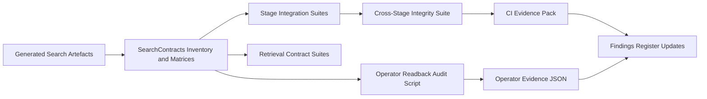

# Comprehensive Field Integrity Integration Framework Plan

## Outcome

Deliver a deterministic, test-enforced framework that proves semantic-search field integrity across all index families and pipeline stages (extraction -> builder -> bulk assembly -> retrieval/readback), with clear CI vs operator evidence boundaries.

## Scope and Boundaries

- In scope: semantic-search families used by Oak search (`lessons`, `units`, `unit_rollup`, `threads`, `sequences`, `sequence_facets`, `meta` contract checks).
- In scope: framework artefacts (canonical field inventory, stage matrices, test manifest, integration suites, readback audit operation, evidence docs).
- Out of scope: ingest pipeline redesign, compatibility layers, dynamic fallback mapping behaviour.

## Authoritative Inputs

- Session entry and lane policy: [.agent/prompts/semantic-search/semantic-search.prompt.md](.agent/prompts/semantic-search/semantic-search.prompt.md)
- Existing execution authority to refine and operationalise: [.agent/plans/semantic-search/archive/completed/comprehensive-field-integrity-integration-tests.execution.plan.md](.agent/plans/semantic-search/archive/completed/comprehensive-field-integrity-integration-tests.execution.plan.md)
- Foundation directives: [.agent/directives/principles.md](.agent/directives/principles.md), [.agent/directives/testing-strategy.md](.agent/directives/testing-strategy.md), [.agent/directives/schema-first-execution.md](.agent/directives/schema-first-execution.md)

## Key Design Decisions

- Canonical inventory location: create `packages/libs/search-contracts` as a boundary-safe shared contract package consumed by CLI and SDK.
- Inventory derivation: derive from generated artefacts in `[packages/sdks/oak-sdk-codegen/src/types/generated/search/es-mappings](packages/sdks/oak-sdk-codegen/src/types/generated/search/es-mappings)` and `[packages/sdks/oak-sdk-codegen/src/types/generated/search/index-documents.ts](packages/sdks/oak-sdk-codegen/src/types/generated/search/index-documents.ts)`; no manual field lists.
- Test model: integration-first, in-process for CI; operator/live evidence separated into explicit operations scripts.
- Semantics policy: retrieval assertions are mapping-aware (e.g. phrase semantics on analysed `text`; exact-match only when keyword/non-analysed surfaces exist).

## Architecture Flow

## Execution Phases

### Phase 0 - Framework Foundation (RED -> GREEN -> REFACTOR)

1. Create and register `[packages/libs/search-contracts](packages/libs/search-contracts)` with explicit exports for:

- field inventory

n   - ingest matrix

- retrieval matrix
- gap-ledger schema helpers

1. Implement inventory generation/parity tests first (`RED`) to enforce generated type-vs-mapping alignment.
2. Add stage matrix tests and machine-readable gap ledger at [.agent/plans/semantic-search/archive/completed/field-gap-ledger.json](.agent/plans/semantic-search/archive/completed/field-gap-ledger.json).
3. Add root manifest-driven `test:field-integrity` command (explicit file list, no globs, fail on missing paths/empty manifest).

Primary files:

- `packages/libs/search-contracts/src/*`
- `package.json`
- `.agent/plans/semantic-search/archive/completed/field-gap-ledger.json`

### Phase 1 - Stage-Level Integrity Suites

1. Add extraction integration suite for all families and grouped field semantics.
2. Add builder integration suite asserting inventory/matrix-driven expected outputs.
3. Add bulk-op assembly integration suite validating action/document alternation, routing, and field preservation.

Primary files:

- `[apps/oak-search-cli/src/adapters](apps/oak-search-cli/src/adapters)`
- `[apps/oak-search-cli/src/lib/indexing](apps/oak-search-cli/src/lib/indexing)`

### Phase 2 - Cross-Stage and Retrieval Integrity

1. Add cross-stage in-process integration suite (source fixtures -> indexed payload assertions; no network IO).
2. Add retrieval integration + unit suites in `[packages/sdks/oak-search-sdk/src/retrieval](packages/sdks/oak-search-sdk/src/retrieval)` keyed by shared inventory/matrix.
3. Add mapping-aware semantics evidence note and fail-fast checks for invalid field usage.

Primary files:

- `[apps/oak-search-cli/src/lib/indexing](apps/oak-search-cli/src/lib/indexing)`
- `[packages/sdks/oak-search-sdk/src/retrieval](packages/sdks/oak-search-sdk/src/retrieval)`
- `.agent/plans/semantic-search/archive/completed/evidence/task-2.2-retrieval-semantics.md`

### Phase 3 - Readback Audit and Operational Proof

1. Implement `apps/oak-search-cli/operations/ingestion/field-readback-audit.ts` and in-process tests first.
2. Enforce JSON evidence output containing alias resolution, mapping type/presence, exists/missing counts, attempts/timing.
3. Implement bounded retry/backoff policy for refresh visibility and transient 429/503 handling before disposition.
4. Integrate ledger-driven audit command usage and explicit non-zero failures for unknown fields/missing mappings/unresolved aliases.

Primary files:

- `apps/oak-search-cli/operations/ingestion/field-readback-audit.ts`
- `apps/oak-search-cli/src/lib/indexing/readback-field-audit.integration.test.ts`
- `.agent/plans/semantic-search/archive/completed/evidence/task-2.3.evidence.json`

### Phase 4 - Hardening and Plan/Prompt Coherence

1. Run full gate sequence one gate at a time; restart from sequence start on any failure.
2. Run mandatory reviewer cycle for this lane:

- `architecture-reviewer-barney`
- `docs-adr-reviewer`
- `test-reviewer`
- `elasticsearch-reviewer`

1. Propagate evidence/status consistency across:

- [.agent/prompts/semantic-search/semantic-search.prompt.md](.agent/prompts/semantic-search/semantic-search.prompt.md)
- [.agent/plans/semantic-search/archive/completed/comprehensive-field-integrity-integration-tests.execution.plan.md](.agent/plans/semantic-search/archive/completed/comprehensive-field-integrity-integration-tests.execution.plan.md)
- `.agent/plans/semantic-search/archive/completed/search-tool-prod-validation-findings-2026-03-15.md`

## Deterministic Validation Strategy

- Per-task local gates: `pnpm type-check`, `pnpm lint:fix`, `pnpm test`.
- Per-phase full sequence: `pnpm sdk-codegen` -> `pnpm build` -> `pnpm type-check` -> `pnpm doc-gen` -> `pnpm lint:fix` -> `pnpm format:root` -> `pnpm markdownlint:root` -> `pnpm subagents:check` -> `pnpm test` -> `pnpm test:e2e` -> `pnpm test:ui` -> `pnpm smoke:dev:stub`.
- Completion gate: `pnpm check`.

## Risks and Mitigations

- Inventory drift risk -> derive strictly from generated artefacts and enforce parity tests.
- `thread_slugs` and `category_titles` blind-field ambiguity -> explicit matrix semantics + stage and retrieval contract tests before ingest.
- Boundary creep between SDK/CLI -> contracts package with explicit dependency direction and no reverse imports.
- False confidence from operator-only checks -> CI in-process suites remain the primary correctness proofs; operator evidence is supplementary runtime validation.

## Exit Criteria

- All in-scope fields are represented in inventory + matrices and exercised by manifest-listed suites.
- No `unknown` statuses remain in the gap ledger for in-scope families.
- CI and operator evidence for active findings (`F1`/`F2`) are linked and coherent.
- Pre-ingest readiness gate in the active execution plan is fully green.
