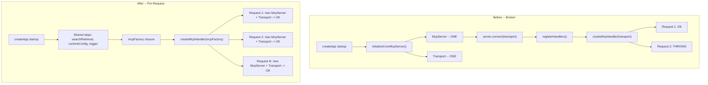

# Fix Streamable HTTP Transport Stateless Mode Bug

## The Bug

`[application.ts](apps/oak-curriculum-mcp-streamable-http/src/application.ts)` creates **one** `StreamableHTTPServerTransport` in stateless mode at startup (line 247) and reuses it for every request. The MCP SDK (v1.26.0) throws after the first request:

```247:247:apps/oak-curriculum-mcp-streamable-http/src/application.ts
  const transport = new StreamableHTTPServerTransport({ sessionIdGenerator: undefined });
```

The SDK enforces this at `webStandardStreamableHttp.js:137`:

```javascript
if (!this.sessionIdGenerator && this._hasHandledRequest) {
    throw new Error('Stateless transport cannot be reused across requests.');
}
```

**Impact**: Local dev broken (second request fails with 500). Vercel warm instances likely affected. E2E tests masked the bug by creating fresh `createApp()` per test.

## Architectural Decision: Option B -- Per-Request Transport

After reviewing the three options from the [bug plan](apps/oak-curriculum-mcp-streamable-http/.agent/plans/semantic-search/active/streamable-http-transport-stateless-bug.md), **Option B (per-request transport)** is recommended:

- Matches the SDK's canonical `[simpleStatelessStreamableHttp.ts](https://github.com/modelcontextprotocol/typescript-sdk/blob/v1.x/src/examples/server/simpleStatelessStreamableHttp.ts)` pattern exactly
- True stateless -- works on Vercel, any serverless platform, and local dev
- No session tracking, no configuration, no state management
- Simplest correct solution (first question: could it be simpler?)
- The rules prohibit "inventing optionality" (rules against dual mode / Option C)

**Key insight**: The SDK stateless example creates **both a new McpServer AND a new transport per request**. Our code creates one of each at startup. The fix aligns our code with the SDK's documented pattern.

## Architecture Change



### What Changes

| File                                                                           | Change                                                                                                                                                                                     |
| ------------------------------------------------------------------------------ | ------------------------------------------------------------------------------------------------------------------------------------------------------------------------------------------ |
| `[application.ts](apps/oak-curriculum-mcp-streamable-http/src/application.ts)` | `initializeCoreMcpServer()` becomes a factory closure. `initializeCoreEndpoints()` captures shared deps (searchRetrieval, config) and returns a factory function, not a transport instance |
| `[handlers.ts](apps/oak-curriculum-mcp-streamable-http/src/handlers.ts)`       | `createMcpHandler()` takes a factory instead of a pre-created transport. Per request: creates McpServer, registers handlers, creates transport, connects, handles, cleans up               |
| `[auth-routes.ts](apps/oak-curriculum-mcp-streamable-http/src/auth-routes.ts)` | `setupAuthRoutes()` receives and passes the factory instead of `coreTransport`                                                                                                             |

### Shared (once) vs Per-Request

- **Shared at startup**: `runtimeConfig`, `logger`, `searchRetrieval` (ES client), `toolHandlerOverrides`, `resourceUrl`, `overrideToolsListHandler` config
- **Per-request**: `McpServer`, `StreamableHTTPServerTransport`, `server.connect(transport)`, `registerHandlers()` calls

The ES client is designed for connection pooling and must NOT be recreated per request. The `McpServer` is lightweight (~20 tool registrations) and is the same pattern the SDK example uses.

### GET and DELETE /mcp

In stateless mode, GET (SSE) and DELETE (session termination) are not supported. The SDK's stateless example returns 405 for both. Our implementation should either delegate to the per-request transport (which will handle appropriately) or return 405 explicitly, matching the SDK pattern.

## Implementation Plan (TDD)

### Phase 1: Investigate and Confirm

Manually confirm the bug with curl or MCP Inspector against local dev. Short phase -- the evidence is strong.

### Phase 2: RED -- E2E Test

Write an E2E test that sends `initialize` then `tools/list` to the **same app instance**. With the current code this MUST fail, proving the bug at the E2E level.

### Phase 3: GREEN -- Implement Per-Request Transport

1. **Create `McpServerFactory` type** -- a closure returning `{ server, transport }` per call
2. **Refactor `initializeCoreEndpoints()`** -- capture shared deps, return factory + readiness signal
3. **Refactor `createMcpHandler()`** -- use factory per request, cleanup on `res.on('close')`
4. **Refactor `auth-routes.ts`** -- pass factory instead of transport
5. **Handle GET/DELETE** -- return 405 for stateless mode (matching SDK pattern)

Key code shape for the handler:

```typescript
export function createMcpHandler(
  mcpFactory: McpServerFactory,
  logger?: Logger,
): (req: express.Request, res: express.Response) => Promise<void> {
  return async (req, res) => {
    const { server, transport } = mcpFactory();
    await server.connect(transport);
    const mcpRequest = createMcpRequest(req);
    await setRequestContext(req, async () => {
      await transport.handleRequest(mcpRequest, res, req.body);
    });
    res.on('close', () => {
      transport.close();
      server.close();
    });
  };
}
```

### Phase 4: REFACTOR -- Simplify Tests and Docs

With per-request transport, the app handles multiple requests. This simplifies:

- **E2E tests**: Tests that needed multiple fresh apps for multi-step MCP flows (e.g. `getWidgetHtml()` in `[widget-resource.e2e.test.ts](apps/oak-curriculum-mcp-streamable-http/e2e-tests/widget-resource.e2e.test.ts)`) can use one app
- **Smoke tests**: `withFreshServer`/`withEphemeralServer` workaround in `[smoke-assertions/index.ts](apps/oak-curriculum-mcp-streamable-http/smoke-tests/smoke-assertions/index.ts)` can be removed -- MCP assertions share the original server
- **Comments**: Remove all "transport is one-client" comments throughout E2E and smoke test files

### Phase 5: Quality Gates and Verification

1. Run full quality gate chain: `pnpm type-gen` through `pnpm smoke:dev:stub`
2. Verify `smoke:dev:stub` passes without `withFreshServer` workaround
3. Deploy to Vercel preview and run `smoke:remote` (if available)
4. Update `[docs/vercel-environment-config.md](apps/oak-curriculum-mcp-streamable-http/docs/vercel-environment-config.md)` -- remove "stateless by design" framing if it implied transport reuse was intentional
5. Write ADR documenting the per-request transport decision

### Phase 6: Sub-Agent Reviews

After implementation, invoke:

- `code-reviewer` for quality/security/maintainability
- `architecture-reviewer` for boundary compliance
- `test-reviewer` for TDD compliance and test quality

## Risk Assessment

- **Per-request McpServer cost**: ~20 tool registrations per request. The SDK example does this. Negligible for Vercel serverless (5-10 requests per warm instance). If profiling shows issues, tools can be registered via a shared configuration object.
- **Readiness signal**: Currently `ready` is the `server.connect()` promise. With per-request, resolve `ready` once shared deps (ES client) are configured. The MCP readiness middleware continues to work.
- **Proxy in createMcpRequest**: The Clerk/MCP auth bridge proxy is unaffected -- it operates on the Express request, not the transport.
