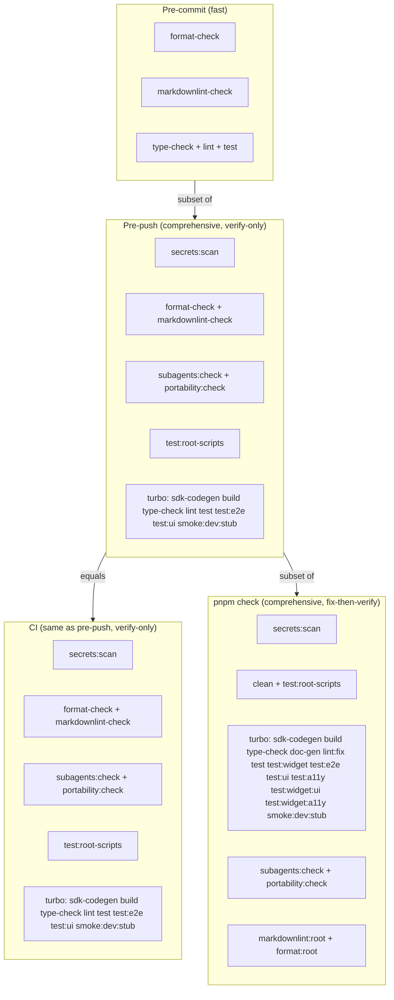

# Gate Topology Decisions

Three owner decisions block ADR-121 reconciliation. This plan records the decisions and the concrete changes each implies.

## Decision 1: Pre-push === CI (same check set)

**Principle**: If pre-push and CI run the same checks, then a CI failure that passes locally is immediately diagnostic — it is environmental or configuration, never "a check you didn't run." Pre-commit remains fast.

**Rationale**: The subset model ("CI runs more") introduces ambiguity. The equality model eliminates it. The developer already accepts this duration when running `pnpm check`; pushing is less frequent than committing, so the cost is acceptable.

**ADR-121 principle #4 becomes**: "Pre-push and CI run the same check set. A CI-only failure indicates an environmental or configuration issue, not a missing check. Pre-commit is the fast local gate."

**Concrete changes to [`.husky/pre-push`](.husky/pre-push)**:

- Add `pnpm subagents:check`
- Add `pnpm portability:check`
- Add `pnpm test:root-scripts`
- Add `test:ui` and `smoke:dev:stub` to the Turbo invocation
- Remove `--only` from `test:e2e` (so Turbo dependencies like `build` are honoured)
- Wrap `markdownlint-check:root` in `if !` guard (currently missing, unlike format check)

**Concrete changes to [`.github/workflows/ci.yml`](.github/workflows/ci.yml)**:

- Add `sdk-codegen` to the Turbo invocation (pre-push runs it; CI should too for equality)

**When `test:a11y` and widget tests are promoted (plan item 0d)**: add them to BOTH pre-push and CI simultaneously, preserving equality.

## Decision 2: Developer surfaces fix then verify; remote surfaces verify only

**Principle**: `pnpm check` is a developer workflow that produces a clean state then verifies it. CI is a remote gate that verifies only, never mutates. This is an intentional design distinction.

**Rationale**: Mutations in CI are invisible and misleading — if CI auto-fixes a lint issue, the developer never sees it and the "pass" is hollow. Mutations in a developer workflow are useful and immediate — the developer sees the changes and can commit them.

**ADR-121 update**: Add a "Verify vs Mutate" section documenting:

- `pnpm check` uses fix-mode commands (`format:root`, `markdownlint:root`, `lint:fix`) — **intentional**
- Pre-commit, pre-push, and CI use check/verify-only commands — **intentional**
- The design rule: "Developer aggregate surfaces may mutate; hook and remote surfaces verify only"

**No code changes needed** — this documents existing behaviour as intentional.

## Decision 3: Branch-scope secret scanning everywhere

**Principle**: Full-history scanning (`secrets:scan:all`) is idempotent after the first clean run. Unless someone rewrites history (which is prohibited), re-scanning full history on every push is ceremony without enforcement value. Branch-scope scanning (`secrets:scan`) catches new secrets, which is the actual threat model.

**Rationale**: `--full-history` walks every commit ever made. Once the history is clean, the only new secrets can arrive via new commits on branches. `--branches --tags` (without `--full-history`) scans exactly that. Full-history scanning should be a bootstrap or audit action, not a per-push gate.

**Concrete changes**:

- [`.husky/pre-push`](.husky/pre-push): change `pnpm secrets:scan:all` to `pnpm secrets:scan`
- [`.github/workflows/ci.yml`](.github/workflows/ci.yml): change `pnpm secrets:scan:all` to `pnpm secrets:scan` (and update Docker fallback to remove `--full-history`)
- `pnpm check` already uses `secrets:scan` — no change needed
- Document in ADR-121 reconciliation: "`secrets:scan:all` is for bootstrap audits and post-rebase verification, not routine gates"

## Resulting gate topology

**Invariants**:

- pre-commit is a strict subset of pre-push
- pre-push === CI (same checks, same scope)
- pre-push is a strict subset of `pnpm check`
- `pnpm check` is the broadest surface (includes `doc-gen`, widget tests, a11y, fix-mode)
- All surfaces use branch-scope secret scanning; full-history is bootstrap-only

## Open question: `doc-gen` in pre-push/CI?

`pnpm check` runs `doc-gen` but neither pre-push nor CI do. Under the "pre-push === CI" rule, this is fine — `doc-gen` is part of `pnpm check`'s broader scope. But should it be in pre-push/CI? `doc-gen` produces generated documentation files; if those files are committed, stale docs would be a CI concern. If they are gitignored, it only matters for `pnpm check`. This is a minor follow-up question, not a blocker.
