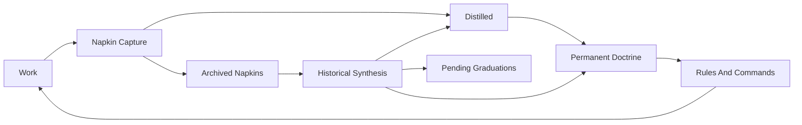

# Historical Napkin Synthesis Plan

## Judgement

Yes, this is a separate mechanism worth considering. It is adjacent to, but distinct from, the current `consolidate-docs` cross-session scan.

Current surfaces already cover:

- Session capture: `.agent/commands/session-handoff.md` captures surprises and candidates into `.agent/memory/active/napkin.md`.
- Thread/rotation consolidation: `.agent/commands/consolidate-docs.md` reads recent sessions, current napkin, distilled entries, and active capture buffers.
- Layer orchestration: `.agent/practice-core/decision-records/PDR-046-layered-knowledge-processing.md` says to process layers bottom-up without compressing knowledge.
- Cross-plane drift: `.agent/practice-core/decision-records/PDR-028-executive-memory-feedback-loop.md` adds active/operational/executive plane synthesis.

The missing mechanism is archive-scale synthesis: periodically reread `.agent/memory/active/archive/napkin-*.md` as a corpus after prior distillations have happened. The question is not “what should this napkin contribute upward?” but “what does the historical sequence reveal now that could not have been visible then?”

## Benefits

- Reveals long-wave failure modes: repeated corrections separated by weeks can expose a deeper structural cause that individual rotations treated as separate incidents.
- Tests the learning loop itself: if many archived napkins show the same class of overdue graduation, the loop has a throughput or routing problem, not just more content.
- Improves Practice evolution quality: PDR candidates become better grounded because they can cite historical arcs, not only recent local recurrence.
- Detects stale or overfit doctrine: historical reread can show that a rule solved an early symptom but later sessions worked around it, ignored it, or needed a different firing point.
- Preserves the value of archived napkins: archives become an evidence corpus, not just cold storage after rotation.

## Fit In The Memory Loop

This should be a cadence layer around the existing loop, not a new ordinary step every session.

Placement:

- Session boundary: do not run it in `session-handoff`; that loop must stay lightweight.
- Consolidation boundary: add it as an optional triggered subsection of `consolidate-docs`, probably after the current cross-session scan and before graduation routing.
- Practice governance: amend `PDR-014` to distinguish recent-thread cross-session consolidation from archive-scale historical synthesis.
- Layering: treat archived napkins as Layer 0 historical capture feeding Layer 1/2, governed by `PDR-046`.

## Implementation Shape

- Add a named trigger: run archive-scale synthesis when the owner requests it, when a repeated pattern spans multiple rotations, when consolidation reports “same family again,” or on a periodic Practice-health cadence.
- Add a bounded corpus selection rule: choose a named window such as “all napkins since last historical synthesis marker,” “last N archived napkins,” or “all napkins matching a thread/theme.” Avoid rereading the entire archive by default unless the work is explicitly a historical pass.
- Add an output artefact: create a synthesis report under an appropriate research or analysis surface, with findings routed onward to `distilled.md`, `.agent/memory/operational/pending-graduations.md`, PDR amendments, rules, or patterns by existing routing rules.
- Add a marker: record the archive window processed and the synthesis date so future passes know what has already been read holistically.
- Keep the source archives immutable in substance: do not rewrite archived napkins; synthesise from them.

## Candidate Doctrine Changes

- Amend `.agent/practice-core/decision-records/PDR-014-consolidation-and-knowledge-flow-discipline.md` to name “archive-scale historical synthesis” as a sibling to cross-session consolidation.
- Refine `.agent/commands/consolidate-docs.md` step 5, or add a new step near step 5, to distinguish:
  - current rotation cross-session scan;
  - archive-scale historical synthesis;
  - cross-plane scan.
- Add a pending-graduations entry capturing this exact owner observation, with status `due` if the owner wants the mechanism designed now, or `pending` if it should wait for the next deep-consolidation pass.

## First Safe Landing

The smallest useful landing would be documentation-only:

- Capture this as a pending-graduations item.
- Amend `consolidate-docs` to name the mechanism and triggers.
- If approved, amend `PDR-014` with the conceptual distinction and consequences.

No code is needed for the first landing. Automation can come later if repeated manual passes show stable selection and output shapes.