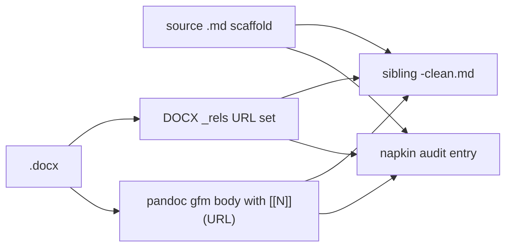

## Inputs and target

- Source markdown (structural authority): [.agent/research/kg-neo4j-stardog-product-creation/kg-neo4j-stardog-product-creation.md](.agent/research/kg-neo4j-stardog-product-creation/kg-neo4j-stardog-product-creation.md) — 220 lines, 103 PUA citation blocks (`U+E200`...`U+E201`), 324 `turn…` refs (55 unique), 0 `utm_source=chatgpt.com` trackers.
- DOCX (URL recovery authority): [.agent/research/kg-neo4j-stardog-product-creation/kg-neo4j-stardog-product-creation.docx](.agent/research/kg-neo4j-stardog-product-creation/kg-neo4j-stardog-product-creation.docx) — 24 unique URLs in `word/_rels/document.xml.rels`.
- No PDF present, so the citation-set agreement check is reduced to two surfaces (DOCX `_rels` vs pandoc body emit). Will surface that as a caveat in the napkin audit.
- Output (new sibling, never overwrites source): `.agent/research/kg-neo4j-stardog-product-creation/kg-neo4j-stardog-product-creation-clean.md`.

## Approach

The existing markdown scaffold is high quality (executive summary, sectioned narrative, mermaid blocks, and several decision-matrix tables). Default pattern from the chatgpt-report-normalisation skill applies: **markdown is the structural source, DOCX/pandoc only as the citation lookup layer**, write a sibling `*-clean.md`, and run positional matching against pandoc — do not build a marker-string-to-URL lookup table.

## Steps

1. Extract pandoc gfm body and DOCX `_rels` URL set in a scratch dir under `/tmp` (no writes inside the research folder yet). Confirm the 24 `_rels` URLs match (or are a superset of) the URL set pandoc emits in the body, and note any pandoc trailing raw-URL bibliography to discard.
2. Build the work copy from the source markdown bytes; do not edit the source in place.
3. Walk the 103 PUA citation blocks in document order. For each block, find the preceding prose context (normalised whitespace, full-text search) in the pandoc body, extract the consecutive `[[N]](URL)` link(s) at that position, and replace the PUA block with the recovered URL list. Honour the skill rule that the same `citeturn…` string can map to different citations at different positions.
4. Build the deduplicated reference map in first-occurrence order. Replace every recovered inline citation with `[[N]](#ref-N)` so reuse is visible.
5. Strip every remaining PUA character (`U+E200`–`U+E2FF`) and clean up double spaces left at marker-removal boundaries (skipping inside fenced code and mermaid blocks).
6. Append a `## References` section with thematic subsections driven by the recovered URL families (likely *Oak repository*, *Neo4j product and docs*, *Stardog product and docs*, plus any minor third-party group). Each entry: `- **[N]** <https://full.url/>` with no invented titles or dates.
7. Validation pass on the new clean file:
   - No `cite`, `filecite`, or `turn…` markers remain.
   - No PUA characters remain (`grep -P '[\x{e200}-\x{e2ff}]'`).
   - Structural parity vs source: identical heading outline, section order, table count, fenced-code/mermaid block count.
   - Body-text drift proof: apply the same `strip_citations` + whitespace-normalise to source and clean copy and confirm character-identical output.
8. Record the citation-set audit in [.agent/memory/active/napkin.md](.agent/memory/active/napkin.md) (today's session entry only — not in the clean file): source-markdown `turn…` total/unique (324 / 55), distinct PUA citation blocks (103), DOCX `_rels` unique URLs (24), pandoc body-emit unique URL count, and a one-line statement on whether the two available citation surfaces (DOCX `_rels` vs pandoc body) agree, plus an explicit note that no PDF was present so the third-surface check could not be run.

## Guardrails

- Repair task, not a rewrite. No paraphrasing, summarising, or freshness sweep.
- Source `.md` and `.docx` remain untouched on disk.
- Clean file contains the report and its `## References` section only — no `### Recovery notes` block, no diagnostic counts, no meta-commentary.
- No invented reference titles, authors, or dates; bare URLs only.
- No promotion into tracked canon under this task; the clean copy stays beside the source under `.agent/research/`.