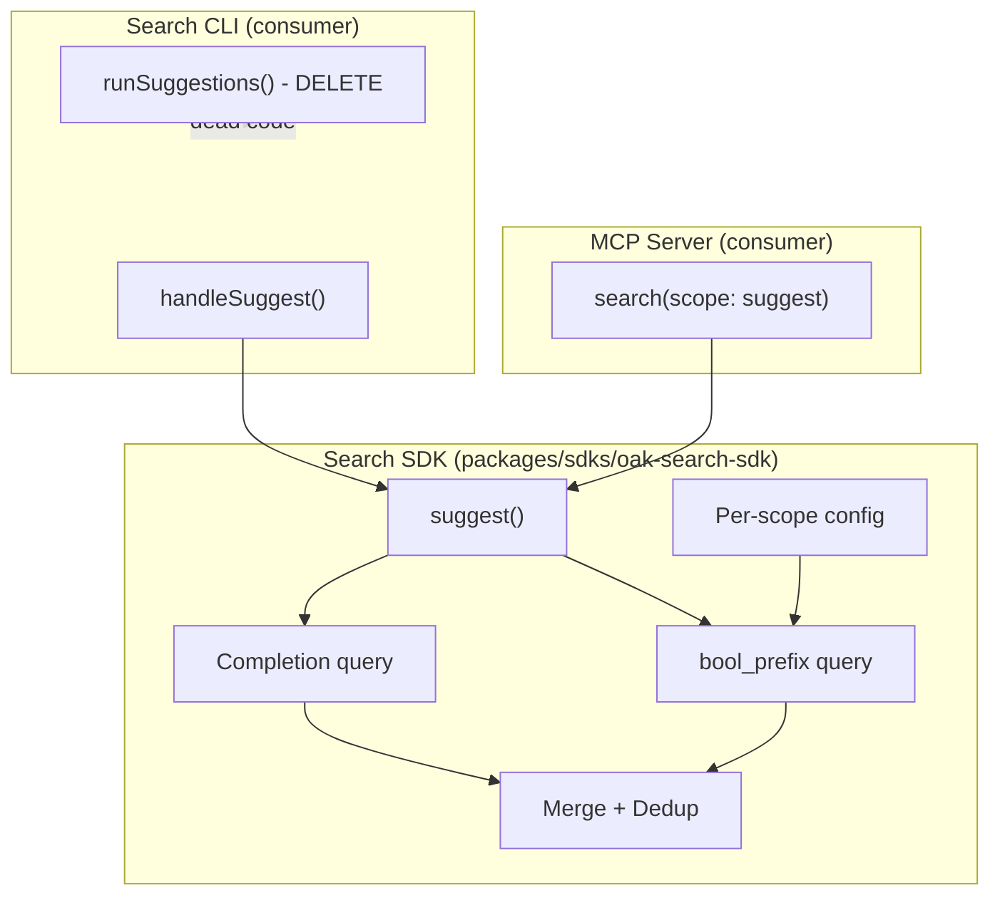

# M1 Final Steps — Suggest Pipeline, Binary Exclusion, and M0 Gates

## Current State

- **Branch**: `feat/semantic_search_deployment` with 33 uncommitted files (consolidation session work from 2026-02-28)
- **All other snags**: Complete (M1-S001a/b, S002, S004, S005, S006, S008). M1-S007 deferred.
- **Quality gates G1-G4**: Complete with evidence. G5-G8 pending (M1 only, not M0 blockers).

## Work Items (in order)

### 0. Commit outstanding consolidation work

33 modified/added files from the 2026-02-28 consolidation sessions are uncommitted. These include documentation extractions to permanent locations, distilled.md pruning, fitness ceiling frontmatter, code patterns, and the knowledge flow rewrite. Clean working tree before new work.

### 1. M1-S003: Exclude binary endpoint from MCP tools (~30 min)

Mechanical change. The remote MCP server cannot trigger client-side downloads; `get-lessons-assets` already provides download URLs.

**Files to change:**

- `[packages/sdks/oak-sdk-codegen/code-generation/typegen/mcp-tools/mcp-tool-generator.ts](packages/sdks/oak-sdk-codegen/code-generation/typegen/mcp-tools/mcp-tool-generator.ts)` — Add `/lessons/{lesson}/assets/{type}` to `SKIPPED_PATHS` (line 36)
- `[packages/sdks/oak-sdk-codegen/code-generation/typegen/mcp-tools/parts/tool-description.ts](packages/sdks/oak-sdk-codegen/code-generation/typegen/mcp-tools/parts/tool-description.ts)` — Remove `GET_LESSONS_ASSETS_BY_TYPE_WARNING` constant and its `case` in `getToolDescriptionEnhancement()`
- `[packages/sdks/oak-sdk-codegen/code-generation/typegen/mcp-tools/parts/tool-description.unit.test.ts](packages/sdks/oak-sdk-codegen/code-generation/typegen/mcp-tools/parts/tool-description.unit.test.ts)` — Update tests
- Run `pnpm sdk-codegen` to regenerate (32 to 31 tools)
- The generated `toolNames` in `[definitions.ts](packages/sdks/oak-sdk-codegen/src/types/generated/api-schema/mcp-tools/definitions.ts)` flows to the E2E test automatically — no manual update needed
- Run quality gates

### 2. M1-S009: Complete suggest pipeline in search SDK (~2-3 hours)

This is the main work. The SDK `suggest()` uses only the ES completion suggester. The CLI has a proven dual-query approach (completion + `bool_prefix` on `search_as_you_type` fields) that is dead code in production — the CLI commands already use the SDK's incomplete `suggest()`. Fix the SDK; the CLI benefits automatically.

**Key insight**: `runSuggestions` in the CLI is not used in production (only in its own unit tests). The production path goes through `retrieval.suggest()` from the SDK. So we need to:

1. Complete the SDK suggest
2. Clean up the dead CLI code

#### Phase 1 — RED: Extend SDK suggest tests

Write integration tests in `[packages/sdks/oak-search-sdk/src/retrieval/suggestions.integration.test.ts](packages/sdks/oak-search-sdk/src/retrieval/suggestions.integration.test.ts)` that specify:

- `bool_prefix` query leg runs when completion returns fewer results than limit
- Results from both queries are merged and deduplicated
- Per-scope `boolPrefixFields` are used (lessons: `lesson_title.sa`, units: `unit_title.sa`, sequences: `sequence_title.sa` with `._2gram`, `._3gram` variants)
- `phaseSlug` context support for sequences

Tests must fail (SDK does not have this logic yet).

#### Phase 2 — GREEN: Implement dual-query suggest in SDK

1. **Extend `SuggestClient` interface** in `[packages/sdks/oak-search-sdk/src/retrieval/suggestions.ts](packages/sdks/oak-search-sdk/src/retrieval/suggestions.ts)`:

- Add a `searchDocuments()` method (or similar) for regular ES search calls needed by `bool_prefix`
- Keep existing `search()` for completion
- This follows ISP — completion suggest and document search are distinct operations that serve the same suggest feature

1. **Add per-scope bool_prefix configuration** to the SDK:

- Extract `boolPrefixFields` definitions from CLI's `[scope-config.ts](apps/oak-search-cli/src/lib/suggestions/scope-config.ts)` into the SDK
- Extract filter-building logic (`buildFilters`, `buildSequenceFilters`) into the SDK
- The scope config maps scope name to: `boolPrefixFields`, `sourceFields`, filter builders

1. **Implement dual-query in `suggest()`**:

- Run completion query first (existing logic)
- If results < limit, run `bool_prefix` on `search_as_you_type` sub-fields
- Merge and deduplicate by document ID
- Return combined results up to limit

1. **Run tests** — they must now pass.

#### Phase 3 — REFACTOR: Clean up CLI dead code

- Delete `apps/oak-search-cli/src/lib/suggestions/index.ts` (unused `runSuggestions`)
- Delete `apps/oak-search-cli/src/lib/suggestions/index.unit.test.ts`
- Evaluate whether `[scope-config.ts](apps/oak-search-cli/src/lib/suggestions/scope-config.ts)` has any remaining CLI-specific consumers; if not, delete it too
- Update any imports or barrel files

#### Architecture Decision

### 3. Quality gates

After both code changes:

- `pnpm sdk-codegen` (M1-S003 regeneration)
- `pnpm build`
- `pnpm type-check`
- `pnpm lint:fix`
- `pnpm format:root`
- `pnpm markdownlint:root`
- `pnpm test`
- `pnpm test:e2e`
- `pnpm test:ui`
- `pnpm smoke:dev:stub`

### 4. Remaining M0 gates (human decisions)

- `pnpm secrets:scan:all` — automated
- Manual sensitive-information review — human decision
- Merge `feat/semantic_search_deployment` to `main` — human decision
- Make repository public on GitHub — human decision

## Risks

- `**SuggestClient` interface change** may affect the ES client adapter wiring in both MCP apps (HTTP and STDIO). The `createSearchRetrieval` factory will need to provide a client that satisfies the extended interface.
- **Bool_prefix field names** are index-mapping dependent (`lesson_title.sa`, `._2gram`, `._3gram`). These are determined by the ES `search_as_you_type` mapping — verify the field names are correct against the actual index mapping before coding.
- **Deduplication logic** needs a stable document ID. Completion results use `option.text`; `bool_prefix` results use `_id`. Need to reconcile these.

## Not doing

- M1-S007 (prerequisite sub-graphs) — deferred post-merge
- G5-G8 (M1 engineering/ops gates) — do not block M0
- New features or scope expansion
