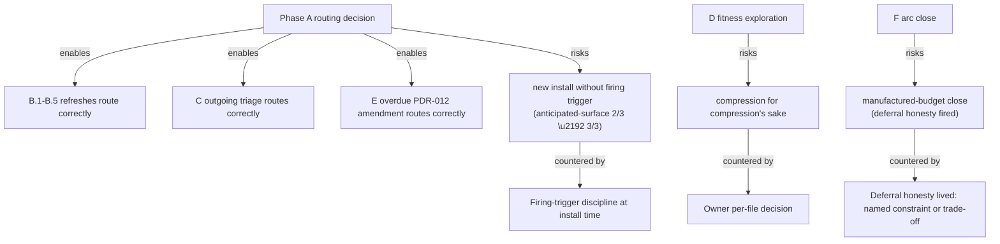

# Session 6 — Closing the doctrine-consolidation arc

**Thread**: `memory-feedback` (closing). **Owner-paced, owner-gated per item per [PDR-003](.agent/practice-core/decision-records/PDR-003-care-and-consult.md).** Not a velocity session.

**Landing target** (per [PDR-026](.agent/practice-core/decision-records/PDR-026-per-session-landing-commitment.md)): `pnpm practice:fitness --strict-hard` exits 0; staged plan at [`.agent/plans/agentic-engineering-enhancements/current/staged-doctrine-consolidation-and-graduation.plan.md`](.agent/plans/agentic-engineering-enhancements/current/staged-doctrine-consolidation-and-graduation.plan.md) moves to `archive/completed/`; Practice Core [CHANGELOG](.agent/practice-core/CHANGELOG.md) arc-close entry; `memory-feedback` thread archived from `repo-continuity.md § Active threads`; `observability-sentry-otel` becomes the next-active thread.

## Settled at session open

- **Reference-tier sweep bound**: deep-dives only (`.agent/reference/agentic-engineering/deep-dives/`). Wider sweep deferred with named trigger.
- **`deferral-honesty-rule` instance count**: 3/3 reached. Ratification proceeds — but routing is **not ad-hoc**. Owner direction: establish a *graduation-target routing pattern* first; multiple homes may be appropriate; the routing must be principled.

## Operating discipline (always-on this session)

- **Class A.1 firing** ([rule](.agent/rules/plan-body-first-principles-check.md)) on every new artefact body OR materially-amended doctrine body. Three rewrites in Session 5 prove the tripwire is load-bearing.
- **Deferral honesty lived**: any defer cites named external constraint (clock, cost, dependency, owner veto) or named priority trade-off with explicit evidence. The words "budget", "next session", "for later", "out of scope" are not acceptable. (The candidate rule body being lived in the breach being avoided.)
- **Firing-trigger discipline** ([PDR-029](.agent/practice-core/decision-records/PDR-029-perturbation-mechanism-bundle.md)): any new install names a concrete near-term firing opportunity OR is retired. Active counter-pressure to `anticipated-surface-installed-then-empirically-unexercised` (Pending 2/3).
- **Owner-gated per Practice Core edit** per PDR-003. Sub-agents may dispatch for review/research; not for write actions.

## Phase A — Routing decision precedes routing application

Owner-direction-load-bearing: do this **first**, because pieces 4, 5, 6, 7, 8 below all need it.

**A.1 — Author graduation-target routing pattern**

Hypothesis (subject to Class A.1 firing on the body): amend [PDR-014](.agent/practice-core/decision-records/PDR-014-consolidation-and-knowledge-flow-discipline.md) with a §`Graduation-target routing` section that names, for each candidate doctrine type:
- decision criteria for `pattern | PDR | ADR | rule | principle | command-rubric | plan-body | practice-md` (the existing `graduation-target` schema field values plus operational additions)
- the "multiple-homes-may-be-appropriate" doctrine the owner named
- composition rules (e.g. principle + always-applied rule that operationalises it; PDR + command rubric that fires it)
- routing for the immediate test cases (`deferral-honesty-rule`, `default-retire-on-empty`, the three pattern candidates)

Class A.1 fires on the routing body. If the body produces a "this should be a new PDR not an amendment" or "this should live in PDR-026 not PDR-014" rewrite, ratify with owner before authoring.

**Acceptance**: PDR-014 amended (or new artefact authored if Class A.1 reshapes); routing decision tree present; `docs-adr-reviewer` well-formed verdict; owner-approved.

**A.2 — Apply routing to the Pending-band candidates**

Per the routing pattern just authored, settle each:
- `deferral-honesty-rule` (3/3) — owner question to be raised inline at A.2: where does it land per the routing? (rule + PDR-026 amendment + `/session-handoff` step? a single home? composition?)
- `manufactured-budget` (2/3) — pattern; route under the routing pattern (likely pattern file or distilled entry; named trigger for third instance)
- `anticipated-surface-installed-then-empirically-unexercised` (2/3) — same as above
- `owner-mediated-evidence-loop-for-agent-installed-protections` (1/3) — same as above
- `default-retire-on-empty` (rule candidate; gated on parent reaching 3/3) — defer with named trigger if parent unresolved

Each candidate either lands per the routing OR is annotated with a named trigger and stays in the Pending band.

## Phase B — Doctrine-coherent refreshes (composed where possible)

**B.1 — PDR-014 terminology refresh** (originally piece #4)

Five `workstream` references in [PDR-014](.agent/practice-core/decision-records/PDR-014-consolidation-and-knowledge-flow-discipline.md) (lines 63, 71, 73, 76, 157) updated to thread/session vocabulary. **Composed with A.1** in a single Amendment Log entry — same PDR, same session, single-amendment honesty.

**B.2 — Re-home lost `standing-decisions` substance** (originally piece #5)

[`observability-sentry-otel.next-session.md` line 53](.agent/memory/operational/threads/observability-sentry-otel.next-session.md) references a non-existent section; substance lost was *"concrete attribution starts forward from 2026-04-22"*. Owner question to ask inline (per the routing pattern from A.1, this becomes a routing application, not an ad-hoc choice): three home options remain — PDR-027 amendment / thread README / inline restate. Ask owner with the routing-pattern lens applied.

**B.3 — Practice Core CHANGELOG catch-up** (originally piece #6)

No entries in [`CHANGELOG.md`](.agent/practice-core/CHANGELOG.md) since 2026-02-28 despite Sessions 4–5 substantial PDR work. Author catch-up entries: PDR-029 (and amendments), PDR-030, PDR-031, PDR-011/PDR-015×2/PDR-019/PDR-026 amendments, ADR-053 amendment, the new `--no-verify-requires-fresh-authorisation` rule, two principle additions, plus this session's PDR-014 amendment. Composed with arc-close entry at Phase F.

**B.4 — `practice-bootstrap.md` workstream-brief drift** (originally piece #7)

Three references in [`practice-bootstrap.md`](.agent/practice-core/practice-bootstrap.md) (lines 456, 461, 464) describe the retired workstream-brief surface as canonical. Mechanical refresh to thread-record pointer language.

**B.5 — Reference-tier sweep** (originally piece #2; bound: deep-dives only per owner)

Sweep [`.agent/reference/agentic-engineering/deep-dives/`](.agent/reference/agentic-engineering/deep-dives/) for residual `<workstream>--` track-naming citations. Concrete known site: `operational-awareness-and-state-surfaces.md` line 83. Single batched in-place edit. Wider repo-scope sweep (90+ mentions outside `archive/`) deferred with named trigger: *next dedicated terminology-refresh consolidation slot OR explicit owner direction*.

## Phase C — Outgoing triage per [PDR-007](.agent/practice-core/decision-records/PDR-007-incoming-and-outgoing-practice-context.md) (originally piece #1)

Stage 2(a) honest carry from Session 5. Per-file disposition for the 13 files (~1481 lines) at `.agent/practice-context/outgoing/`:

`README.md`, `agent-collaboration/`, `cross-repo-transfer-operations.md`, `design-token-governance-for-self-contained-ui.md`, `health-probe-and-policy-spine.md`, `plan-lifecycle-four-stage.md`, `practice-maturity-framework.md`, `production-reviewer-scaling.md`, `reviewer-gateway-operations.md`, `seeding-protocol-guidance.md`, `starter-templates.md`, `three-dimension-fitness-functions.md`, `two-way-merge-methodology.md`.

Disposition options per file (per PDR-007): ephemeral exchange / portable PDR / general abstract pattern → Practice Core / host-local reference → `.agent/reference/` / defect → delete. Owner-gated per file. Apply the dedicated portability lens.

## Phase D — Holistic fitness exploration (originally piece #3)

Per-file owner-decision (compress / raise / restructure / split) for the 5 hard-zone items, owner-decided per Step 9§e:

- [`AGENT.md`](.agent/directives/AGENT.md) (291/275 lines)
- [`principles.md`](.agent/directives/principles.md) (26222/24000 chars + 525/525 line soft limit; +594 chars from Session 5's two principle additions)
- [`testing-strategy.md`](.agent/directives/testing-strategy.md) (566/550 lines + 1 prose line at 102/100)
- [`distilled.md`](.agent/memory/active/distilled.md) (307/275 lines)
- [`continuity-practice.md`](docs/governance/continuity-practice.md) (219/210 lines)

Couples with **napkin rotation** ([`napkin.md`](.agent/memory/active/napkin.md) at 1226 lines, 2.4× rotation threshold) and **distilled compression** (both honestly deferred from post-handoff consolidation walk).

9 soft-zone items reviewed for any natural land-or-defer. Owner decides each.

**Acceptance**: `pnpm practice:fitness --strict-hard` exits 0 by Phase F.

## Phase E — Overdue Due-band item action

Most overdue Due item across the arc (flagged 2026-04-19, passed S3 / S4 / S5; re-flagged in post-handoff walk Step 7b):

- **`reviewer-findings-applied-in-close-not-deferred`** in [`distilled.md`](.agent/memory/active/distilled.md) — graduation target: PDR-012 amendment per the register entry. Apply the graduation-target routing pattern from Phase A. Land OR re-defer with named trigger and explicit reason.

## Phase F — Arc close

In order:

1. **Final fitness gate**: `pnpm practice:fitness --strict-hard` (must exit 0 — re-run if 5 hard-zone items not all addressed in Phase D).
2. **Staged plan archive**: move [`current/staged-doctrine-consolidation-and-graduation.plan.md`](.agent/plans/agentic-engineering-enhancements/current/staged-doctrine-consolidation-and-graduation.plan.md) → `archive/completed/`. Update plan body with arc-close summary; mark all 6 todos `completed`; ensure all internal links remain resolvable from new path.
3. **Practice Core CHANGELOG arc-close entry**: composes Phase B.3 catch-up plus this session's landings into a single dated entry.
4. **Thread archive**: remove `memory-feedback` row from [`repo-continuity.md § Active threads`](.agent/memory/operational/repo-continuity.md). Move thread next-session record to archive (per [PDR-026](.agent/practice-core/decision-records/PDR-026-per-session-landing-commitment.md): "delete on session close once its landing target has been reported"). Owner question: keep as historical artefact under `threads/archive/` or git-history-only? Default: archive directory for arc-narrative continuity.
5. **Re-activate `observability-sentry-otel`**: update `repo-continuity.md § Current session focus` and `§ Next safe step` to point at [`observability-sentry-otel.next-session.md`](.agent/memory/operational/threads/observability-sentry-otel.next-session.md) §L-8 WS1.
6. **Pending-band cleanup**: remove ratified candidates per Phase A.2; refresh trigger conditions on remaining items.
7. **Reviewer dispatch** (close phase): `docs-adr-reviewer` close-pass on PDR-014 amendment + arc-close artefacts; `release-readiness-reviewer` GO/GO-WITH-CONDITIONS/NO-GO recommendation per staged plan §Reviewer discipline; `architecture-reviewer-barney` or `betty` if routing pattern shapes module boundaries.
8. **Commit**: standard `/jc-commit` flow (no `--no-verify`; if any quality gate requires bypass, fresh per-commit owner authorisation per the rule).
9. **Session handoff**: `/jc-session-handoff` standard close — Step 7b updates the `Active identities` column; Step 7c walks identity health-probe; Step 9 consolidation gate (likely "completed this session" given Phase D fitness work).

## Risks / forces

- **Self-applying delete-bias**: any new artefact authored MUST name a concrete near-term firing trigger (PDR-029 retention discipline). Phase A's routing pattern is the obvious candidate to install-without-firing — it must name *this session's* application as the first firing.
- **Routing pattern as itself a third instance** of `anticipated-surface-installed-then-empirically-unexercised` if it doesn't fire in this session. Phase A.2 (apply routing to candidates) is the firing — load-bearing.
- **Manufactured-budget close**: live the deferral-honesty rule even before it formally lands. Any item that doesn't close MUST cite named external constraint or named priority trade-off.
- **8 pieces × owner-gated**: real per-item disposition is the only honest mode. Plan does NOT manufacture velocity. If session can't honestly close all 8 pieces + Phase F, the dishonest move is silent partial-complete; the honest move is named-trigger defer per item with explicit reason.
- **Reference-tier sweep bound deferred**: 90+ mentions deferred with named trigger; honest scope, not silent omission.

## Foundation alignment

- [`principles.md`](.agent/directives/principles.md) — *Owner Direction Beats Plan*; *Misleading docs are blocking*; *Cardinal rule*.
- [PDR-003](.agent/practice-core/decision-records/PDR-003-care-and-consult.md) — owner-gated per Practice Core edit.
- [PDR-007](.agent/practice-core/decision-records/PDR-007-incoming-and-outgoing-practice-context.md) — outgoing triage per-file disposition.
- [PDR-014](.agent/practice-core/decision-records/PDR-014-consolidation-and-knowledge-flow-discipline.md) — amended this session (routing + terminology).
- [PDR-026](.agent/practice-core/decision-records/PDR-026-per-session-landing-commitment.md) — landing-commitment discipline; one thread per session.
- [PDR-027](.agent/practice-core/decision-records/PDR-027-threads-sessions-and-agent-identity.md) — threads as continuity unit.
- [PDR-029](.agent/practice-core/decision-records/PDR-029-perturbation-mechanism-bundle.md) — Class A.1 firing on every new artefact body; firing-trigger discipline.
- [`.agent/rules/plan-body-first-principles-check.md`](.agent/rules/plan-body-first-principles-check.md) — Class A.1 always-applied rule.
- [`.agent/rules/no-verify-requires-fresh-authorisation.md`](.agent/rules/no-verify-requires-fresh-authorisation.md) — fresh per-commit authorisation if needed.

## Non-goals

- Do NOT switch threads mid-session.
- Do NOT compress Core content just to satisfy fitness — owner-decided per file (per staged plan owner decision 3).
- Do NOT install new tripwires without named concrete near-term firing trigger (PDR-029 retention discipline).
- Do NOT defer with "budget", "next session", "for later", "out of scope" (deferral-honesty rule lived).
- Do NOT widen reference-tier sweep beyond deep-dives (owner-decided).
- Do NOT make ad-hoc routing decisions for graduations (owner direction this session).
- Do NOT spread execution to a second thread (PDR-026).
- Do NOT make this a velocity session — honest closure of every open item.

## Reviewer discipline

- **Plan-time**: `assumptions-reviewer` (per staged plan §Reviewer discipline — *"is the fitness exploration well-framed?"*) — invoke after this plan is ratified.
- **Mid-cycle**: `docs-adr-reviewer` on PDR-014 amendment intent + close; `architecture-reviewer-barney` or `betty` if routing pattern shapes module boundaries.
- **Close**: `docs-adr-reviewer` final pass; `release-readiness-reviewer` GO/GO-WITH-CONDITIONS/NO-GO; `documentation-hygiene` always-applied rule fires throughout.

## Learning Loop

This session IS the learning-loop close for the arc:

1. Pending-band candidates settled per Phase A.2 (ratify, route, or named-trigger defer).
2. Napkin rotation in Phase D (couples with distilled compression).
3. Practice Core CHANGELOG carries the arc-close entry (Phase F.3).
4. `/jc-consolidate-docs` clean-sheet pass at arc close per staged plan §Consolidation.
5. Experience entry (optional, owner-decided) capturing the arc-close shape.
6. Distilled walk for any new entries; emergent-whole observation across the 5 2026-04-21 experience entries — the `owner-mediated-evidence-loop-for-agent-installed-protections` candidate's empirical evidence trail lives in `.agent/experience/2026-04-21-*.md`.

## Three remaining owner-decisions to surface inline

These are simpler choices that settle at the work block where they govern:

- **Phase A.1**: where exactly does the graduation-target routing land per Class A.1 firing? PDR-014 amendment is the hypothesis; reshape if the body's first-principles check produces a rewrite.
- **Phase B.2**: where does the lost `standing-decisions` substance re-home — apply the routing from Phase A.1.
- **Phase F.4**: thread next-session record archival path — `threads/archive/` directory (default) or git-history-only?