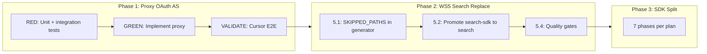

# Merge-Blocker Execution Sequence

## Current State

Three workstreams block the `feat/semantic_search_deployment` branch merge. All prerequisites are complete. The branch is 1 commit ahead of origin.

---

## 1. Proxy OAuth AS (Immediate Priority)

**Plan**: [proxy-oauth-as-for-cursor.plan.md](/.agent/plans/semantic-search/archive/completed/proxy-oauth-as-for-cursor.plan.md) ✅ COMPLETE — [ADR-115](/docs/architecture/architectural-decisions/115-proxy-oauth-as-for-cursor.md)
**Location**: `apps/oak-curriculum-mcp-streamable-http/`

### Why first

Cursor users cannot authenticate at all. The server is spec-compliant but Cursor has a confirmed client-side bug ([forum #151331](https://forum.cursor.com/t/mcp-oauth-callback-loses-authorization-server-url-discovered-from-resource-metadata-causing-token-exchange-failure/151331)) that loses the `resource_metadata` URL when RS and AS are on different origins. The fix is an always-on proxy that makes Cursor see RS and AS on the same origin. Architecture reviewed (Barney + Fred approved).

### TDD execution

**RED phase** -- Write failing tests first:

- **Unit tests** (`src/oauth-proxy/oauth-proxy-upstream.unit.test.ts`):
  - Upstream URL derivation from `CLERK_PUBLISHABLE_KEY`
  - Authorise redirect URL construction (appends all query params to known FAPI base)
  - Grant type validation (accepts `authorization_code`, `refresh_token`; rejects others)
  - Token request validation (requires `code` + `code_verifier` for auth_code grants)
  - Proxy error response construction (OAuth 2.0 error format, RFC 6749 Section 5.2)
  - AS metadata rewriting (rewrites endpoint URLs, preserves capability fields)
- **Integration tests** (`src/oauth-proxy/oauth-proxy-routes.integration.test.ts`):
  - `POST /oauth/register` -- forwards body to fake upstream, returns response
  - `GET /oauth/authorize` -- constructs correct redirect (302) with all query params
  - `POST /oauth/token` (auth_code grant) -- forwards to fake upstream
  - `POST /oauth/token` (refresh grant) -- forwards to fake upstream
  - `POST /oauth/token` (invalid grant) -- rejects with 400
  - Upstream 4xx/5xx -- passes through Clerk's error response
  - Upstream timeout (>10s) -- returns 504 with `temporarily_unavailable`
  - Updated PRM -- `authorization_servers` points to self-origin
  - Updated AS metadata -- advertises proxy endpoint URLs

**GREEN phase** -- Implement minimally:

- Pure functions in `src/oauth-proxy/oauth-proxy-upstream.ts`
- Route handlers in `src/oauth-proxy/oauth-proxy-routes.ts`
- Register proxy routes in Phase 2.5 via [oauth-and-caching-setup.ts](apps/oak-curriculum-mcp-streamable-http/src/app/oauth-and-caching-setup.ts)
- Add `/oauth/authorize`, `/oauth/token`, `/oauth/register` to `CLERK_SKIP_PATHS` in [conditional-clerk-middleware.ts](apps/oak-curriculum-mcp-streamable-http/src/conditional-clerk-middleware.ts)
- Update PRM in [auth-routes.ts](apps/oak-curriculum-mcp-streamable-http/src/auth-routes.ts) `registerPublicOAuthMetadataEndpoints` -- `authorization_servers` points to self-origin
- Update AS metadata in `deriveAuthServerMetadata` -- rewrite endpoint URLs to proxy

**VALIDATE** -- Manual Cursor E2E:

- Start dev server with proxy (`pnpm dev` from HTTP server dir)
- Enable Cursor, confirm full OAuth flow completes
- Server logs show `Authorization: Bearer oat_...` on `POST /mcp`
- Monitor for Basic auth bug ([GitHub #3734](https://github.com/cursor/cursor/issues/3734))
- Run `pnpm smoke:oauth:spec` with updated assertions (self-origin URLs)

### Key architectural invariants

- Tokens are still Clerk tokens -- the proxy does not issue its own
- The proxy is stateless and transparent (pass-through)
- PKCE validation happens at Clerk, not at the proxy
- Always-on: one code path, all clients, all environments
- Open redirect prevention: redirect target validated against known FAPI domain derived at startup
- 10s timeout on all upstream HTTP calls

### Files to create/modify

| File                                                     | Action                                          |
| -------------------------------------------------------- | ----------------------------------------------- |
| `src/oauth-proxy/oauth-proxy-upstream.ts`                | NEW -- pure functions                           |
| `src/oauth-proxy/oauth-proxy-upstream.unit.test.ts`      | NEW -- unit tests                               |
| `src/oauth-proxy/oauth-proxy-routes.ts`                  | NEW -- Express route handlers                   |
| `src/oauth-proxy/oauth-proxy-routes.integration.test.ts` | NEW -- integration tests                        |
| `src/oauth-proxy/index.ts`                               | NEW -- barrel export                            |
| `src/auth-routes.ts`                                     | MODIFY -- PRM + AS metadata point to self       |
| `src/conditional-clerk-middleware.ts`                    | MODIFY -- add proxy paths to `CLERK_SKIP_PATHS` |
| `src/app/oauth-and-caching-setup.ts`                     | MODIFY -- register proxy routes in Phase 2.5    |

---

## 2. WS5 -- Replace Old Search (After Proxy Validates)

**Plan**: [phase-3a-mcp-search-integration.md](/.agent/plans/semantic-search/archive/completed/phase-3a-mcp-search-integration.md) sections 5.1-5.4
**Location**: `packages/sdks/oak-curriculum-sdk/`

### What remains

Both `aggregated-search/` (old REST-based, 7 files) and `aggregated-search-sdk/` (new SDK-based, 9 files) currently coexist in [definitions.ts](packages/sdks/oak-curriculum-sdk/src/mcp/universal-tools/definitions.ts). Both `search` and `search-sdk` are in `AGGREGATED_TOOL_DEFS`.

- **5.1**: Add `SKIPPED_PATHS` to `type-gen/typegen/mcp-tools/mcp-tool-generator.ts` -- exclude `/search/lessons` and `/search/transcripts` from generated tools. TDD.
- **5.2**: Promote `search-sdk` to `search` -- rename in `AGGREGATED_TOOL_DEFS`, delete `aggregated-search/` module, update executor dispatch, update all cross-references (guidance, prompts, workflows, READMEs). TDD.
- **5.4**: Full quality gate chain.

### Dependencies

None. Ready to start. Unblocks SDK workspace separation (hard gate G0).

---

## 3. SDK Workspace Separation (After WS5 Completes)

**Plan**: [sdk-workspace-separation.md](/.agent/plans/semantic-search/active/sdk-workspace-separation.md)
**Hard gate**: WS5 tasks `ws5-skip-old-gen`, `ws5-promote-search`, `ws5-quality-gates` must be `completed` first.

7 phases (Phase 0-7) covering scaffold, move, rewire, test, document, validate. Estimated
