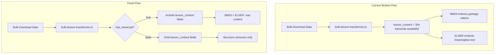

# Missing Transcript Handling (ADR-095)

## Impact

Teachers searching Oak curriculum will get more accurate results:

- MFL lessons won't pollute results with "transcript" or "available" tokens
- Lessons without transcripts remain findable via structure retrievers (pedagogical metadata)
- RRF ranking correctly reflects actual content availability (~19% of lessons lack transcripts)

## Architecture Overview




## Key Files

| File | Purpose ||------|---------|| [`packages/sdks/.../field-definitions/curriculum.ts`](packages/sdks/oak-curriculum-sdk/type-gen/typegen/search/field-definitions/curriculum.ts) | Schema source of truth - add `has_transcript`, make `lesson_content` optional || [`apps/.../bulk-lesson-transformer.ts`](apps/oak-open-curriculum-semantic-search/src/adapters/bulk-lesson-transformer.ts) | Transformer - update `buildLessonContentFields()` || [`apps/.../bulk-lesson-transformer.unit.test.ts`](apps/oak-open-curriculum-semantic-search/src/adapters/bulk-lesson-transformer.unit.test.ts) | Tests - write failing tests FIRST (TDD) || [`apps/.../document-transforms.ts`](apps/oak-open-curriculum-semantic-search/src/lib/indexing/document-transforms.ts) | API ingestion - investigate if still used (DRY) |

## Implementation Steps

### Step 1: Foundation Review (Mandatory)

Re-read foundation documents before coding:

- [`rules.md`](.agent/directives-and-memory/rules.md) - TDD, no type shortcuts
- [`testing-strategy.md`](.agent/directives-and-memory/testing-strategy.md) - Write tests FIRST
- [`schema-first-execution.md`](.agent/directives-and-memory/schema-first-execution.md) - Generator is source of truth

### Step 2: TDD - Write Failing Tests FIRST

Update [`bulk-lesson-transformer.unit.test.ts`](apps/oak-open-curriculum-semantic-search/src/adapters/bulk-lesson-transformer.unit.test.ts):

1. **DELETE** lines 185-207 (tests asserting wrong `[No transcript available]` behavior)
2. **ADD** new tests for correct behavior:

- `it('includes content fields when transcript exists')`
- `it('omits content fields when transcript is null')`
- `it('omits content fields when transcript is undefined')`
- `it('omits content fields when transcript is empty string')`
- `it('sets has_transcript to true/false correctly')`
- `it('always includes structure fields regardless of transcript')`

Run tests - they MUST fail (RED phase).

### Step 3: Update Schema (Generator Source of Truth)

Edit [`curriculum.ts`](packages/sdks/oak-curriculum-sdk/type-gen/typegen/search/field-definitions/curriculum.ts):

1. **Add `has_transcript` field** (line ~59, before `lesson_content`):
   ```typescript
         { name: 'has_transcript', zodType: 'boolean', optional: false },
   ```


2. **Make `lesson_content` optional** (line 60):
   ```typescript
         // Change: optional: false → optional: true
         { name: 'lesson_content', zodType: 'string', optional: true },
   ```


3. **Add TSDoc** explaining why these fields are optional (MFL, PE lessons)
4. Run `pnpm type-gen` to regenerate Zod schemas and ES mappings

### Step 4: Update Transformer

Edit [`bulk-lesson-transformer.ts`](apps/oak-open-curriculum-semantic-search/src/adapters/bulk-lesson-transformer.ts):

1. Update `LessonContentFields` interface (lines 151-161):

- Add `has_transcript: boolean`
- Make `lesson_content` and `lesson_content_semantic` optional

2. Update `buildLessonContentFields()` (line 164):
   ```typescript
         const hasTranscript = typeof lesson.transcript_sentences === 'string' 
           && lesson.transcript_sentences.length > 0;
         
         return {
           has_transcript: hasTranscript,
           ...(hasTranscript ? {
             lesson_content: lesson.transcript_sentences,
             lesson_content_semantic: lesson.transcript_sentences,
           } : {}),
           // Structure fields always populated
           lesson_structure: structureSummary,
           // ... rest unchanged
         };
   ```


Run tests - they MUST pass (GREEN phase).

### Step 5: Investigate DRY Issue

Check if [`document-transforms.ts`](apps/oak-open-curriculum-semantic-search/src/lib/indexing/document-transforms.ts) is still used:

- If API ingestion is deprecated (bulk-first strategy per ADR-093), document this
- If both are used, ensure consistent conditional logic (single source of truth)
- Do NOT implement duplicate logic - extract shared helper if needed

### Step 6: Add TSDoc and Documentation

1. **TSDoc** on `buildLessonContentFields()` explaining conditional inclusion
2. **TSDoc** on `has_transcript` field in schema
3. **Update** [`missing-transcript-handling.md`](.agent/plans/semantic-search/active/missing-transcript-handling.md) - mark items complete

### Step 7: Add Upstream API Wishlist Item

Add to [`04-high-priority-requests.md`](.agent/plans/external/ooc-api-wishlist/04-high-priority-requests.md):

- Request explicit optional marking for `transcript_sentences` in OpenAPI schema
- Request native `has_transcript` field consideration

### Step 8: Quality Gates (One at a Time)

```bash
pnpm type-gen        # Regenerate types
pnpm build           # Build all packages
pnpm type-check      # Verify types
pnpm lint:fix        # Fix linting issues
pnpm format:root     # Format code
pnpm markdownlint:root # Format markdown
pnpm test            # Unit + integration tests
pnpm test:e2e        # E2E tests
pnpm test:e2e:built  # Built E2E tests
pnpm test:ui         # UI tests
pnpm smoke:dev:stub  # Smoke tests
```

Analyze ALL failures together after gates complete. Look for architectural issues.

### Step 9: Update Plan Status

Mark blocking tasks complete in:

- [`missing-transcript-handling.md`](.agent/plans/semantic-search/active/missing-transcript-handling.md)
- [`roadmap.md`](.agent/plans/semantic-search/roadmap.md)
- [`current-state.md`](.agent/plans/semantic-search/current-state.md)

## Post-Implementation: Re-Ingest

After quality gates pass, unblocked re-ingestion:

```bash
cd apps/oak-open-curriculum-semantic-search
pnpm es:setup --reset
pnpm es:ingest-live --bulk --bulk-dir ./bulk-downloads --force
pnpm es:status
```

Expected: ~12,320 lessons, ~1,665 units, ~1,665 rollups, ~164 threads.

## Success Criteria

- [ ] Tests written FIRST and initially fail (TDD RED)
- [ ] `has_transcript` field added to schema
- [ ] `lesson_content` made optional in schema
- [ ] Transformer conditionally includes content fields
- [ ] DRY issue investigated and resolved