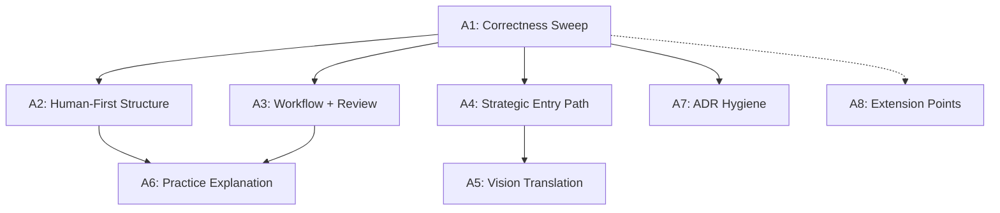

# Onboarding Merge-Blocking Remediation (A1-A8)

## Dependency Order



A1 is the foundation. A2, A3, A4, A7 can proceed in sequence after A1. A5 depends on A4. A6 depends on A2 + A3. A8 is low-dependency.

---

## A1. Onboarding Correctness Sweep

Foundation work — fixes factual errors that undermine trust. Everything else depends on this.

### A1.1 Fix broken `institutional-memory.md` link

- **File**: [README.md](README.md) line 22
- **Current**: `[memory](docs/architecture/institutional-memory.md)` — file does not exist
- **Fix**: Change to `[memory](.agent/memory/distilled.md)` (the actual institutional memory file)

### A1.2 Add prerequisites section

- **Files**: [docs/development/onboarding.md](docs/development/onboarding.md), [README.md](README.md)
- **Action**: Add a "Prerequisites" section before the clone step with two tiers:
  - **Required** (clone, build, test): Node.js 24.x (with `nvm`/`fnm` link), pnpm (with `corepack enable` note)
  - **Required for push**: gitleaks (with install link) — the husky pre-push hook runs `gitleaks detect`

### A1.3 Create `.nvmrc`

- **File**: `.nvmrc` (new, one line: `24`)

### A1.4 Fix `.env.example` misleading comments

- **File**: [.env.example](.env.example) lines 40-42
- Line 40: `"required — MCP servers fail at startup without these"` to `"required only for search features and some MCP server modes"`
- Line 42: `docs/ES_SERVERLESS_SETUP.md` to `apps/oak-search-cli/docs/ES_SERVERLESS_SETUP.md`

### A1.5 Fix script-documentation drift

Five files need the same class of fix — command descriptions out of sync with `package.json`:

- [docs/development/onboarding.md](docs/development/onboarding.md) line 74: Add `subagents:check` to `pnpm make` description (between `lint:fix` and `markdownlint:root`)
- [docs/development/build-system.md](docs/development/build-system.md) line 58: Add `subagents:check` to `pnpm make` description; line 78: Add `subagents:check` to `pnpm qg` description
- [docs/quick-start.md](docs/quick-start.md) line 91: Fix truncated `pnpm make` description to match the full pipeline
- [docs/development/troubleshooting.md](docs/development/troubleshooting.md) line 13: Fix pnpm version `9.x+` to `10.x`
- Add a note in [onboarding.md](docs/development/onboarding.md) and [CONTRIBUTING.md](CONTRIBUTING.md) deferring to [build-system.md](docs/development/build-system.md) as the single source of truth for command definitions
- Fix `pnpm qg` description: `smoke` to `smoke:dev:stub` where inaccurate

### A1.6 Fix additional link and content errors

- [README.md](README.md) line 3: Fix double-dash typo `Elasticsearch-serverless--backed` to `Elasticsearch-serverless-backed`
- [ADR-029](docs/architecture/architectural-decisions/029-no-manual-api-data.md) line 181: Fix broken plan link to `archive/completed/` path
- ADR-029 line 182: Fix workspace path `packages/oak-curriculum-sdk/` to `packages/sdks/oak-curriculum-sdk/`
- [ADR index](docs/architecture/architectural-decisions/README.md) line 3: Fix Quick Navigation links pointing to archived documents — relabel or remove
- [CONTRIBUTING.md](CONTRIBUTING.md): Resolve E2E test credential guidance contradiction with onboarding.md

---

## A2. Human-First Onboarding Structure

Restructures [docs/development/onboarding.md](docs/development/onboarding.md) to be audience-aware, jargon-free, and progressive.

### A2.1 "What's Different About This Repo" section

- Add after "Choose Your Path" (before step 1). 5-6 bullet points:
  - Schema-first generation (why: zero manual type maintenance)
  - Strict TDD at all levels (why: tests are specifications, not afterthoughts)
  - No type shortcuts (why: type information is structural truth)
  - No disabled quality gates (why: guardrails are entropy reduction, not friction)
  - Result pattern (why: explicit error handling, no silent failures)
  - Agentic engineering practice (why: AI reviewers + quality gates = structural immune system)
- Include the guardrails-as-entropy-reduction rationale
- Include a brief TDD walkthrough with a concrete repo example

### A2.2 Define jargon inline

- In [onboarding.md](docs/development/onboarding.md) and [README.md](README.md), define on first use:
  - MCP (Model Context Protocol — a standard for connecting AI tools to data sources)
  - OpenAPI (a machine-readable specification describing an HTTP API)
  - ADR (Architectural Decision Record — a document capturing a significant design choice)
  - SDK (Software Development Kit)
  - TDD (Test-Driven Development — write tests before code)
  - Zod (a TypeScript-first runtime validation library)
  - "workspace" (a package within this monorepo)

### A2.3 Default path and plain-English path descriptions

- Add to "Choose Your Path": default recommendation for unsure contributors (SDK/docs path)
- Add one-sentence plain-English descriptions of what each path involves
- Reorder step 4 to separate "verify (no keys)" from "full pipeline (may need keys)"

### A2.4 Day 1 essentials vs reference separation

- Visually separate steps 0-4 as "Day 1 Essentials" and steps 5-11 as "Reference — Read When You Need Them"
- Add a "You're ready when..." checklist after the essentials
- Add expected-output annotations after key verification commands
- Add time-to-productivity estimates by contribution level

### A2.5 Link architecture diagram

- Add a prominent link to the Architecture TL;DR diagram from [quick-start.md](docs/quick-start.md) (the `OpenAPI Spec → type-gen → SDK/MCP/Search` diagram) into [onboarding.md](docs/development/onboarding.md) step 1

### A2.6 Fix type safety guidance

- [docs/quick-start.md](docs/quick-start.md): Refine "use `unknown` at boundaries" to clarify that validation must use generated Zod schemas from the SDK
- [.agent/directives/rules.md](.agent/directives/rules.md): Add explicit `as const` exception to the type assertions rule (it is a data-structure annotation, not a type assertion)

---

## A3. Workflow and Review Contract

The single biggest gap for team-scale adoption. One new document covering the complete development lifecycle.

### A3.1 Create workflow documentation

- **File**: `docs/development/workflow.md` (new)
- **Content** (one document covering the complete lifecycle):
  - Branch creation (conventional naming)
  - TDD cycle (red/green/refactor) — brief, link to testing-strategy.md
  - Local quality gates (`pnpm fix` for quick fixes, `pnpm make` for full pipeline)
  - Commit (conventional commits)
  - Push (pre-push secret scan via husky/gitleaks)
  - PR creation and guidelines
  - CI checks (list exactly what CI runs)
  - AI sub-agent review: what they do, when they run, which reviewers exist, findings are advisory
  - Human review: requirements, what to look for that AI reviewers may miss
  - Merge strategy
  - Automated release via semantic-release
  - Diagram showing the flow
  - CI-vs-local gap: what CI runs vs what remains local-only
  - Quality metrics / "what does good look like?" for individual contributors
- **Cross-references**: Link from [CONTRIBUTING.md](CONTRIBUTING.md), [onboarding.md](docs/development/onboarding.md), [docs/README.md](docs/README.md)

---

## A4. Strategic Entry Path

Makes VISION.md and strategic content discoverable for non-developer audiences.

### A4.1 Restructure README and add strategic entry points

- [README.md](README.md): Add plain-language first sentence before the technical description: "This repository is how Oak makes its curriculum available to AI tools and the wider education technology community."
- [README.md](README.md): Add "For strategic overview, start with [Vision](docs/VISION.md)" after opening paragraph
- [docs/README.md](docs/README.md): Add a "Vision and Strategy" section to Getting Started
- [docs/development/onboarding.md](docs/development/onboarding.md): Add "Strategic / Leadership" path to "Choose Your Path": VISION.md, ADR index, practice.md
- [docs/development/onboarding.md](docs/development/onboarding.md): Add lead/senior developer path option
- [docs/development/onboarding.md](docs/development/onboarding.md): Add mission-framing paragraph connecting engineering work to teacher outcomes
- Standardise "sub-agents" vs "subagents" terminology across all touched files

---

## A5. Vision Capability Translation and Evidence

Makes [VISION.md](docs/VISION.md) useful for non-technical audiences.

### A5.1 User-value descriptions and evidence baseline

- For each capability in the status table, add a user-facing description (e.g. "Semantic search — when a teacher searches for a lesson, the system finds the right one 98% of the time")
- Add plain-language explanations to each row
- Add current baseline values where available (MRR scores, test suite metrics, package readiness)
- Note which metrics are pre-public-release aspirational
- Translate ground-truth quality scores into teacher-facing language
- Add a "Last Updated" date
- Expand the Aila relationship section with 2-3 concrete examples of mutual reinforcement

---

## A6. Human-Facing Agentic Practice Explanation

Explains the agentic practice for human developers and managers.

### A6.1 Practice explanation

- **Location**: New section in [docs/development/onboarding.md](docs/development/onboarding.md), linked from [docs/README.md](docs/README.md) and [docs/architecture/README.md](docs/architecture/README.md)
- **Content**:
  - What the sub-agents do (review code, architecture, types, tests, security)
  - When they run (during development, invoked by the working AI agent)
  - What napkin/distilled memory is (AI institutional memory — humans can ignore unless curious)
  - What is expected of human developers (follow the same rules: TDD, type safety, quality gates)
  - How AI review fits into the PR lifecycle (cross-reference workflow.md from A3)
  - For managers: what it means for velocity and quality, what to monitor
  - Surface the "single engineer + AI" staffing model evidence from ADR-119
  - Make the 115+ ADR count prominent as a maturity signal in README

---

## A7. ADR and Link Hygiene

Can run in parallel with A2-A6.

### A7.1 ADR hygiene pass

- [ADR-029](docs/architecture/architectural-decisions/029-no-manual-api-data.md): Fix stale plan link (line 181) and workspace path (line 182) — overlaps with A1.6, done there
- [ADR index](docs/architecture/architectural-decisions/README.md) line 3: Fix Quick Navigation links to archived documents — overlaps with A1.6
- Add a "Start Here: 5 ADRs in 15 minutes" callout to the ADR index, listing: ADR-029, ADR-030, ADR-031, ADR-048, ADR-107

---

## A8. Extension Points Guide

Addresses the "how do I add things?" gap.

### A8.1 Create extension points guide

- **File**: `docs/development/extending.md` (new)
- **Content**: Practical guidance for:
  - Adding new MCP tools (generator templates, descriptor map, registration)
  - Adding new search indices (mapping generators, ingestion pipeline, ground truth)
  - Extending the SDK with new helpers (validation helpers, exports, doc-gen)
  - Adding new core packages (workspace setup, turbo config, ESLint boundaries)
- **Cross-references**: Link from [onboarding.md](docs/development/onboarding.md), [CONTRIBUTING.md](CONTRIBUTING.md), [docs/README.md](docs/README.md)

---

## Quality Gates

After all changes, run (in order):

```bash
pnpm markdownlint:root
pnpm format:root
```

These are the relevant gates for documentation-only changes. Run `pnpm lint:fix` if any non-markdown files are touched.

## Specialist Reviews

After completing all workstreams, invoke:

- `docs-adr-reviewer` — A7.1 (ADR hygiene), A5.1 (VISION.md), A6.1 (practice explanation)
- `config-reviewer` — A1.4, A1.5 (command drift, `.env.example` contradictions)
- `test-reviewer` — A3.1 (E2E credential guidance in workflow docs)
- `code-reviewer` — gateway review of all changes
- `onboarding-reviewer` — validate the complete remediation against the original findings
