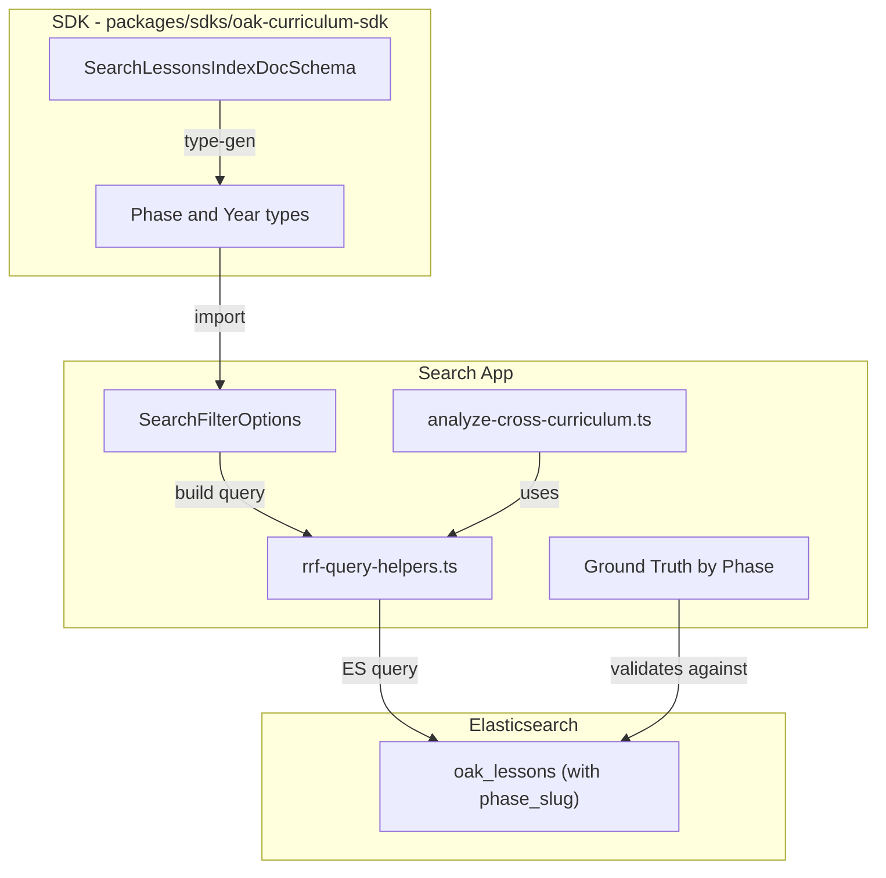

# M3 Revised: Phase-Aligned Search Quality Architecture

## Progress Summary (Updated 2026-01-03)

### Completed ✅

| Phase | Description | Key Changes |

|-------|-------------|-------------|

| **Phase 1** | SDK Schema Enhancement | `phase_slug` added to `LESSONS_INDEX_FIELDS`, `UNITS_INDEX_FIELDS`, `UNIT_ROLLUP_INDEX_FIELDS` in `curriculum.ts` generator |

| **Phase 2** | Indexing Pipeline Update | `derivePhaseFromKeyStage()` in `document-transforms.ts`; used by `buildLessonDocument`, `buildUnitDocument`, `createRollupDocument` |

| **Phase 3** | Search Filter Architecture | Array support in `SearchFilterOptions`; `expandPhasesToKeyStages()` in `phase-filter-utils.ts`; filter precedence (phases > keyStages > keyStage) |

| **Phase 4** | Analysis Script Enhancement | CLI supports `--phase`, `--keyStages`, `--years`, `--examBoards`; phase-based query merging |

### Key Files Modified

- `packages/sdks/oak-curriculum-sdk/type-gen/typegen/search/field-definitions/curriculum.ts` — Added `phase_slug` field
- `apps/oak-open-curriculum-semantic-search/src/lib/indexing/document-transforms.ts` — `derivePhaseFromKeyStage()`
- `apps/oak-open-curriculum-semantic-search/src/lib/indexing/lesson-document-core.ts` — Populates `phase_slug`
- `apps/oak-open-curriculum-semantic-search/src/lib/indexing/unit-document-core.ts` — Populates `phase_slug`
- `apps/oak-open-curriculum-semantic-search/src/lib/hybrid-search/phase-filter-utils.ts` — NEW: Phase expansion utilities
- `apps/oak-open-curriculum-semantic-search/src/lib/hybrid-search/rrf-query-helpers.ts` — Array filter support
- `apps/oak-open-curriculum-semantic-search/evaluation/analysis/analyze-cross-curriculum.ts` — Phase-aware CLI

### Remaining Work (Fresh Session)

| Phase | Description | Status |

|-------|-------------|--------|

| **Phase 5** | Ground Truth Restructure | 📋 PENDING — Create comprehensive ground truths including `maths/primary/`, `maths/secondary/`, restructure all subjects |

| **Phase 6** | ES Re-index | 📋 PENDING — Update-by-query to add `phase_slug` to existing documents |

| **Phase 7** | Baselines | 📋 PENDING — Run phase-based baselines for all subjects |

| **Docs** | Documentation | 📋 PENDING — ADR, READMEs, TSDoc |

### Decision Log

- **2026-01-03**: Confirmed that Phase 5 should create a **full set of comprehensive ground truths**, not just restructure existing ones. This includes creating entirely new `maths/primary/` queries (which don't exist yet) and proper phase-based organization for all subjects. This is foundational work that will serve the project for years.
- **2026-01-03**: MCP server (`ooc-http-dev-local`) is running and available for Phase 5 implementation. Use MCP tools to explore KS1+KS2 maths content:
- `get-key-stages-subject-units --keyStage ks1 --subject maths`
- `get-key-stages-subject-units --keyStage ks2 --subject maths`
- `get-key-stages-subject-lessons --keyStage ks1 --subject maths`
- `get-key-stages-subject-lessons --keyStage ks2 --subject maths`
- `get-lessons-summary` to validate slugs exist

---

## Impact and Users

**Who benefits**:

- **Teachers**: Can search across "all primary maths" or "secondary science AQA" naturally
- **AI agents**: Get accurate curriculum context with flexible filtering
- **Our team**: Can measure search quality accurately to make informed improvements

**The core problem**: Ground truths for Primary span KS1+KS2, but our test harness only supports single key stage filters. English KS1 (0.131 MRR) and KS2 (0.107 MRR) baselines are test artefacts, not search quality issues.---

## Domain Model Clarification

| Concept | Values | Notes ||---------|--------|-------|| **Phase** | `primary`, `secondary` | Fundamental division; GCSE is NOT a phase || **Key Stage** | `ks1`, `ks2`, `ks3`, `ks4` | GCSE = KS4 (synonym) || **Year** | 1-11 | Maps to key stages || **Sequence** | `{subject}-{phase}` | e.g., `english-primary`, `maths-secondary` || **Exam Board** | `aqa`, `edexcel`, `ocr`, etc. | KS4 only; optional filter |**Phase to Key Stage mapping**:

- `primary` = `['ks1', 'ks2']` = Years 1-6
- `secondary` = `['ks3', 'ks4']` = Years 7-11

---

## Architecture Overview



---

## Phase 1: SDK Schema Enhancement

**Goal**: Add `phase_slug` field to index documents; define `Phase` and `Year` types.**Files to modify**:

1. [`packages/sdks/oak-curriculum-sdk/src/types/generated/search/index-documents.ts`](packages/sdks/oak-curriculum-sdk/src/types/generated/search/index-documents.ts)

**Changes**:

```typescript
// Add Phase type (if not already present from API schema)
export const PhaseSchema = z.enum(['primary', 'secondary']);
export type Phase = z.infer<typeof PhaseSchema>;

// Add Year type
export const YearSchema = z.union([
  z.literal(1), z.literal(2), z.literal(3), z.literal(4), z.literal(5),
  z.literal(6), z.literal(7), z.literal(8), z.literal(9), z.literal(10), z.literal(11),
]);
export type Year = z.infer<typeof YearSchema>;

// In SearchLessonsIndexDocSchema, add after key_stage:
phase_slug: PhaseSchema.optional(),
```

**Also add to**:

- `SearchUnitsIndexDocSchema`
- `SearchUnitRollupDocSchema`

**TDD approach**:

1. RED: Write unit test expecting `phase_slug` in parsed schema output
2. GREEN: Add field to schema
3. REFACTOR: Add comprehensive TSDoc

---

## Phase 2: Indexing Pipeline Update

**Goal**: Populate `phase_slug` during document creation.**Files to modify**:

1. [`apps/oak-open-curriculum-semantic-search/src/lib/indexing/lesson-document-core.ts`](apps/oak-open-curriculum-semantic-search/src/lib/indexing/lesson-document-core.ts)

- Add `phaseSlug` to `CreateLessonDocParams`
- Include in output document

2. [`apps/oak-open-curriculum-semantic-search/src/lib/indexing/unit-document-core.ts`](apps/oak-open-curriculum-semantic-search/src/lib/indexing/unit-document-core.ts)

- Same changes for unit documents

3. [`apps/oak-open-curriculum-semantic-search/src/adapters/bulk-lesson-transformer.ts`](apps/oak-open-curriculum-semantic-search/src/adapters/bulk-lesson-transformer.ts)

- Extract `phaseSlug` from bulk data (already present in sequence-organised files)

**Pure derivation function** (for cases where we only have key stage):

```typescript
/**
    * Derives phase from key stage.
    * @param keyStage - The key stage slug
    * @returns The corresponding phase
 */
function derivePhaseFromKeyStage(keyStage: KeyStage): Phase {
  return keyStage === 'ks1' || keyStage === 'ks2' ? 'primary' : 'secondary';
}
```

**Note**: Bulk files are already organised by sequence (e.g., `english-primary.json`), so `phaseSlug` can be extracted directly from the filename/metadata.---

## Phase 3: Search Filter Architecture

**Goal**: Support array filters for all curriculum dimensions.**File to modify**: [`apps/oak-open-curriculum-semantic-search/src/lib/hybrid-search/rrf-query-helpers.ts`](apps/oak-open-curriculum-semantic-search/src/lib/hybrid-search/rrf-query-helpers.ts)**Current interface**:

```typescript
interface SearchFilterOptions {
  readonly subject?: SearchSubjectSlug;
  readonly keyStage?: KeyStage;
  readonly year?: string;
  readonly tier?: string;
  readonly examBoard?: string;
  // ...
}
```

**New interface**:

```typescript
/**
    * Search filter options supporting flexible curriculum navigation.
    * 
    * All array fields use OR logic within the field (e.g., keyStages: ['ks1', 'ks2'] 
    * matches documents in EITHER ks1 OR ks2).
    * 
    * Different fields use AND logic between them (e.g., subject + keyStages
    * matches documents that satisfy BOTH conditions).
 */
interface SearchFilterOptions {
  // Subject dimension
  readonly subject?: SearchSubjectSlug;
  readonly subjects?: readonly SearchSubjectSlug[];
  
  // Phase dimension (expands to key stages)
  readonly phase?: Phase;
  readonly phases?: readonly Phase[];
  
  // Key stage dimension
  readonly keyStage?: KeyStage;
  readonly keyStages?: readonly KeyStage[];
  
  // Year dimension
  readonly year?: string;
  readonly years?: readonly string[];
  
  // KS4 metadata dimensions
  readonly tier?: string;
  readonly tiers?: readonly string[];
  readonly examBoard?: string;
  readonly examBoards?: readonly string[];
  
  // Existing fields unchanged
  readonly unitSlug?: string;
  readonly examSubject?: string;
  readonly ks4Option?: string;
  readonly threadSlug?: string;
  readonly category?: string;
}
```

**Filter precedence logic**:

```typescript
/**
    * Builds key stage filter with phase expansion.
    * Priority: phases > keyStages > keyStage (singular)
 */
function buildKeyStageFilter(options: SearchFilterOptions): QueryContainer | undefined {
  // Phase takes precedence - expand to key stages
  if (options.phases?.length) {
    return { terms: { key_stage: expandPhasesToKeyStages(options.phases) } };
  }
  if (options.phase) {
    return { terms: { key_stage: expandPhasesToKeyStages([options.phase]) } };
  }
  
  // Array keyStages
  if (options.keyStages?.length) {
    return { terms: { key_stage: [...options.keyStages] } };
  }
  
  // Legacy single keyStage
  if (options.keyStage) {
    return { term: { key_stage: options.keyStage } };
  }
  
  return undefined;
}

/**
    * Expands phases to their constituent key stages.
 */
function expandPhasesToKeyStages(phases: readonly Phase[]): KeyStage[] {
  const result: KeyStage[] = [];
  for (const phase of phases) {
    if (phase === 'primary') {
      result.push('ks1', 'ks2');
    } else {
      result.push('ks3', 'ks4');
    }
  }
  return result;
}
```

**Exam board filter**:

```typescript
function buildExamBoardFilter(options: SearchFilterOptions): QueryContainer | undefined {
  if (options.examBoards?.length) {
    return { terms: { exam_boards: [...options.examBoards] } };
  }
  if (options.examBoard) {
    return { terms: { exam_boards: [options.examBoard] } };
  }
  return undefined;
}
```

---

## Phase 4: Analysis Script Enhancement

**Goal**: Support all filter dimensions in CLI.**File**: [`apps/oak-open-curriculum-semantic-search/evaluation/analysis/analyze-cross-curriculum.ts`](apps/oak-open-curriculum-semantic-search/evaluation/analysis/analyze-cross-curriculum.ts)**New CLI parameters**:

```typescript
const { values } = parseArgs({
  options: {
    // Subject
    subject: { type: 'string', short: 's' },
    
    // Phase (primary/secondary)
    phase: { type: 'string', short: 'p' },
    
    // Key stage (single or comma-separated)
    keyStage: { type: 'string', short: 'k' },
    keyStages: { type: 'string' },
    
    // Year (comma-separated)
    years: { type: 'string', short: 'y' },
    
    // Exam board (comma-separated)
    examBoard: { type: 'string', short: 'e' },
    examBoards: { type: 'string' },
    
    // Output control
    verbose: { type: 'boolean', short: 'v' },
  },
});
```

**Usage examples**:

```bash
# Phase-based (primary = KS1+KS2)
pnpm tsx evaluation/analysis/analyze-cross-curriculum.ts --subject english --phase primary
pnpm tsx evaluation/analysis/analyze-cross-curriculum.ts --subject english --phase secondary

# Specific key stages
pnpm tsx evaluation/analysis/analyze-cross-curriculum.ts --subject maths --keyStages ks3,ks4

# With exam board filter
pnpm tsx evaluation/analysis/analyze-cross-curriculum.ts --subject science --phase secondary --examBoard aqa

# Legacy single key stage (still works)
pnpm tsx evaluation/analysis/analyze-cross-curriculum.ts --subject french --keyStage ks3
```

---

## Phase 5: Ground Truth Restructure

**Status**: 📋 PENDING — Next major work item**Goal**: Create comprehensive ground truths organised by phase for ALL subjects.

### Current State Analysis

| Subject | Current Structure | Primary Coverage | Secondary Coverage | Action Required |

|---------|-------------------|------------------|-------------------|-----------------|

| **Maths** | Root-level files + `units/` | ❌ NONE | KS4 only (55 queries) | CREATE primary; restructure secondary |

| **English** | `primary/`, `ks3/`, `ks4/` | ✅ Good | ✅ Split by KS | Merge KS3+KS4 into secondary |

| **Science** | `primary/`, `ks3/` | ✅ KS2 | ⚠️ KS3 only | Add KS4 or create secondary |

| **History** | `primary/`, `ks3/` | ✅ KS2 | ⚠️ KS3 only | Add KS4 or create secondary |

| **Geography** | `ks3/` only | ❌ NONE | ⚠️ KS3 only | Consider primary; create secondary |

| **Others** | `ks3/` only | ❌ NONE | ⚠️ KS3 only | Create secondary directories |

### Target Structure

```javascript
ground-truth/
├── maths/                    # NEW DIRECTORY
│   ├── primary/              # NEW - Years 1-6 content
│   │   ├── number.ts         # Addition, subtraction, place value, fractions
│   │   ├── shape.ts          # 2D/3D shapes, symmetry, position
│   │   ├── measurement.ts    # Length, weight, time, money
│   │   ├── hard-queries.ts
│   │   └── index.ts
│   └── secondary/            # Reorganised from root + units/
│       ├── algebra.ts        # ← from root algebra.ts
│       ├── geometry.ts       # ← from root geometry.ts
│       ├── number.ts         # ← from root number.ts
│       ├── graphs.ts         # ← from root graphs.ts
│       ├── statistics.ts     # ← from root statistics.ts
│       ├── hard-queries.ts
│       └── index.ts
├── english/
│   ├── primary/              # Existing - review and enhance
│   └── secondary/            # NEW - merge ks3/ + ks4/
│       ├── literature.ts
│       ├── language.ts
│       ├── hard-queries.ts
│       └── index.ts
├── science/
│   ├── primary/              # Existing - review
│   └── secondary/            # NEW - merge ks3/ + add ks4
├── history/
│   ├── primary/              # Existing
│   └── secondary/            # NEW
├── [other subjects]/
│   └── secondary/            # Create from existing ks3/
```


### Implementation Steps

**Step 1: Create Maths Primary Ground Truths (NEW CONTENT)**This is the most significant work - creating queries that don't exist yet:

1. Use Oak MCP tools to explore KS1+KS2 maths content:

- `get-key-stages-subject-units --keyStage ks1 --subject maths`
- `get-key-stages-subject-units --keyStage ks2 --subject maths`
- `get-key-stages-subject-lessons --keyStage ks1 --subject maths`
- `get-key-stages-subject-lessons --keyStage ks2 --subject maths`

2. Create queries for primary maths topics:

- Number: counting, place value, addition, subtraction, multiplication, division, fractions
- Shape: 2D shapes, 3D shapes, symmetry, position and direction
- Measurement: length, mass, capacity, time, money
- Statistics: tally charts, pictograms, bar charts

3. Validate all slugs exist via MCP `get-lessons-summary`

**Step 2: Restructure Maths Secondary**

1. Create `maths/` directory
2. Move existing root-level files into `maths/secondary/`
3. Update imports in root `index.ts`
4. Verify query counts match

**Step 3: Restructure English Secondary**

1. Create `english/secondary/` directory
2. Merge content from `english/ks3/` and `english/ks4/`
3. Remove duplication if any
4. Update exports

**Step 4: Create Secondary Directories for All Subjects**For subjects currently with only `ks3/`:

1. Rename/copy to `secondary/`
2. Update exports
3. Validate no query loss

**Step 5: Update analyze-cross-curriculum.ts Mappings**The `GROUND_TRUTHS_BY_SUBJECT_AND_KS` structure needs updating to support phase-based loading.

### Ground Truth Creation Methodology

Use **two complementary data sources**:

1. **Bulk Download Data** (`reference/bulk_download_data/`)

- Browse `{subject}-primary.json` and `{subject}-secondary.json`
- Identify lesson slugs for candidate queries

2. **Oak Curriculum MCP Tools** (`ooc-http-dev-local`)

- `search` — Find lessons by topic
- `get-lessons-summary` — Validate slugs exist
- `get-key-stages-subject-lessons` — List all available lessons
- `get-key-stages-subject-units` — Understand unit structure

### Acceptance Criteria

| Criterion | Measurement |

|-----------|-------------|

| `maths/primary/` exists with ≥30 queries | File check, query count |

| `maths/secondary/` exists with reorganised content | File check |

| All subjects have `secondary/` directories | Directory structure |

| Total query count ≥ current (263+) | Count before/after |

| All slugs validated via MCP | Validation script passes |

| CLI `--phase` option works with new structure | Manual test |

### Key Principle

- Queries in `{subject}/primary/` are tested with `phase: 'primary'` filter
- Queries in `{subject}/secondary/` are tested with `phase: 'secondary'` filter
- This alignment eliminates the measurement artefacts that caused false low MRR

---

## Phase 6: Re-index with Phase Data

**Goal**: Add `phase_slug` to existing ES documents.**Approach**: ES update-by-query (faster than full re-ingest):

```bash
# Run from Kibana Dev Tools or curl
POST oak_lessons/_update_by_query
{
  "script": {
    "source": "ctx._source.phase_slug = (ctx._source.key_stage == 'ks1' || ctx._source.key_stage == 'ks2') ? 'primary' : 'secondary'"
  }
}

POST oak_units/_update_by_query
{
  "script": {
    "source": "ctx._source.phase_slug = (ctx._source.key_stage == 'ks1' || ctx._source.key_stage == 'ks2') ? 'primary' : 'secondary'"
  }
}

POST oak_unit_rollup/_update_by_query
{
  "script": {
    "source": "ctx._source.phase_slug = (ctx._source.key_stage == 'ks1' || ctx._source.key_stage == 'ks2') ? 'primary' : 'secondary'"
  }
}
```

---

## Phase 7: Run Phase-Based Baselines

**Goal**: Establish accurate baselines for all subjects by phase.

```bash
cd apps/oak-open-curriculum-semantic-search

# Core subjects - both phases
for subject in english maths science; do
  pnpm tsx evaluation/analysis/analyze-cross-curriculum.ts --subject $subject --phase primary
  pnpm tsx evaluation/analysis/analyze-cross-curriculum.ts --subject $subject --phase secondary
done

# Humanities
for subject in history geography; do
  pnpm tsx evaluation/analysis/analyze-cross-curriculum.ts --subject $subject --phase primary
  pnpm tsx evaluation/analysis/analyze-cross-curriculum.ts --subject $subject --phase secondary
done

# Secondary only subjects
for subject in french spanish german computing art music design-technology citizenship religious-education physical-education; do
  pnpm tsx evaluation/analysis/analyze-cross-curriculum.ts --subject $subject --phase secondary
done

# Primary only
pnpm tsx evaluation/analysis/analyze-cross-curriculum.ts --subject cooking-nutrition --phase primary
```

Record all results in [EXPERIMENT-LOG.md](.agent/evaluations/EXPERIMENT-LOG.md).---

## Documentation Requirements

1. **TSDoc**: All new types, functions, interfaces - comprehensive with examples
2. **ADR**: Create ADR-XXX "Phase-Aligned Filter Architecture"
3. **README**: Update search app README with new filter parameters
4. **Update current-state.md**: Replace key-stage matrix with phase-based matrix
5. **Update semantic-search.prompt.md**: Remove GCSE as separate concept

---

## Quality Gates

Run after each phase (from repo root):

```bash
pnpm type-gen
pnpm build
pnpm type-check
pnpm lint:fix
pnpm format:root
pnpm markdownlint:root
pnpm test
pnpm test:e2e
pnpm test:e2e:built
pnpm test:ui
pnpm smoke:dev:stub
```

---

## Foundation Document Re-Read Schedule

| Checkpoint | Re-read ||------------|---------|| Before Phase 1 | rules.md, schema-first-execution.md || Before Phase 3 | rules.md (First Question) || Before Phase 5 | testing-strategy.md || Before Phase 7 | All three |---