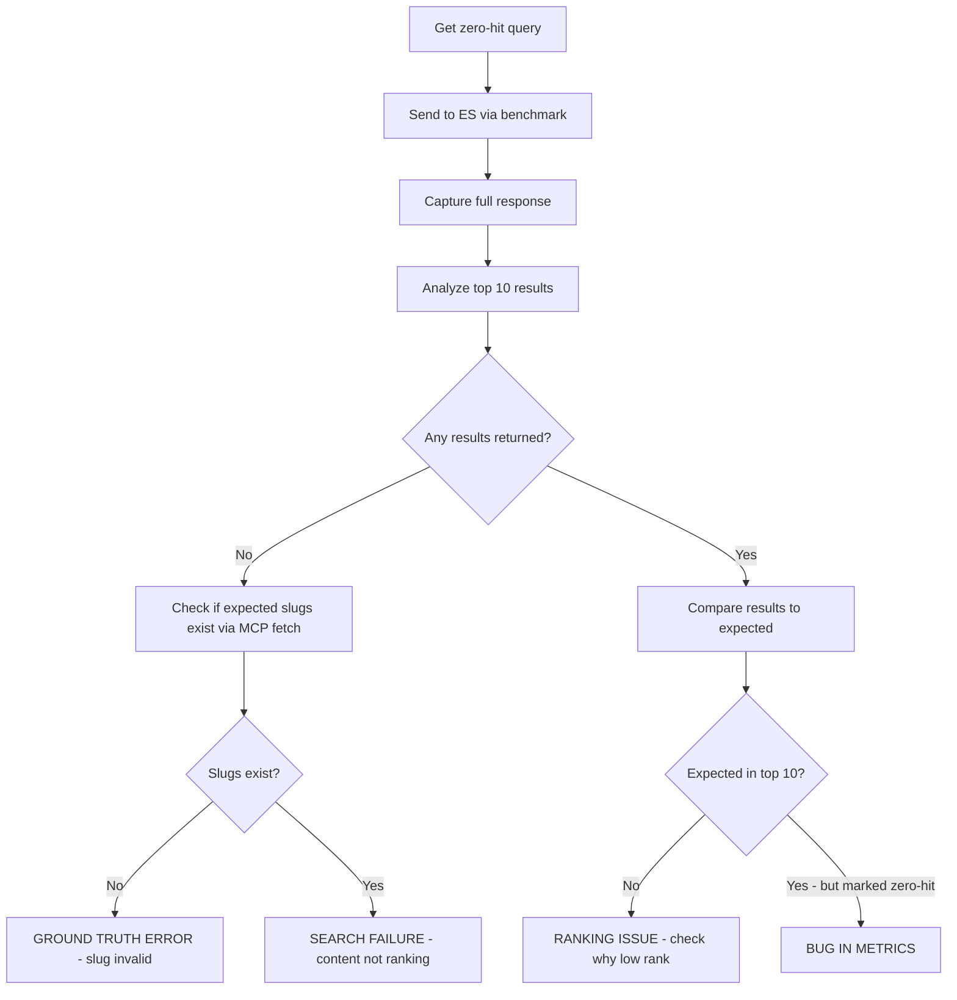

# Phase 8 Analysis Remediation

## Track 1: Switch from P@10 to P@3

**Rationale**: Ground truths have 2-4 relevant slugs per query, making P@10=0.50 mathematically impossible.

### Files to modify

1. [`evaluation/analysis/benchmark-query-runner.ts`](apps/oak-open-curriculum-semantic-search/evaluation/analysis/benchmark-query-runner.ts)

   - Line 125: Change `calculatePrecisionAtK(actualResults, relevanceMap, 10)` to `calculatePrecisionAtK(actualResults, relevanceMap, 3)`
   - Rename `precision10` to `precision3` in `QueryResult` interface

2. [`evaluation/analysis/benchmark-stats.ts`](apps/oak-open-curriculum-semantic-search/evaluation/analysis/benchmark-stats.ts)

   - Rename `precision10` to `precision3` in `CategoryResult` interface
   - Update aggregation logic

3. [`evaluation/analysis/benchmark-entry-runner.ts`](apps/oak-open-curriculum-semantic-search/evaluation/analysis/benchmark-entry-runner.ts)

   - Rename `precision10` to `precision3` in `EntryBenchmarkResult` interface
   - Update aggregation

4. [`evaluation/baselines/baselines.json`](apps/oak-open-curriculum-semantic-search/evaluation/baselines/baselines.json)

   - Rename `precision10` to `precision3` in all entries
   - Update reference values (target 0.5 for P@3 is more achievable)

5. Update all test files and documentation referencing P@10

---

## Track 2: Create Filtered Aggregates (Excluding LLM-Required Categories)

**Rationale**: `pedagogical-intent` and `natural-expression` require LLM capabilities we don't have. Keep measuring them, but report separate aggregates.

### Approach

Add to [`evaluation/analysis/benchmark-output.ts`](apps/oak-open-curriculum-semantic-search/evaluation/analysis/benchmark-output.ts):

```typescript
// Categories that require LLM features to function well
const LLM_REQUIRED_CATEGORIES: QueryCategory[] = ['pedagogical-intent', 'natural-expression'];

function calculateFilteredAggregate(results: EntryBenchmarkResult[]): FilteredAggregate {
  // Filter out LLM-required categories from per-category results
  // Calculate aggregate metrics only from remaining categories
}
```

### Output structure

```
OVERALL (509 queries): MRR=0.582 | ...
OVERALL EXCLUDING LLM-REQUIRED (389 queries): MRR=0.68 | ...
```

Also update baselines.json to store both aggregate types.

---

## Track 3: Investigate MFL Retriever Weighting

**Correction**: ELSER English-only limitation is NOT the cause. The real issue is MFL lessons lack transcripts, so content-based retrievers underperform.

### Current architecture (from `rrf-query-helpers.ts`)

```
4-way RRF:
1. BM25 on Content (lesson_content = transcript)
2. ELSER on Content
3. BM25 on Structure (lesson_structure)
4. ELSER on Structure
```

### Investigation needed

1. Verify MFL lessons have empty/missing `lesson_content` field
2. Determine if RRF weights can be adjusted per-subject
3. Options:

   - Use conditional retriever selection based on subject
   - Increase structure retriever boost for subjects without transcripts
   - Add `has_transcript` field to index and use in scoring

### Files to investigate

- [`src/lib/hybrid-search/rrf-query-builders.ts`](apps/oak-open-curriculum-semantic-search/src/lib/hybrid-search/rrf-query-builders.ts)
- [`src/lib/indexing/document-transforms.ts`](apps/oak-open-curriculum-semantic-search/src/lib/indexing/document-transforms.ts) - verify transcript population

---

## Track 4: Fix Miscategorized Queries

### Queries to fix

1. **Art Primary** - [`src/lib/search-quality/ground-truth/art/primary/index.ts`](apps/oak-open-curriculum-semantic-search/src/lib/search-quality/ground-truth/art/primary/index.ts)

   - Query: `"hands-on activity for reluctant artists"`
   - Change: `pedagogical-intent` -> `natural-expression`
   - Reason: Contains curriculum-adjacent terms, not pure methodology

2. **Geography Primary** - [`src/lib/search-quality/ground-truth/geography/primary/index.ts`](apps/oak-open-curriculum-semantic-search/src/lib/search-quality/ground-truth/geography/primary/index.ts)

   - Query: `"outdoor fieldwork activity autumn"`
   - Change: `pedagogical-intent` -> `precise-topic`
   - Reason: "fieldwork" and "autumn" are curriculum terms that match slug directly

---

## Track 5: Zero-Hit Query Investigation

**Scope**: From the benchmark, there are ~94 queries with zero-hit results (18.5% of 509).

### Methodology for each zero-hit query



### Output

Create investigation report: `.agent/evaluations/zero-hit-investigation.md`

| Query | Subject | Phase | Category | Diagnosis | Action |

|-------|---------|-------|----------|-----------|--------|

| "..." | french | secondary | ... | GROUND_TRUTH_ERROR | Fix slug |

| "..." | maths | primary | ... | SEARCH_FAILURE | Investigate ranking |

### MCP Tools to use (NOT search)

- `mcp_oak-local_get-lessons-summary` - verify lesson exists
- `mcp_oak-local_fetch` - get lesson details
- `mcp_oak-local_get-key-stages-subject-lessons` - browse available lessons

---

## Execution Order

1. **Track 4** (15 min) - Fix miscategorized queries first (simple, reduces noise)
2. **Track 1** (30 min) - Switch P@10 to P@3
3. **Track 2** (45 min) - Add filtered aggregates
4. **Track 5** (2-4 hours) - Systematic zero-hit investigation
5. **Track 3** (1-2 hours) - MFL retriever investigation (after Track 5 findings)

## Quality Gates

After each track:

```bash
pnpm type-gen && pnpm build && pnpm type-check && pnpm lint:fix
pnpm test  # Unit tests
pnpm ground-truth:validate  # Ensure ground truths valid
```

After all tracks:

```bash
pnpm benchmark --all  # Re-run full benchmark with fixes
# Update baselines.json with new results
# Full quality gate suite
```
