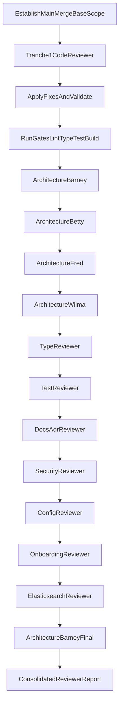

# Pre-merge Broad Review (Re-run, New Order)

## Intent and Scope

- Review all changes on this branch since `merge-base(main, HEAD)` (`main...HEAD`), not only recent commits.
- Current branch scope: `feat/search_cli_enhancements`, `158` changed files.
- Treat all reviewer findings as blocking by default; only reject findings with explicit rationale.
- Enforce strict principles alignment from `[.agent/directives/principles.md](.agent/directives/principles.md)`, especially: no compatibility layers, fail fast, no type shortcuts, no disabled checks.

## Domain Risk Map (Prioritised During Review)

- CLI lifecycle/admin/indexing paths: `[apps/oak-search-cli/src/cli/admin/admin-lifecycle-commands.ts](apps/oak-search-cli/src/cli/admin/admin-lifecycle-commands.ts)`, `[apps/oak-search-cli/src/cli/admin/admin-lifecycle-alias-commands.ts](apps/oak-search-cli/src/cli/admin/admin-lifecycle-alias-commands.ts)`, `[apps/oak-search-cli/src/lib/indexing/run-versioned-ingest.ts](apps/oak-search-cli/src/lib/indexing/run-versioned-ingest.ts)`
- Elasticsearch client/count/synonyms surfaces: `[apps/oak-search-cli/src/cli/shared/with-es-client.ts](apps/oak-search-cli/src/cli/shared/with-es-client.ts)`, `[packages/sdks/oak-search-sdk/src/admin/create-admin-service.ts](packages/sdks/oak-search-sdk/src/admin/create-admin-service.ts)`, `[packages/sdks/oak-search-sdk/src/admin/admin-index-operations.ts](packages/sdks/oak-search-sdk/src/admin/admin-index-operations.ts)`, `[packages/sdks/oak-search-sdk/src/admin/verify-doc-counts.ts](packages/sdks/oak-search-sdk/src/admin/verify-doc-counts.ts)`
- Generator-first/schema-derived changes: `[packages/sdks/oak-sdk-codegen/code-generation/sitemap-scanner-core.ts](packages/sdks/oak-sdk-codegen/code-generation/sitemap-scanner-core.ts)`, `[packages/sdks/oak-sdk-codegen/code-generation/typegen/routing/validate-canonical-urls.ts](packages/sdks/oak-sdk-codegen/code-generation/typegen/routing/validate-canonical-urls.ts)`, `[packages/sdks/oak-sdk-codegen/code-generation/codegen.ts](packages/sdks/oak-sdk-codegen/code-generation/codegen.ts)`
- Process/config/doc shifts: `[agent-tools/src/core/runtime.ts](agent-tools/src/core/runtime.ts)`, `[package.json](package.json)`, `[turbo.json](turbo.json)`, `[.husky/pre-commit](.husky/pre-commit)`, ADR updates in `[docs/architecture/architectural-decisions/](docs/architecture/architectural-decisions/)`

## Execution Flow

## Tranche Protocol (Applied to Every Reviewer)

- Invoke reviewer in strict order with `readonly: true` and branch-wide scope (`main...HEAD`).
- Record findings by severity with concrete file/symbol references.
- Implement fixes for accepted findings before moving on.
- For any rejected finding, capture explicit rejection rationale and evidence.
- Run quality gates from repo root after each tranche fix set:
  - `pnpm lint`
  - `pnpm type-check`
  - `pnpm test`
  - `pnpm build`
- If any gate fails, fix and re-run full gate set until clean.

## Reviewer Order (Exact)

1. `code-reviewer` only (deep standalone pass)
2. `architecture-reviewer-barney`
3. `architecture-reviewer-betty`
4. `architecture-reviewer-fred`
5. `architecture-reviewer-wilma`
6. `type-reviewer`
7. `test-reviewer`
8. `docs-adr-reviewer`
9. `security-reviewer`
10. `config-reviewer`
11. `onboarding-reviewer`
12. `elasticsearch-reviewer` (required; Elasticsearch-related files changed)
13. `architecture-reviewer-barney` (final regression pass)

## Reporting Contract (Per Reviewer)

- Findings ordered by severity, each with file/symbol references.
- What was fixed in this tranche.
- What was consciously rejected and why.
- Residual risks or verification gaps.

## Acceptance Criteria

- All 13 reviewer tranches completed in required order.
- No unresolved blocking findings remain.
- All non-blocking suggestions either implemented or explicitly rejected with rationale.
- Every tranche’s post-fix quality gates pass cleanly.
- Final report includes per-reviewer sections and overall residual-risk statement.

## Risks and Mitigations

- Review fatigue across large diff (`158` files): enforce tranche isolation and gate discipline to prevent drift.
- Generated artefact noise hiding root causes: focus review on generator sources first, then validate generated outputs.
- Cross-cutting regressions after later fixes: final Barney pass plus clean full gates before completion.
