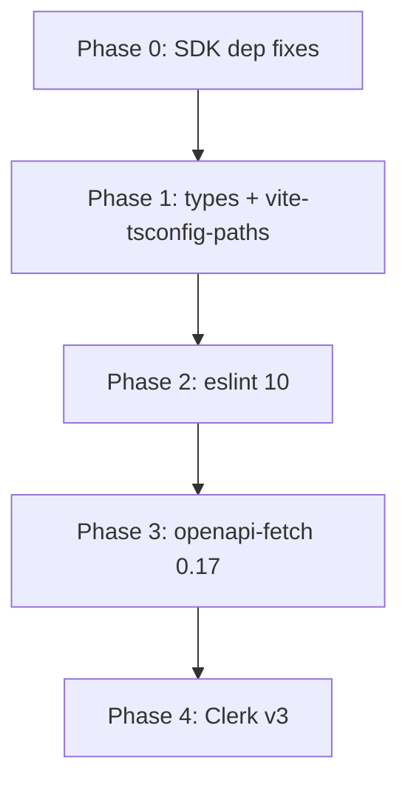

# SDK Fixes and Batch 2 Major Upgrades

## Phase 0: SDK Dependency Classification Fixes

Two quick fixes flagged by Barney during Batch 1 review.

### 0a. curriculum-sdk — promote `@elastic/elasticsearch` to peerDependency

[packages/sdks/oak-curriculum-sdk/package.json](packages/sdks/oak-curriculum-sdk/package.json) exports `./elasticsearch` which re-exports types from [src/types/es-types.ts](packages/sdks/oak-curriculum-sdk/src/types/es-types.ts):

```typescript
import type { estypes } from '@elastic/elasticsearch';
```

Consumers (only `apps/oak-search-cli` today) need `@elastic/elasticsearch` installed to resolve these types. Mirror the pattern already used by `oak-search-sdk`:

- Add `"@elastic/elasticsearch": "^9.3.4"` to `peerDependencies`
- Keep `"^9.3.4"` in `devDependencies` (satisfies the peer for tests)

### 0b. oak-search-sdk — tighten peer floor

[packages/sdks/oak-search-sdk/package.json](packages/sdks/oak-search-sdk/package.json) line 37:

- Change `"@elastic/elasticsearch": "^9.2.0"` to `"^9.3.4"` in `peerDependencies`
- Ensures consumers cannot satisfy the peer with a pre-security-patch version

Both changes: `pnpm install`, verify `pnpm qg` passes.

---

## Phase 1: Low-Risk Standalone Major Bumps

Quick wins with minimal blast radius.

- `@types/node`: `^24.10.13` to `^25.3.3` — root `package.json` + all workspaces that declare it (curriculum-sdk, sdk-codegen, search-sdk, oak-eslint)
- `@types/supertest`: `^6.0.3` to `^7.2.0` — root `package.json` only
- `vite-tsconfig-paths`: `^5.1.4` to `^6.1.1` — [apps/oak-search-cli/package.json](apps/oak-search-cli/package.json) only (devDependency, Vitest plugin)

Review checkpoint: **config-reviewer** on version consistency.

---

## Phase 2: ESLint 10 Migration (resolves 13 Dependabot alerts)

This is the highest-value Batch 2 item. ESLint 10 drops `@eslint/eslintrc` (which pulls vulnerable `minimatch@3` and `ajv@6`), resolving 13 open Dependabot alerts at source.

### Current state (already compatible)

- All 14 workspaces use flat config (`eslint.config.ts`) — no `.eslintrc.*` files
- Custom rules in oak-eslint use modern `context` API (no deprecated methods)
- `defineConfig` and `globalIgnores` imported from `eslint/config` (stable in v10)
- Node.js 24.x meets v10 minimum

### Changes required

**[packages/core/oak-eslint/package.json](packages/core/oak-eslint/package.json):**

- `peerDependencies.eslint`: `^9.0.0` to `^10.0.0`
- `@eslint/js`: `^9.39.1` to `^10.0.1`
- `eslint-plugin-sonarjs`: `^3.0.5` to `^4.0.0`
- `globals`: `^16.5.0` to `^17.4.0`

**Root [package.json](package.json):**

- `eslint`: `^9.39.1` to `^10.0.2`
- `@eslint/js`: `^9.39.1` to `^10.0.1`

**All workspace `package.json` files that declare `eslint`** (root, oak-search-cli, mcp-streamable-http, result, type-helpers):

- `eslint`: `^9.39.1` to `^10.0.2`

**Verification after bump:**

- `pnpm install --no-frozen-lockfile`
- `pnpm build` (oak-eslint must build first)
- `pnpm lint` — new `eslint:recommended` rules (`preserve-caught-error`, `no-useless-assignment`, `no-unassigned-vars`) may produce new diagnostics to fix
- `pnpm type-check` — confirm plugin types still compile
- Full `pnpm qg`

**Items to watch:**

- `reactHooksPlugin as ESLint.Plugin` cast in [packages/core/oak-eslint/src/configs/react.ts](packages/core/oak-eslint/src/configs/react.ts) — verify v10 plugin typing
- `testRules as unknown as Linter.RulesRecord` cast in [apps/oak-search-cli/eslint.config.ts](apps/oak-search-cli/eslint.config.ts) — may need adjustment

Review checkpoint: **code-reviewer** + **architecture-reviewer-fred** (eslint is a quality gate).

---

## Phase 3: openapi-fetch 0.15 to 0.17

Medium risk — `openapi-fetch` is a runtime dependency of both SDK packages.

**Affected workspaces:**

- [packages/sdks/oak-curriculum-sdk/package.json](packages/sdks/oak-curriculum-sdk/package.json) — `dependencies`
- [packages/sdks/oak-sdk-codegen/package.json](packages/sdks/oak-sdk-codegen/package.json) — `dependencies`

**API surface used:** `createClient`, `wrapAsPathBasedClient`, `createQuerySerializer`, `defaultBodySerializer`, `Middleware`, `PathBasedClient`

**Approach:** Check the [openapi-fetch changelog](https://openapi-ts.dev/openapi-fetch/changelog) for breaking changes between 0.15 and 0.17. This is a 0.x package so any minor bump can be breaking. Likely needs `pnpm sdk-codegen` rerun since `PathBasedClient` types flow into generated code.

Review checkpoint: **code-reviewer** + **type-reviewer** (SDK type boundary).

---

## Phase 4: Clerk v3 Migration

Medium-high risk. Only affects one workspace but touches auth infrastructure.

**[apps/oak-curriculum-mcp-streamable-http/package.json](apps/oak-curriculum-mcp-streamable-http/package.json):**

- `@clerk/backend`: `^2.32.1` to `^3.0.1`
- `@clerk/express`: `^1.7.74` to `^2.0.1`
- `@clerk/mcp-tools`: verify compatibility with Clerk v3

**~14 files to update** (auth middleware, auth routes, token verification, types, smoke tests). Key files:

- `src/auth-routes.ts` — `clerkMiddleware` setup
- `src/check-mcp-client-auth.ts` — `getAuth` usage
- `src/auth/mcp-auth/mcp-auth-clerk.ts` — `getAuth` with `acceptsToken`
- `src/auth/mcp-auth/verify-clerk-token.ts` — `MachineAuthObject` type
- `src/auth/mcp-auth/types.ts` — `AuthObject`, `PendingSessionOptions`
- 4 smoke test files — `createClerkClient` API

**Approach:** Read Clerk v3 migration guide before starting. Use the `/clerk` skill router for patterns. Run smoke tests against live Clerk to verify auth flow.

Review checkpoint: **security-reviewer** + **architecture-reviewer-wilma** (auth boundary resilience).

---

## Phase 5: Out-of-Scope / Separate Track

- `**openapi-zod-client-adapter` replacement**: The upstream `openapi-zod-client` is dead. [Castr](https://github.com/EngraphCode/castr) is being built as its replacement (Zod 4 native, canonical IR, OpenAPI bidirectional). When Castr is ready, the adapter workspace will be replaced entirely rather than migrated. Not part of this batch.
- **Rate limiting** (CodeQL alerts #4-#8): All server code runs behind Vercel firewall; the public URL is additionally behind Cloudflare. If a rate limiting concern exists for a specific path not covered by these layers, that should be investigated as a targeted issue rather than blanket app-level rate limiting. Not a dependency update concern.

---

## Execution Order



Phases 0-1 can be done in a single commit. Phase 2 (eslint 10) is the largest item and resolves the most security alerts. Phases 3 and 4 are independent of each other but depend on 0-2 being stable first.
