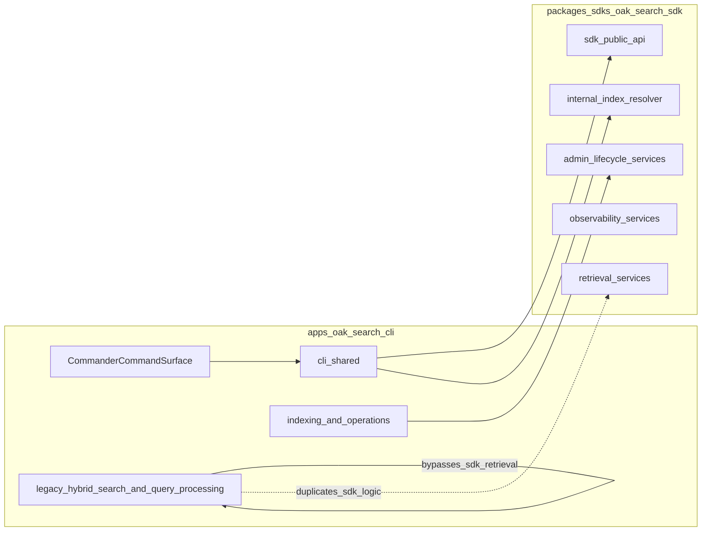
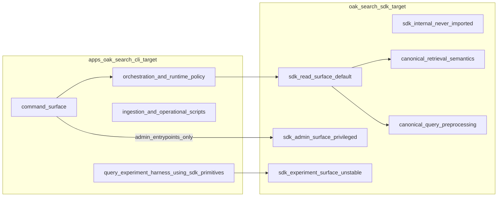

---

name: Search CLI-SDK Boundary Diagnosis
overview: |
  Decision-complete architecture diagnosis for `apps/oak-search-cli` and `packages/sdks/oak-search-sdk`, now encoding explicit capability tiers (read/admin/experiments), privilege boundaries, and boundary fitness functions so existing issues are either resolved directly or made irrelevant.
todos:

- id: map-as-is-boundary
content: Create final as-is boundary map and ownership matrix across CLI and SDK module families.
status: completed
- id: define-to-be-boundary
content: "Define strict to-be boundary contract: canonical ownership, allowed cross-boundary dependencies, forbidden patterns."
status: completed
- id: diagnose-violations
content: Catalogue all wrong-place modules and duplicates (critical/high/medium) with architectural rationale and impact.
status: completed
- id: set-excellence-criteria
content: Define long-term architectural excellence criteria and fitness functions for boundary health.
status: completed
- id: adr-and-doc-target
content: Specify ADR/documentation outputs needed so the boundary doctrine is durable and discoverable.
status: completed
- id: encode-owner-constraints
content: Encode owner constraints (semi-separate admin, read-only default, experiment support) as enforceable architecture policy.
status: completed
- id: lock-pre-implementation-decisions
content: Convert open boundary questions into concrete recommendations and required ADR outputs before implementation planning.
status: pending
- id: define-diagnosis-output-artifact
content: Make diagnosis output explicit: implementation plan document under `.agent/plans/semantic-search/active/`.
status: completed
isProject: false

---

# Search CLI/SDK Boundary Architecture Diagnosis

## Scope and Intent

This plan is **diagnostic-only** (no implementation sequencing yet) and assumes
**breaking boundary changes are acceptable** if they improve long-term
architecture.

Primary scope:

- `apps/oak-search-cli`
- `packages/sdks/oak-search-sdk`

## Owner Constraints (Now Explicit Policy)

1. Admin functions must be **semi-separate** from default consumer flows.
2. Most consumers should be **read-only by default**.
3. Future experimentation must be supported without reintroducing parallel
  canonical implementations.

These are now treated as **architecture invariants**, not optional preferences.

## Current Boundary (As-Is)

## What Is In The Right Place

- **SDK ownership is mostly correct** for retrieval/admin/observability services and index resolution primitives:
  - `packages/sdks/oak-search-sdk/src/retrieval/create-retrieval-service.ts`
  - `packages/sdks/oak-search-sdk/src/admin/index-lifecycle-service.ts`
  - `packages/sdks/oak-search-sdk/src/observability/create-observability-service.ts`
- **CLI ownership is correct** for command wiring, env bootstrap, and operational workflows:
  - `apps/oak-search-cli/bin/oaksearch.ts`
  - `apps/oak-search-cli/src/cli`
  - `apps/oak-search-cli/src/lib/indexing`

## What Is In The Wrong Place (Boundary Violations)

- **Critical duplication across boundary** (SDK and CLI both implement same retrieval preprocessing):
  - `apps/oak-search-cli/src/lib/query-processing`
  - `packages/sdks/oak-search-sdk/src/retrieval/query-processing`
- **Parallel retrieval stacks** (CLI local hybrid-search path vs SDK retrieval path):
  - `apps/oak-search-cli/src/lib/hybrid-search`
  - `packages/sdks/oak-search-sdk/src/retrieval`
- **Leaky/degraded boundary shape**:
  - CLI-local duplicate `createIndexResolver` in `apps/oak-search-cli/src/lib/search-index-target.ts`
  - SDK public barrel currently re-exports internal surface from `packages/sdks/oak-search-sdk/src/internal/index.ts` via `packages/sdks/oak-search-sdk/src/index.ts`

## Should The Nature Of The Boundary Change?

Yes. Move from a shared-implementation boundary to a strict capability boundary:

- `oak-search-sdk` owns canonical deterministic semantics.
- `oak-search-cli` owns orchestration, command UX, and runtime policy.
- Experiments remain supported but only through an explicit SDK experiment seam.

## Target Boundary Contract (To-Be)

Contract rules:

- No CLI-local duplicates of retrieval/preprocessing business logic.
- Default consumer paths use `sdk/read` only.
- Admin/write capability is isolated to `sdk/admin` and explicit admin entrypoints.
- SDK exposes composable primitives for experimentation via `sdk/experiments`.
- CLI never imports SDK `internal/*`.
- Default SDK entrypoint does not transitively expose admin/write symbols.
- SDK public API contains no app-specific references.

## Experimentation Boundary (Allowed vs Forbidden)

Allowed:

- compose published experiment primitives from `sdk/experiments`
- tune ranking/query options through explicit extension interfaces
- evaluate hypotheses in app-level experiment harnesses

Forbidden:

- duplicating canonical retrieval/preprocessing implementations in CLI
- importing SDK internals for experiment shortcuts
- mutating canonical aliases/indices from experiment flows by default

Graduation rule:

- successful experiment logic is promoted into canonical SDK primitives, then
consumed by CLI via normal SDK surfaces.

## Experiment Blast-Radius Envelope

- experiments run against isolated namespace/targets (non-canonical aliases)
- read-only credentials are default
- any write-capable experiment path requires explicit elevated mode
- global kill-switch for experiment command execution
- TTL/cleanup policy for experiment artefacts
- no experiment can mutate canonical aliases without explicit operator action

## Long-Term Architectural Excellence (Definition)

- **Single semantic source of truth** for search/retrieval and preprocessing in SDK.
- **Thin CLI** with explicit composition roots, resource lifecycle, and fail-fast
operator ergonomics.
- **Explicit extension seam** for experiments (SDK primitive interfaces), not forks/duplications.
- **Strict API hygiene**: public-only SDK imports; no internal re-export leakage.
- **Blocking boundary fitness functions**:
  - no duplicate module families across CLI/SDK for canonical retrieval concerns,
  - no CLI imports from SDK internals,
  - no divergence in query semantics between CLI and SDK paths,
  - non-admin CLI modules cannot import admin SDK surface,
  - default SDK entrypoint does not expose admin/write symbols,
  - experiment modules import only approved experiment surfaces.

## Diagnostic Deliverables

- Boundary map (as-is and to-be) checked into architecture docs.
- Canonical ownership matrix (module family -> owner package).
- ADR update/new ADR defining final CLI/SDK boundary doctrine, capability model,
and extension model.
- Risk register for boundary shift (semantic drift, experiment compatibility, API break blast-radius).
- **Required output artifact of this diagnosis**: an executable implementation
plan document created in:
  - `.agent/plans/semantic-search/active/`
  - using the plan templates/components workflow from
  `@.agent/plans/templates/README.md`
  - with deterministic tasks, acceptance criteria, and quality-gate sequence
  aligned to `@.agent/commands/plan.md`

## Lint Boundary Enforcement (Explicit)

Architectural boundaries in this plan must be enforced in lint config, not only
described in prose.

Primary enforcement targets:

1. `apps/oak-search-cli/eslint.config.ts`
2. shared standards boundary rules used by this workspace (for example
  `@oaknational/eslint-plugin-standards` rule sets consumed by the CLI config)

Required lint-enforced boundaries:

- non-admin CLI modules cannot import `sdk/admin` surfaces
- default SDK entrypoint cannot re-export admin/write symbols
- experiments can import only approved `sdk/experiments` surfaces
- no imports from SDK internal modules (`internal/*`) from app code

Verification expectations:

- violating imports fail lint as blocking errors
- rule coverage includes `src/cli/`**, `src/lib/`**, `evaluation/**`,
and experiment package/workspace once created
- at least one intentional negative fixture per boundary class proves rules are
active (failing case) and one positive fixture proves allowed path

## Decisions To Lock Before Implementation Planning

- SDK experiment surface decision:
  - recommendation: expose explicit unstable `sdk/experiments` surface (not `internal/`*)
- experiment module placement:
  - recommendation: dedicated experiments package or explicit trigger to extract
  after second consumer
- admin separation strategy:
  - recommendation: preserve in same SDK package but separate `read` vs `admin`
  entry surfaces with static boundary checks
- operational scripts ownership:
  - recommendation: keep CLI orchestration app-local; move deterministic lifecycle
  semantics into SDK admin services

Required pre-implementation artefacts for each decision:

1. ADR entry/update with chosen option and rejected options
2. owner sign-off
3. enforcement mechanism (lint/dependency/test fitness check)

No implementation planning is complete until these artefacts exist.

## Promotion Output Contract

When this diagnosis is accepted, the immediate next document must be an
implementation plan in `.agent/plans/semantic-search/active/` that executes the
chosen boundary decisions.

Minimum contract for that implementation plan:

1. Explicit task breakdown for CLI/SDK boundary migration.
2. TDD RED/GREEN/REFACTOR structure with one-gate-at-a-time quality discipline.
3. Lint boundary enforcement tasks and validation evidence.
4. Clear closure criteria that either resolve identified architectural issues or
  render them irrelevant through enforced boundary policy.

## Plan Authority

- This diagnosis plan is the boundary doctrine source for CLI/SDK separation.
- `.agent/plans/semantic-search/active/cli-robustness.plan.md` remains the
active incident execution source and must reference this doctrine for boundary
rules.
