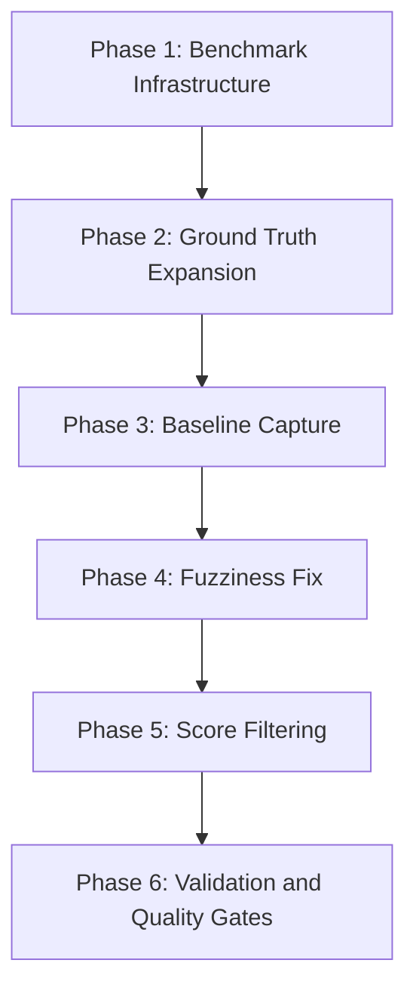

# Search Results Quality Fix

## Context

Single-word cross-subject lesson queries return the entire index (8,000-10,000 results) with poor-to-mixed ranking. Two compounding root causes:

1. **Fuzziness**: `fuzziness: 'AUTO'` allows 1-edit matches for 3-5 char words ("apple" matches "apply", "tree" matches "three"/"true")
2. **Volume**: No `min_score` threshold; ELSER assigns non-zero scores to nearly everything; 4-way RRF surfaces all of them

The unit BM25 config already uses the more conservative `AUTO:3,6` with `prefix_length: 1`, providing a tested precedent.

## Approach

Ground truths before configuration changes. Measure before and after. TDD at all levels.



---

## Phase 1: Enable Cross-Subject Benchmarking

The benchmark runner currently requires `subject` on every query. The SDK already supports unfiltered queries (`subject?` is optional in `SearchParamsBase`). The gap is in 4 benchmark files.

### 1a. Make `RunQueryInput.subject` optional

**File**: [benchmark-query-runner-lessons.ts](apps/oak-search-cli/evaluation/analysis/benchmark-query-runner-lessons.ts)

- Change `RunQueryInput.subject` from `AllSubjectSlug` to `AllSubjectSlug | undefined`
- In `runQuery()`, only set `subject` in `sdkParams` when `input.subject` is defined
- Current code (line 138): `const subject: SearchSubjectSlug = isSubject(input.subject) ? input.subject : 'science';` -- this always maps to a subject. Change to pass `undefined` when `input.subject` is `undefined`

**Tests first**: Update [benchmark-query-runner-lessons.unit.test.ts](apps/oak-search-cli/evaluation/analysis/benchmark-query-runner-lessons.unit.test.ts) with a test case for `subject: undefined` that verifies `searchFn` is called without a `subject` param.

### 1b. Make `GroundTruthEntry.subject` optional

**File**: [benchmark-entry-runner.ts](apps/oak-search-cli/evaluation/analysis/benchmark-entry-runner.ts)

- Change `GroundTruthEntry.subject` from `AllSubjectSlug` to `AllSubjectSlug | undefined`
- Change `EntryBenchmarkResult.subject` similarly
- In `benchmarkEntry()` and `benchmarkEntryForReview()`, pass `entry.subject` (now possibly undefined) through to `runQuery()`

**Tests first**: Update [benchmark-entry.integration.test.ts](apps/oak-search-cli/evaluation/analysis/benchmark-entry.integration.test.ts).

### 1c. Add cross-subject adapter

**File**: [benchmark-adapters.ts](apps/oak-search-cli/evaluation/analysis/benchmark-adapters.ts)

- Add `getCrossSubjectGroundTruthEntries()` that maps `CROSS_SUBJECT_LESSON_GROUND_TRUTHS` to `GroundTruthEntry[]` with `subject: undefined`, `phase: undefined`
- The `GroundTruthBase` interface (line 38) requires `subject: AllSubjectSlug` -- cross-subject entries won't fit this shape. Either:
  - Create a separate mapping function that doesn't use `groupEntries()`, OR
  - Widen `GroundTruthBase.subject` to optional (but this affects all scopes)
- Recommended: Create a direct mapping function for cross-subject entries (simpler, no impact on per-subject path)

### 1d. Integrate into benchmark-main.ts

**File**: [benchmark-main.ts](apps/oak-search-cli/evaluation/analysis/benchmark-main.ts)

- In `filterEntries()`, merge results from `getLessonGroundTruthEntries()` and `getCrossSubjectGroundTruthEntries()`
- Add `--cross-subject` CLI flag (or include in `--all`)
- Update display formatting to handle entries without a subject

---

## Phase 2: Ground Truth Expansion

Use the known-answer-first methodology from the ground-truth-design skill. For each query:

1. Mine bulk data via shell commands to identify candidate lessons
2. Design the query a teacher would type
3. Test via the Oak MCP `search` tool (scope: "lessons", no subject filter)
4. Capture top 3 with relevance scores (3/2/1)

### 2a. "tree" ground truth

**File**: `apps/oak-search-cli/src/lib/search-quality/ground-truth/cross-subject/tree-lessons.ts`

Mine bulk data for tree-related lessons (science KS1 has "Structure of a tree", "Naming trees", "Deciduous and evergreen trees"; geography KS2 has "The benefits of trees"). Exclude maths "tree diagram" lessons (not about trees) and English "Twisted Tree" novel (literary, not about trees as a topic).

Expected shape:

```typescript
export const TREE_LESSONS: CrossSubjectLessonGroundTruth = {
  query: 'tree',
  expectedRelevance: {
    'structure-of-a-tree': 3,    // Directly about tree anatomy
    'naming-trees': 3,           // Identifying tree species
    'the-benefits-of-trees': 2,  // Geography perspective on trees
  },
  description: 'Unfiltered "tree" search should surface science and geography lessons about trees, not maths "tree diagram" lessons or fuzzy matches to "three"/"true".',
} as const;
```

Slugs must be verified against bulk data before committing.

### 2b. "mountain" ground truth

**File**: `apps/oak-search-cli/src/lib/search-quality/ground-truth/cross-subject/mountain-lessons.ts`

Mine bulk data for mountain lessons. Geography KS2 has "The formation of mountains", "Mountains and their features", "Mountains and landmarks of the world". Exclude English "story mountain" lessons (literacy device, not about mountains).

### 2c. Register in index.ts

**File**: [ground-truth/index.ts](apps/oak-search-cli/src/lib/search-quality/ground-truth/index.ts)

- Import `TREE_LESSONS` and `MOUNTAIN_LESSONS`
- Add to `CROSS_SUBJECT_LESSON_GROUND_TRUTHS` array
- Add re-exports

---

## Phase 3: Baseline Capture

Before any search configuration changes:

1. Run per-subject benchmark: `pnpm benchmark:lessons --all` -- capture MRR, NDCG@10
2. Run cross-subject benchmark (once Phase 1 is done): capture current metrics for apple/tree/mountain
3. Record baselines in the plan or a baseline snapshot file

This establishes the regression baseline. Current per-subject: MRR 0.983, NDCG@10 0.944.

---

## Phase 4: Fuzziness Fix (Option 1)

### 4a. Align lesson fuzziness with units

**File**: [rrf-query-builders.ts](packages/sdks/oak-search-sdk/src/retrieval/rrf-query-builders.ts) (line 56-59)

Change:

```typescript
const bm25Config =
  scope === 'lesson'
    ? { fuzziness: 'AUTO' as const, minimum_should_match: '2<65%' }
    : { fuzziness: 'AUTO:3,6' as const, prefix_length: 1, fuzzy_transpositions: true };
```

To:

```typescript
const bm25Config =
  scope === 'lesson'
    ? { fuzziness: 'AUTO:3,6' as const, prefix_length: 1, fuzzy_transpositions: true, minimum_should_match: '2<65%' }
    : { fuzziness: 'AUTO:3,6' as const, prefix_length: 1, fuzzy_transpositions: true };
```

This means:

- `AUTO:3,6` -- 0 edits for 1-2 chars, 1 edit for 3-5, 2 edits for 6+
- `prefix_length: 1` -- first character must match exactly (prevents "apple" matching "three" but also stops some useful typo corrections on the first character)

**Why `AUTO:3,6` not `AUTO:4,7`**: The plan originally suggested `AUTO:4,7` which raises thresholds further (0 edits for 1-3 chars, 1 edit for 4-6, 2 edits for 7+). However, `AUTO:3,6` with `prefix_length: 1` is already proven on units. It prevents "apple" matching "apply" (different first character path via prefix_length=1 prevents this? No -- "apple" and "apply" share prefix "appl" so prefix_length=1 won't help). Let me reconsider...

**Critical insight**: `prefix_length: 1` requires the first character to match exactly. Both "apple" and "apply" start with "a", so `prefix_length: 1` alone won't prevent this match. The edit distance is still 1 (e->y), and `AUTO:3,6` allows 1 edit for 5-char words.

**Recommendation**: Use `AUTO:4,7` for lessons, which raises thresholds:

- 1-3 chars: 0 edits (exact)
- 4-6 chars: 1 edit (but with `prefix_length: 1`, "apple" can still match "apply")
- 7+ chars: 2 edits

To fully prevent "apple" -> "apply", we need `AUTO:6,9` (0 edits for 1-5 chars) OR a higher `prefix_length`. The simplest effective fix: use `prefix_length: 2` with `AUTO:3,6`, requiring first 2 chars to match exactly. "apple"/"apply" share "ap" so even that won't help.

**Revised recommendation**: The most robust fix for 5-char queries is `fuzziness: 'AUTO:6,9'` which requires 6+ chars for any fuzzy matching. This eliminates ALL fuzzy matching for words under 6 characters. Combined with ELSER semantic search (which handles genuine conceptual similarity) and the synonym filter, this is safe -- we don't need character-level fuzziness for short common words.

**Tests first**: The `buildFourWayRetriever` and `buildBm25Retriever` functions are pure -- test the retriever shape for lesson scope to verify the new fuzziness config appears in the output.

---

## Phase 5: Score Filtering (Option 2)

### 5a. Add post-RRF score filtering

**File**: [create-retrieval-service.ts](packages/sdks/oak-search-sdk/src/retrieval/create-retrieval-service.ts) or [rrf-query-helpers.ts](packages/sdks/oak-search-sdk/src/retrieval/rrf-query-helpers.ts)

Add a pure function that filters results below a score threshold after `normaliseTranscriptScores()`:

```typescript
function filterByMinScore(
  hits: readonly NormalisedHit[],
  minScore: number,
): NormalisedHit[] {
  return hits.filter(hit => hit._score >= minScore);
}
```

**Calibration**: Based on the evidence data, relevant results score 0.05-0.06 and noise scores 0.03. A threshold of ~0.04 would cut most noise while preserving all relevant results. However, RRF scores are relative -- the threshold should be calibrated empirically using the benchmarks.

**Important**: The `total` count returned to the consumer should reflect the filtered count, not the ES total. Update the `searchLessons` return to report filtered `total`.

**Tests first**: Pure function -- straightforward unit tests with score arrays.

### 5b. Make threshold configurable

Pass `minScore` as an optional parameter on `SearchLessonsParams` or as an SDK-level config. This allows the benchmark to test different thresholds without code changes.

---

## Phase 6: Validation and Quality Gates

### 6a. Run comparison benchmarks

After implementing Phases 4 and 5:

1. Run per-subject: `pnpm benchmark:lessons --all` -- verify MRR >= 0.95 (no regression from 0.983)
2. Run cross-subject: verify "apple" MRR > 0.5 (acceptance criterion: `making-apple-flapjack-bites` in top 2)
3. Verify "tree" and "mountain" meet their acceptance criteria
4. Use Oak MCP `search` tool to manually verify top 5 results for each query

### 6b. Verify via MCP

Use the `search` MCP tool to run the three diagnostic queries and confirm:

- "apple": `making-apple-flapjack-bites` is #1, no "apply" false positives in top 10
- "tree": science/geography tree lessons dominate, no "three"/"true" pollution
- "mountain": geography mountains rank highest, "story mountain" deprioritised

### 6c. Quality gates

```bash
pnpm type-gen
pnpm build
pnpm type-check
pnpm lint:fix
pnpm format:root
pnpm markdownlint:root
pnpm test
pnpm test:e2e
pnpm test:ui
pnpm smoke:dev:stub
```

### 6d. Update plan document

Update [search-results-quality.md](/.agent/plans/semantic-search/active/search-results-quality.md):

- Add "Implementation Status" section tracking which options were implemented
- Record before/after benchmark results
- Update acceptance criteria with measured values
- Move to archive if all criteria met

---

## Key Files Summary

| File                                                                                        | Change                |
| ------------------------------------------------------------------------------------------- | --------------------- |
| `packages/sdks/oak-search-sdk/src/retrieval/rrf-query-builders.ts`                          | Fuzziness config      |
| `packages/sdks/oak-search-sdk/src/retrieval/rrf-query-helpers.ts`                           | Score filter function |
| `packages/sdks/oak-search-sdk/src/retrieval/create-retrieval-service.ts`                    | Apply score filter    |
| `apps/oak-search-cli/evaluation/analysis/benchmark-query-runner-lessons.ts`                 | Optional subject      |
| `apps/oak-search-cli/evaluation/analysis/benchmark-entry-runner.ts`                         | Optional subject      |
| `apps/oak-search-cli/evaluation/analysis/benchmark-adapters.ts`                             | Cross-subject adapter |
| `apps/oak-search-cli/evaluation/analysis/benchmark-main.ts`                                 | CLI integration       |
| `apps/oak-search-cli/src/lib/search-quality/ground-truth/cross-subject/tree-lessons.ts`     | New GT                |
| `apps/oak-search-cli/src/lib/search-quality/ground-truth/cross-subject/mountain-lessons.ts` | New GT                |
| `apps/oak-search-cli/src/lib/search-quality/ground-truth/index.ts`                          | Register GTs          |

## Open Question: Fuzziness Threshold

The exact `AUTO:X,Y` values need empirical validation. The plan should start with `AUTO:6,9` (no fuzziness for words under 6 chars) and fall back to `AUTO:4,7` if benchmark regression is detected. ELSER semantic search and the synonym filter provide alternative paths for short-word matching that don't rely on character-level fuzziness.

This is the single most impactful decision -- it should be tested first with cross-subject benchmarks before committing.
