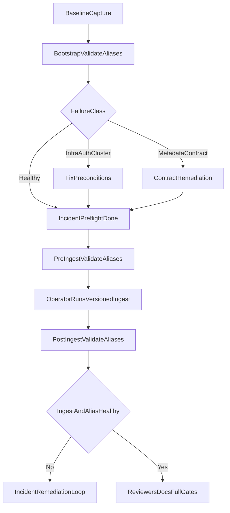

# Semantic Search Ingest Runbook (Operator-Run)

## Scope

Produce a single execution runbook for the active incident lane so first successful alias lifecycle ingest is proven, then closeout is completed in the correct order.

In-scope sources:

- [Semantic search session prompt](/Users/jim/code/oak/oak-mcp-ecosystem/.agent/prompts/semantic-search/semantic-search.prompt.md)
- [CLI robustness active plan](/Users/jim/code/oak/oak-mcp-ecosystem/.agent/plans/semantic-search/active/cli-robustness.plan.md)
- [Boundary migration evidence plan](/Users/jim/code/oak/oak-mcp-ecosystem/.agent/plans/semantic-search/active/search-cli-sdk-boundary-migration.execution.plan.md)
- [ADR-134 capability boundary doctrine](/Users/jim/code/oak/oak-mcp-ecosystem/docs/architecture/architectural-decisions/134-search-sdk-capability-surface-boundary.md)

Out of scope:

- New architecture beyond current incident/boundary lanes
- Compatibility/fallback layers for metadata mapping
- Reopening completed boundary lane without fresh regression evidence

## Runbook Contract

- Operator runs ingest command (`admin versioned-ingest`).
- Agent runs all non-ingest checks and command preparation.
- Agent monitors ingest output, classifies failures, and drives next-step remediation.
- Hard sequencing: no full lifecycle chain until incident preflight/refactor obligations are complete, except the explicit bootstrap `validate-aliases` health check.

## Deterministic Execution Sequence

1. Re-ground and baseline capture:

- `git status --short`
- `git branch --show-current`
- `ls -1 .agent/plans/semantic-search/active`

1. Confirm boundary lane remains green (ADR-134 guardrails still satisfied).
2. Bootstrap health check (allowed exception):

- `cd apps/oak-search-cli`
- `pnpm tsx bin/oaksearch.ts admin validate-aliases`

1. Failure classification gate:

- If connectivity/auth/cluster-health issue -> resolve ops precondition first.
- If metadata contract evidence (`strict_dynamic_mapping_exception`, `previous_version`) -> execute schema/mapping contract remediation path.

1. Complete remaining incident-lane preflight/refactor obligations (non-ingest).
2. Lifecycle proof chain (operator-run ingest):

- Agent: `pnpm tsx bin/oaksearch.ts admin validate-aliases`
- Operator: `pnpm tsx bin/oaksearch.ts admin versioned-ingest`
- Agent: monitor/diagnose output live
- Agent: `pnpm tsx bin/oaksearch.ts admin validate-aliases`

1. Gate first-migration success:

- ingest exit code `0`
- metadata commit succeeds with strict mapping
- no `previous_version` rejection
- aliases resolve to concrete target indexes

1. If success, continue to closeout in order:

- Phase 5 REFACTOR cleanup
- pending specialist reviewers (`test-reviewer`, `type-reviewer`, `docs-adr-reviewer`, `elasticsearch-reviewer`)
- docs/ADR propagation
- full one-gate-at-a-time quality sequence from repo root

1. Append dated evidence entry under `Next Session Bootstrap (Standalone Entry Point)` in the active CLI robustness plan.

## Failure Branch Runbook

### Branch A: Bootstrap alias validation fails before ingest

- Stop lifecycle chain.
- Classify as infra/auth/cluster vs metadata contract.
- Only proceed to ingest when preconditions are healthy or contract remediation is complete.

### Branch B: Ingest fails with metadata contract evidence

- Stop and treat as schema-first contract drift.
- Trace ownership end-to-end: generator source -> generated mapping/type -> runtime mapping application.
- Re-run coherence checks (`pnpm sdk-codegen`, `pnpm build`, `pnpm type-check`) before retrying lifecycle chain.

### Branch C: Post-ingest alias validation fails

- Treat as active incident, not closeout.
- Repair alias target health and re-run validation before any reviewer/docs/gate closeout.

## Acceptance Criteria

- First successful operator-run ingest is proven by command evidence.
- Alias lifecycle migration is proven by healthy post-ingest alias validation.
- No strict mapping failure remains on `previous_version`.
- Boundary doctrine remains green while incident is remediated.
- Closeout sequence (reviewers -> docs/ADR -> full gates) is completed only after lifecycle success.

## Sequence Diagram

