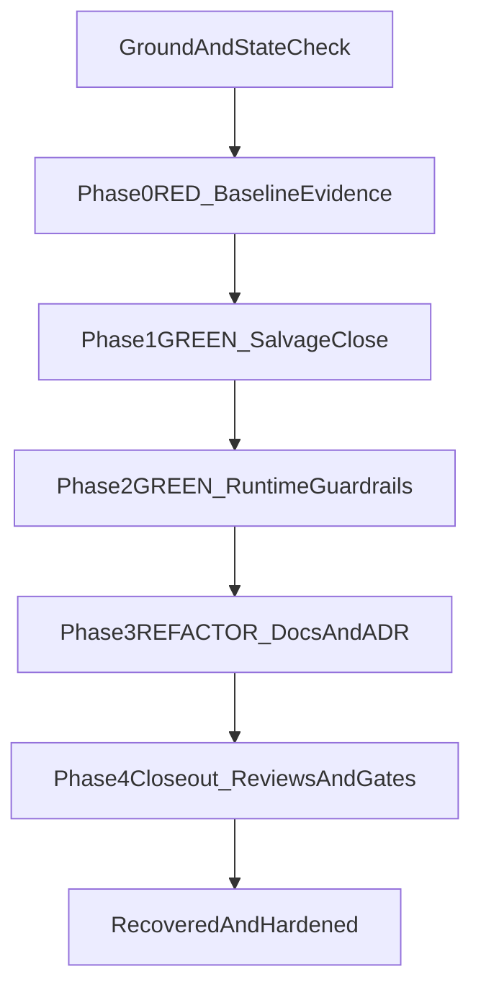

# Semantic Search Recovery Plan

## Objective

Restore lifecycle integrity for semantic-search in production-safe order:

1. Close the active incident safely.
2. Preserve and promote valid staged data where possible.
3. Land hard guardrails so this drift class cannot recur.

Primary execution anchors:

- [.agent/plans/semantic-search/active/semantic-search-recovery-and-guardrails.execution.plan.md](.agent/plans/semantic-search/active/semantic-search-recovery-and-guardrails.execution.plan.md)
- [.agent/plans/semantic-search/active/semantic-search-ingest-runbook.md](.agent/plans/semantic-search/active/semantic-search-ingest-runbook.md)
- [.agent/prompts/semantic-search/semantic-search.prompt.md](.agent/prompts/semantic-search/semantic-search.prompt.md)

## Scope and Boundaries

- **In scope**: Phase 0->4 completion of the active recovery lane, including salvage decisioning, invariant enforcement, lock semantics, and doc/ADR propagation.
- **Out of scope**: unrelated active lanes except where recovery docs must clarify precedence.
- **Hard constraints**: no compatibility layers, no silent fallback behaviour, fail-fast diagnostics, TDD phase discipline, and one-gate-at-a-time validation.

## Execution Sequence

### 1) Phase 0 RED: re-establish live truth (complete first)

- Re-run Step 0.5 evidence pack capture exactly once per run context; keep immutable outputs under `apps/oak-search-cli/recovery-evidence/<timestamp>-phase0-baseline`.
- Confirm baseline includes alias health, `oak_meta` document, `oak_meta` mapping, and filtered six-family version counts.
- Finalise `baseline-summary.md` with deterministic values for `staged_version`, `live_alias_version`, `previous_version_in_mapping`, `mapping_contract_match`.
- Preserve RED intent: guardrail tests must fail before implementation changes.

### 2) Phase 1 GREEN: salvage-first incident closure

- Enforce preflight order from runbook Steps 0-3.5 before any write/promote.
- Reconcile mapping contract (additive-only changes) and metadata/alias coherence before promote.
- Select staged candidate deterministically from evidence:
  - present in all six families,
  - newer than live alias version,
  - lexicographically greatest if multiple candidates.
- Execute promote + mandatory postchecks; on timeout/non-zero/partial action failures, run immediate readback triage before any retry/rollback/unlock.
- Exit Phase 1 only when aliases are healthy on promoted version and metadata lineage (`version`/`previous_version`) is coherent.

### 3) Phase 2 GREEN: anti-recurrence runtime guardrails

- Implement fail-fast lifecycle invariants in SDK/CLI:
  - metadata version must match live alias version before promote,
  - required metadata mapping fields must exist before write paths,
  - alias swap must use `must_exist=true`,
  - partial alias action results are hard failures.
- Add distributed Elasticsearch lease lock (not local lock): create, renew, release via OCC; include TTL and 50%-interval renewal behaviour.
- Cover invariants and locking with unit + integration tests first (RED->GREEN->REFACTOR).

### 4) Phase 3 REFACTOR: doctrine and discoverability alignment

- Keep operator sequence authoritative in runbook and reduce duplicate procedural detail elsewhere by reference.
- Update recovery-facing docs so lane precedence is explicit and non-recovery active lanes are clearly non-entry during incident closure:
  - [.agent/prompts/semantic-search/semantic-search.prompt.md](.agent/prompts/semantic-search/semantic-search.prompt.md)
  - [.agent/plans/semantic-search/active/README.md](.agent/plans/semantic-search/active/README.md)
  - [.agent/plans/semantic-search/README.md](.agent/plans/semantic-search/README.md)
  - [docs/operations/elasticsearch-ingest-lifecycle.md](docs/operations/elasticsearch-ingest-lifecycle.md)
- Ensure ADR updates reflect alias/metadata coherence and swap atomicity doctrine.

### 5) Phase 4 closeout: reviews and quality gates

- Required read-only specialist passes: `code-reviewer`, `test-reviewer`, `type-reviewer`, `docs-adr-reviewer`, `elasticsearch-reviewer`.
- Resolve blocker/high findings before final gate run.
- Execute full quality gates sequentially (`clean -> sdk-codegen -> build -> type-check -> doc-gen -> lint/format/markdown -> tests -> smoke`) and capture evidence.

## Stop/Go Rules

- Do not begin Phase 1 until Phase 0 evidence is complete and internally consistent.
- Do not begin Phase 2 until incident closure is proven by post-promote health checks.
- Do not retry/rollback/release lock after post-mutation failure until readback triage (`validate-aliases`, `meta get`, `count`) is complete.
- If mapping drift requires non-additive changes, stop salvage path and switch to new-index/reindex workflow.

## Risks and Mitigations

- **Environment targeting mix-up (primary vs sandbox)**: enforce explicit `INDEX_TARGET` + evidence-path naming per run.
- **False success from partial alias actions**: treat action-level partials as incident even if top-level call acknowledges.
- **Concurrency corruption**: block concurrent lifecycle operations with ES lease lock before scheduled refresh rollout.
- **Lane confusion during handoff**: make recovery-entry precedence explicit in prompt + active indexes.

## Success Signals

- Recovery run completes without strict mapping failure on `previous_version`.
- Aliases and metadata lineage are coherent after promote.
- Guardrail tests prove failure on incoherent preconditions and pass after implementation.
- Recovery docs, runbook, and lane indexes agree on authority and sequence.
- Required reviewer passes and full quality gates complete with no unresolved blockers.
